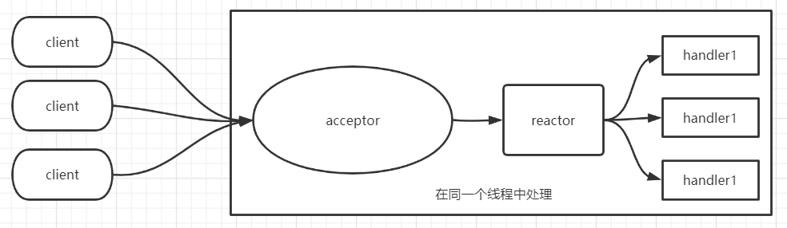

# 020-单线程Reactor反应器模式.md

[TOC]

## 单线程Reactor模式简介

有点类似事件驱动模式

### 事件驱动模式

- 事件源将 事件dispatch 分发到handler 处理器进行事件处理
- 反应器模式中的反应器角色， 类似于事件驱动模式的dispatcher事件分发器角色

### Reactor模式的两大组件

- Reactor反应器： 负责查询IO事件， 当检测到一个IO事件， 将其发送给相应的Handler去处理， 这里的IO事件就是NIO中选择器监控的通道（Channel） IO事件
- Handler处理器： 与IO事件（或者选择键）绑定， 负责 IO事件的处理， 完成真正的连接监理， 通道的读取， 处理业务逻辑， 负责将结果写出到通道里



## 单线程Reactor参考代码

```java
class ConnectionPerThread implements Runnable {
    public void run() {
        try {
            ServerSocket serverSocket =
                    new ServerSocket(NioDemoConfig.SOCKET_SERVER_PORT);
            while (!Thread.interrupted()) {
                Socket socket = serverSocket.accept();
                Handler handler = new Handler(socket);
                //创建新线程来handle
                //或者，使用线程池来处理
                new Thread(handler).start();
            }

        } catch (IOException ex) { /* 处理异常 */ }
    }

    static class Handler implements Runnable {
        final Socket socket;

        Handler(Socket s) {
            socket = s;
        }

        public void run() {
            while (true) {
                try {
                    byte[] input = new byte[NioDemoConfig.SERVER_BUFFER_SIZE];
                    /* 读取数据 */
                    socket.getInputStream().read(input);
                    /* 处理业务逻辑，获取处理结果 */
                    byte[] output =null;
                    /* 写入结果 */
                    socket.getOutputStream().write(output);
                } catch (IOException ex) { /*处理异常*/ }
            }
        }

    }
}
```

## 单线程Reactor优缺点

#### 优点

- 解决了OIO新连接严重阻塞问题， 在一定程度上提高了系统的吞吐量
- 