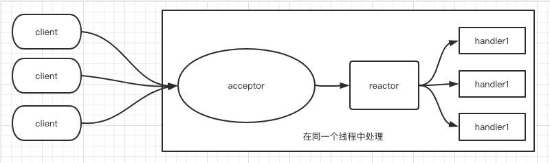
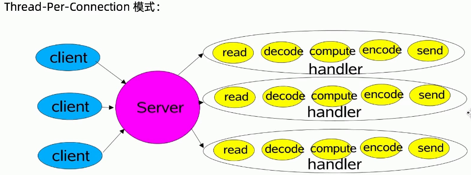
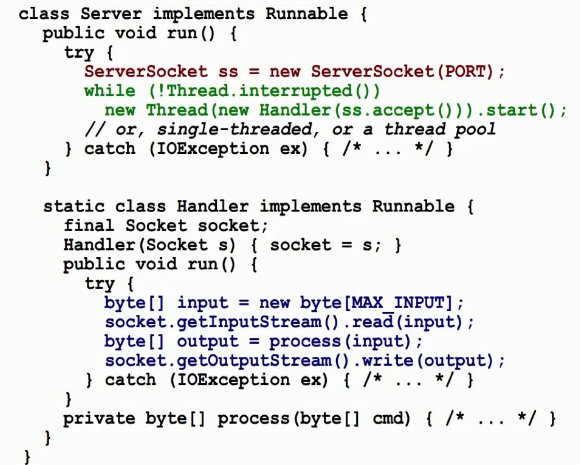

# 020-单线程Reactor反应器模式

[TOC]

## Reactor反应器模式

总体来说， Reactor反应器模式类似于 事件驱动模式

在反应器模式中， 有两个重要的角色

1. Reactor 反应器： 负责查询IO事件， 当检测到一个IO事件， 将其发送给相应的handler处理器去处理， 这里的IO事件， 就是NIO中选择器监控的通道IO事件
2. Handler处理器：与IO事件（或者选择器）进行一个绑定， 负责IO事件的处理， 完成真正的链接建立、通道的读取、处理业务逻辑负责将结果写出到通道内

## 什么是单线程Reactor反应器

简单来说就是：

- Handlers和Reactor反应器在一个线程内执行， 它是最简单的反应器模式



## Thread-pre_connection



- read和send操作都是阻塞操作

### 代码实现



## 改良版本重要实现原理

- 基于 Java NIO
- 使用 SelectionKey 选择器里的几个重要成员方法
  - void attach(Object o)  : 传入Pojo对象， 作为附件存储到SelectionKey
  - Object attachment() : 取出之前通过attach (Object o) 添加到 SelectionKey 选择键中的附件

- 在传递事件时， 实际上传递的是Handler

总之， 在反应器模式中， 需要 `attch` 方法 和 `attachment` 方法结合使用

- 在选择键注册完成之后， 调用 attach方法， 将Handler 处理器绑定到选择键
- 当事件发生时， 调用 attachment 方法， 可以从选择键中取出Handler 处理器，将事件分发到Handler处理器中

## 一个Reactor反应器版本的EchoServer实践案例

```java
//反应器
class EchoServerReactor implements Runnable {
    Selector selector;
    ServerSocketChannel serverSocket;

    EchoServerReactor() throws IOException {
        //Reactor初始化
        selector = Selector.open();
        serverSocket = ServerSocketChannel.open();

        InetSocketAddress address =new InetSocketAddress(NioDemoConfig.SOCKET_SERVER_IP,
                        NioDemoConfig.SOCKET_SERVER_PORT);
        serverSocket.socket().bind(address);
        Logger.info("服务端已经开始监听："+address);
        //非阻塞
        serverSocket.configureBlocking(false);

        //分步处理,第一步,接收accept事件
        SelectionKey sk = serverSocket.register(selector, SelectionKey.OP_ACCEPT);
        //attach callback object, AcceptorHandler
        sk.attach(new AcceptorHandler());
    }

    public void run() {
        try {
            while (!Thread.interrupted()) {
                selector.select();
                Set<SelectionKey> selected = selector.selectedKeys();
                Iterator<SelectionKey> it = selected.iterator();
                while (it.hasNext()) {
                    //Reactor负责dispatch收到的事件
                    SelectionKey sk = it.next();
                    dispatch(sk);
                }
                selected.clear();
            }
        } catch (IOException ex) {
            ex.printStackTrace();
        }
    }

    void dispatch(SelectionKey sk) {
        Runnable handler = (Runnable) sk.attachment();
        //调用之前attach绑定到选择键的handler处理器对象
        if (handler != null) {
            handler.run();
        }
    }

    // Handler:新连接处理器
    class AcceptorHandler implements Runnable {
        public void run() {
            try {
                SocketChannel channel = serverSocket.accept();
                Logger.info("接收到一个连接");
                if (channel != null) {
                    new EchoHandler(selector, channel);
                }
            } catch (IOException e) {
                e.printStackTrace();
            }
        }
    }
    public static void main(String[] args) throws IOException {
        new Thread(new EchoServerReactor()).start();
    }
}
```

## EchoHandler

```java
class EchoHandler implements Runnable {
    final SocketChannel channel;
    final SelectionKey sk;
    final ByteBuffer byteBuffer = ByteBuffer.allocate(1024);
    static final int RECIEVING = 0, SENDING = 1;
    int state = RECIEVING;

    EchoHandler(Selector selector, SocketChannel c) throws IOException {
        channel = c;
        c.configureBlocking(false);
        //仅仅取得选择键，后设置感兴趣的IO事件
        sk = channel.register(selector, 0);

        //将Handler作为选择键的附件
        sk.attach(this);

        //第二步,注册Read就绪事件
        sk.interestOps(SelectionKey.OP_READ);
        selector.wakeup();
    }

    public void run() {
        try {
            if (state == SENDING) {
                //写入通道
                channel.write(byteBuffer);
                //写完后,准备开始从通道读,byteBuffer切换成写模式
                byteBuffer.clear();
                //写完后,注册read就绪事件
                sk.interestOps(SelectionKey.OP_READ);
                //写完后,进入接收的状态
                state = RECIEVING;
            } else if (state == RECIEVING) {
                //从通道读
                int length = 0;
                while ((length = channel.read(byteBuffer)) > 0) {
                    Logger.info(new String(byteBuffer.array(), 0, length));
                }
                //读完后，准备开始写入通道,byteBuffer切换成读模式
                byteBuffer.flip();
                //读完后，注册write就绪事件
                sk.interestOps(SelectionKey.OP_WRITE);
                //读完后,进入发送的状态
                state = SENDING;
            }
            //处理结束了, 这里不能关闭select key，需要重复使用
            //sk.cancel();
        } catch (IOException ex) {
            ex.printStackTrace();
            sk.cancel();
            try {
                channel.finishConnect();
            } catch (IOException e) {
                e.printStackTrace();
            }
        }
    }
}
```

## 单线程Reactor反应器模式的缺点

单线程Reactor反应器模式, 是基于 Java 的NIO实现的, 相对于传统的多线程OIO, 反应器不再需要启动成千上万个进程, 效率大大提升

在单线程反应器模式中, Reactor反应器和 Handler处理器, 都执行在同一条线程上,会带来一个问题: 

当其中某个Handler阻塞时, 会导致其他所有的Handler都得不到执行, 在这种情况下, 如果被阻塞的Handler不仅仅负责输入和输出处理的业务, 还包含负责连接监听的AcceptorHandler处理器, 这是一个非常严重的问题

因为一旦AcceptorHandler处理器阻塞, 会导致整个服务不能接受新的连接, 是的服务器变得不可用

