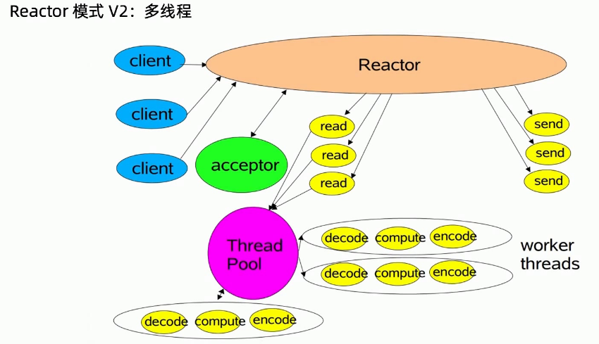

# 030-多线程Reactor反应器模式

[TOC]

## 多线程Reactor反应器的演进

- 首先升级Handler处理器, 既要使用多线程, 又要尽可能地提高效率, 则可以使用线程池
- 其次是升级Reactor反应器, 可以考虑引入多个Selector 选择器, 提升选择大量通道的能力

## 多线程Reactor反应器模式

- 将负责输入输出的IOHandler 处理器的执行, 放入独立的线程池中, 这样业务处理线程与负责服务器监听和IO事件查询的反应器线程相隔离, 避免服务器的连接监听收到阻塞
- 如果服务器为多核CPU, 可以将反应器线程拆分为多个子反应器(SubReactor) 线程, 同时引入多个选择器, 每一个 SubReactor子线程负责一个选择器, 这样就充分释放了系统资源的能力, 也提高了反应器管理大量连接, 提升选择大量通道的能力



- decode / compute /encode 操作都比较耗时, 所有使用线程池进行操作
- 一个线程来进行accetor


## 实践案例

- 引入多个选择器
- 开启多个反应器的处理线程, 一个线程负责执行一个子反应器(SubReactor)

```java
class MultiThreadEchoServerReactor {
    ServerSocketChannel serverSocket;
    AtomicInteger next = new AtomicInteger(0);
    //selectors集合,引入多个selector选择器
    Selector[] selectors = new Selector[2];
    //引入多个子反应器
    SubReactor[] subReactors = null;


    MultiThreadEchoServerReactor() throws IOException {
        //初始化多个selector选择器
        selectors[0] = Selector.open();
        selectors[1] = Selector.open();
        serverSocket = ServerSocketChannel.open();

InetSocketAddress address = new InetSocketAddress(NioDemoConfig.SOCKET_SERVER_IP, NioDemoConfig.SOCKET_SERVER_PORT);
        serverSocket.socket().bind(address);
        //非阻塞
        serverSocket.configureBlocking(false);

        //第一个selector,负责监控新连接事件
        SelectionKey sk = serverSocket.register(selectors[0], SelectionKey.OP_ACCEPT);
        //附加新连接处理handler处理器到SelectionKey（选择键）
        sk.attach(new AcceptorHandler());

        //第一个子反应器，一子反应器负责一个选择器
        SubReactor subReactor1 = new SubReactor(selectors[0]);
        //第二个子反应器，一子反应器负责一个选择器
        SubReactor subReactor2 = new SubReactor(selectors[1]);
        subReactors = new SubReactor[]{subReactor1, subReactor2};
    }

    private void startService() {
        // 一子反应器对应一条线程
        new Thread(subReactors[0]).start();
        new Thread(subReactors[1]).start();
    }

    //反应器
    class SubReactor implements Runnable {
        //每条线程负责一个选择器的查询
        final Selector selector;

        public SubReactor(Selector selector) {
            this.selector = selector;
        }

        public void run() {
            try {
                while (!Thread.interrupted()) {
                    selector.select();
                    Set<SelectionKey> keySet = selector.selectedKeys();
                    Iterator<SelectionKey> it = keySet.iterator();
                    while (it.hasNext()) {
                        //Reactor负责dispatch收到的事件
                        SelectionKey sk = it.next();
                        dispatch(sk);
                    }
                    keySet.clear();
                }
            } catch (IOException ex) {
                ex.printStackTrace();
            }
        }


        void dispatch(SelectionKey sk) {
            Runnable handler = (Runnable) sk.attachment();
            //调用之前attach绑定到选择键的handler处理器对象
            if (handler != null) {
                handler.run();
            }
        }
    }


    // Handler:新连接处理器
    class AcceptorHandler implements Runnable {
        public void run() {
            try {
                SocketChannel channel = serverSocket.accept();
                if (channel != null)
                    new MultiThreadEchoHandler(selectors[next.get()], channel);
            } catch (IOException e) {
                e.printStackTrace();
            }
            if (next.incrementAndGet() == selectors.length) {
                next.set(0);
            }
        }
    }


    public static void main(String[] args) throws IOException {
        MultiThreadEchoServerReactor server =
                new MultiThreadEchoServerReactor();
        server.startService();
    }

}
```

```java
class MultiThreadEchoHandler implements Runnable {
    final SocketChannel channel;
    final SelectionKey sk;
    final ByteBuffer byteBuffer = ByteBuffer.allocate(1024);
    static final int RECIEVING = 0, SENDING = 1;
    int state = RECIEVING;
    //引入线程池
    static ExecutorService pool = Executors.newFixedThreadPool(4);

    MultiThreadEchoHandler(Selector selector, SocketChannel c) throws IOException {
        channel = c;
        c.configureBlocking(false);
        //仅仅取得选择键，后设置感兴趣的IO事件
        sk = channel.register(selector, 0);
        //将本Handler作为sk选择键的附件，方便事件dispatch
        sk.attach(this);
        //向sk选择键注册Read就绪事件
        sk.interestOps(SelectionKey.OP_READ);
        selector.wakeup();
    }

    public void run() {
        //异步任务，在独立的线程池中执行
        pool.execute(new AsyncTask());
    }

    //异步任务，不在Reactor线程中执行
    public synchronized void asyncRun() {
        try {
            if (state == SENDING) {
                //写入通道
                channel.write(byteBuffer);
                //写完后,准备开始从通道读,byteBuffer切换成写模式
                byteBuffer.clear();
                //写完后,注册read就绪事件
                sk.interestOps(SelectionKey.OP_READ);
                //写完后,进入接收的状态
                state = RECIEVING;
            } else if (state == RECIEVING) {
                //从通道读
                int length = 0;
                while ((length = channel.read(byteBuffer)) > 0) {
                    Logger.info(new String(byteBuffer.array(), 0, length));
                }
                //读完后，准备开始写入通道,byteBuffer切换成读模式
                byteBuffer.flip();
                //读完后，注册write就绪事件
                sk.interestOps(SelectionKey.OP_WRITE);
                //读完后,进入发送的状态
                state = SENDING;
            }
            //处理结束了, 这里不能关闭select key，需要重复使用
            //sk.cancel();
        } catch (IOException ex) {
            ex.printStackTrace();
        }
    }

    //异步任务的内部类
    class AsyncTask implements Runnable {
        public void run() {
            MultiThreadEchoHandler.this.asyncRun();
        }
    }
}
```

