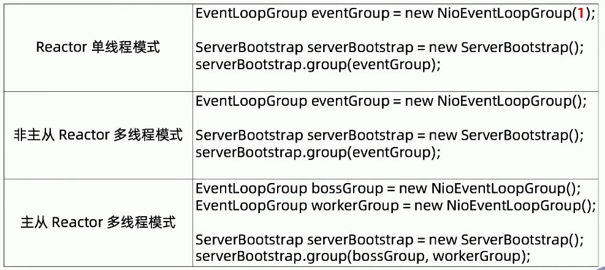

# 040-Netty中的Reactor反应器模式

[TOC]

## Netty中的Reactor反应器模式

netty支持3中模式

-  [020-单线程Reactor反应器模式.md](020-单线程Reactor反应器模式.md) 
-  [030-非主从多线程Reactor反应器模式.md](030-非主从多线程Reactor反应器模式.md) 
-  [031-主从Reactor多线程Reactor反应器模式.md](031-主从Reactor多线程Reactor反应器模式.md) (推荐)

## 如何在Netty中使用Reactor模式

## Netty如何支持Reactor模式?

- 为什么Netty的mainReactor 大多并不能用到一个线程组,只能线程组里面的一个
- Netty给Channel分配NIO event loop的规则是什么
- 通用模式的NIO实现多路复用器是怎么跨平台的

##### Netty如何支持Reactor模式

- 两种Channel 分别绑定到两种EventLoopGroup中去

##### 为什么Netty的mainReactor 大多并不能用到一个线程组,只能线程组里面的一个

对于服务来来说, 只会绑定一个端口, 所以只能绑定到一个线程组

##### Netty给Channel分配NIO event loop的规则是什么

workgroup是怎么选出一个 Channel 

##### 通用模式的NIO实现多路复用器是怎么跨平台的

## 两个线程组

初始化两个线程组， Boss线程组和Worker线程组

- Boss线程组一般只开启一个县城， 除非Netty服务同时监听多个端口
- Worker县城默认是CPU核数的两倍， Boss县城主要监听SocketChannel的OP_ACCEPT事件和客户端的连接（主线程）

## 流程

1. 当Boss线程监听到有SocketChannel连接接入时， 会把SocketChannel包装成NioSocketChannel， 并注册到Work线程的Selector中， 同时监听OP_WRITE和 OP_READ事件
2. 当Work线程监听到某个SocketChannel有就绪的读IO事件时， 会进行以下操作
   1. 将内存池中分配内存， 读取IO数据流
   2. 将读取后的ByteBuf传递给解码器Handler进行解码， 若能解码出完整的请求数据包，就会把请求数据包交给业务逻辑处理Handler
   3. 经过业务逻辑处理的Handler， 在返回相应结果后， 交给编码器进行数据加工
   4. 最终写到缓冲区，并由I/O Worker线程将缓存区的数据输出到网络中并传输给客户端