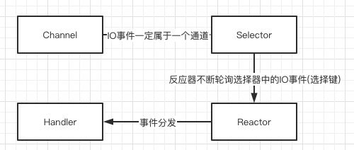

# 030-Reactor模式中IO处理流程

[TOC]

## 回顾Reactor反应器模式中的IO事件的处理流程

1. 通道注册, IO属于通道 (Channel), IO是和通道(对应底层连接而言) 强相关的, 一个IO事件, 一定属于某个通道 , 但是, 如果要查询通道的事件, 首先要将通道注册到选择器, 秩序通道提前注册到Selector 选择器即可, IO 事件会被选择器查询到

2. 查询选择, 在反应器模式中, 一个反应器(或者SubReactor自反应器, 会负责一个线程不断的轮询, 下旬选择器中的IO事件(选择键))

3. 事件分发, 如果查询到IO事件, 则分发给与IO事件有绑定关系的Handler业务处理器

4. 完成真正的IO操作的IO处理器流程, 其中第一步, 第二步 , 其实是Java NIO的功能, 反应器模式仅仅是利用JavaNIO的优势而已

   

