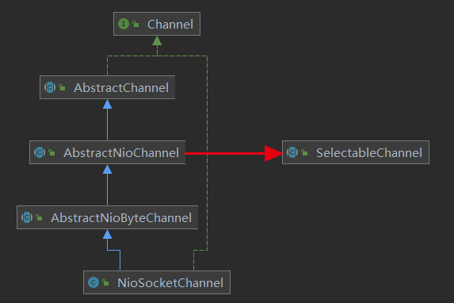

# 020-Netty中的Channel通道组件

[TOC]

## 什么是Channel组件

Netty中不直接使用 Java NIO 的Channel通道组件， 对Channel通道组件进行了自己的封装 （为了支持多种协议）对于常见的链接协议， Netty都实现了自己的通道

## Netty中常见的类型

| 协议 | 类                     | 描述                                   |
| ---- | ---------------------- | -------------------------------------- |
| TCP  | NioSocketChannel       | 异步非阻塞TCP Socket 传输通道          |
| TCP  | NioServerSocketChannel | 异步非阻塞 TCP Socket 服务器端监听通道 |
| TCP  | OioSocketChannel       | 同步非阻塞TCP Socket 传输通道          |
| TCP  | OioServerSocketChannel | 同步非阻塞 TCP Socket服务器端监听通道  |
| UDP  | NioDatagramChannel     | 异步非阻塞的UDP传输通道                |
| UDP  | OioDatagramChannel     | 同步阻塞 UDP 传输通道                  |
| Sctp | NioSctpChannel         | 异步非阻塞Sctp传输通道                 |
| Sctp | NioSctpServerChannel   | 异步非阻塞sctp 服务器端监听通道        |
| Sctp | OioSctpChannel         | 同步阻塞式Sctp传输通道                 |
| Sctp | OioSctpServerChannel   | 同步阻塞式Sctp服务器端监听通道         |

在Netty的NioSocketChannel内部封装了一个 Java NIO 的SelectableChannel成员， 通过这个内部成员， Netty 的 NioSocketChannel 通道上的IO操作， 最终会落地到 Java NIO 的 SelectableChannel底层通道