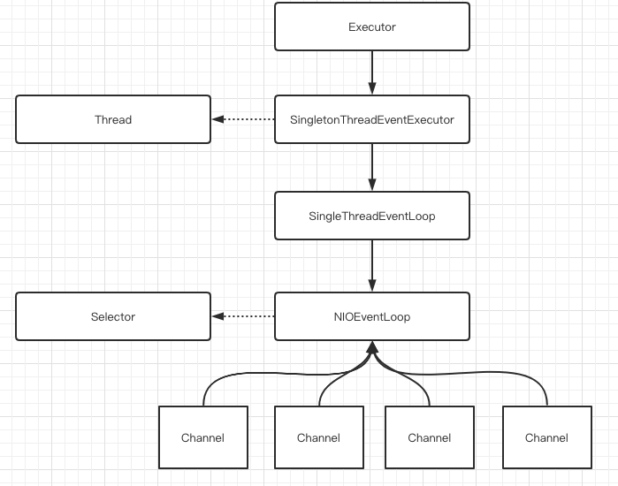

# 010-NioEventLoop

[TOC]

## NioEventLoop

NioEventLoop 类绑定了两个重要的 Java成员属性

- Thread :  一个 NioEventLoop负责轮询多个Channel, 也对应着一个线程轮询多个Channel, 符合 Reactor 模型
- Selector :  一个 NioEventLoop负责一个 Java NIO选择器的使用

