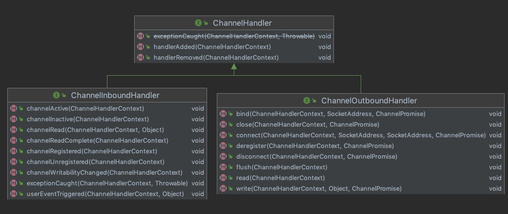

# 010-ChannelInboundHandler通道入站处理器

[TOC]

## 继承结构



```java
public interface ChannelInboundHandler extends ChannelHandler {

     //通道注册完成后, Netty会调用fireChannelRegistered
    void channelRegistered(ChannelHandlerContext ctx) throws Exception;
		//
    void channelUnregistered(ChannelHandlerContext ctx) throws Exception;
		//激活完成之后, Netty会调用 fireChannelActive , 触发激活
    void channelActive(ChannelHandlerContext ctx) throws Exception;
  	//连接断开或者不可用
    void channelInactive(ChannelHandlerContext ctx) throws Exception;
  	// 连接断开或者不可用
    void channelRead(ChannelHandlerContext ctx, Object msg) throws Exception;
  	//完成读取
    void channelReadComplete(ChannelHandlerContext ctx) throws Exception;

    void userEventTriggered(ChannelHandlerContext ctx, Object evt) throws Exception;

    void channelWritabilityChanged(ChannelHandlerContext ctx) throws Exception;
		//发生异常
    @Override
    @SuppressWarnings("deprecation")
    void exceptionCaught(ChannelHandlerContext ctx, Throwable cause) throws Exception;
}
```