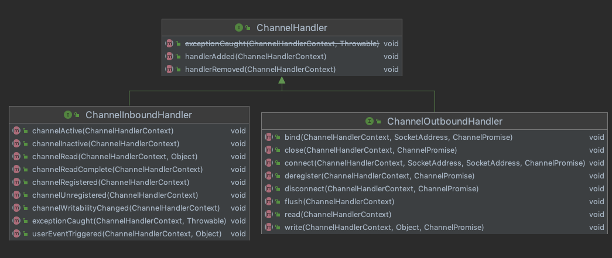

# 020-ChannelOutboundHandler通道出站处理器

[TOC]

## 



```java
public interface ChannelOutboundHandler extends ChannelHandler {
  //监听地址(ip+端口)绑定, 完成底层JavaIo的地址绑定, 如果使用TCP传输协议, 这个方法用于服务器端
    void bind(ChannelHandlerContext ctx, SocketAddress localAddress, ChannelPromise promise) throws Exception;
		//连接服务器, 完成底层Java IO通道的服务端连接操作, 如果受用TCP传输协议, 这个方法用于客户端
    void connect(
            ChannelHandlerContext ctx, SocketAddress remoteAddress,
            SocketAddress localAddress, ChannelPromise promise) throws Exception;
		//断开连接
    void disconnect(ChannelHandlerContext ctx, ChannelPromise promise) throws Exception;
		//关闭连接
    void close(ChannelHandlerContext ctx, ChannelPromise promise) throws Exception;
		//
    void deregister(ChannelHandlerContext ctx, ChannelPromise promise) throws Exception;
    void read(ChannelHandlerContext ctx) throws Exception;
    void write(ChannelHandlerContext ctx, Object msg, ChannelPromise promise) throws Exception;
    void flush(ChannelHandlerContext ctx) throws Exception;
}
```

