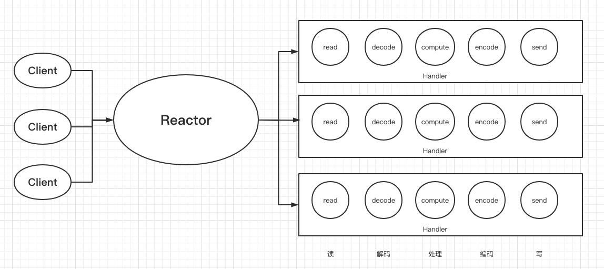

# 040-Netty中的Handler处理器

[TOC]

## NIO中的事件

- 可读 ： SelectKey.OP_READ 该操作对客户端和服务端的`SocketChannel`都有效，当OS的读缓冲区中有数据可读时，该操作就绪。
- 可写 ： SelectKey.OP_WRITE  该操作对客户端和服务端的`SocketChannel`都有效，当OS的写缓冲区中有空闲的空间时(大部分时候都有)，该操作就绪。
- 连接 ： SelectKey.OP_CONNECT 只有客户端`SocketChannel`会注册该操作，当客户端调用`SocketChannel.connect()`时，该操作会就绪。
- 接收 ： SelectKey.OP_ACCEPT 当收到一个客户端的连接请求时，该操作就绪。这是`ServerSocketChannel`上唯一有效的操作。

## Netty中的Handler

EventLoop反应器内部有一个JavaNIO的选择器, 进行事件的分发, 

事件分发的目标是Netty自己的Handler处理器

### Handler的分类

Handler的分类分为两大类

- ChannelInboundHandler  入站处理器
- ChannelOutboudHandler 出站处理器

## 入站流程

当Netty收到入站请求时, 不管是 OP_READ时间的处理, 还是包括 从通道底层触发, 都由Netty通过层层传递, 调用ChannelInboundHandler 处理器进行某个操作

- 在通道中发生了OP_READ事件
- EventLoop查询到了该事件, 分发给ChannelInboundHandler 通道入站处理器, 调用它的入站处理的方法 read
- 在ChannelInboundHandler 通道入站处理器内部的read的方法会从通道中读取数据

## 出站流程

Netty的出栈处理器是应该通过通道出栈处理器到通道的某次IO操作, 

- 在应用程序完成业务处理之后, 可以用过 ChannelOUtboundHandler 通道出栈处理器将处理的结果写入底层通道, 最常用的方法是 write方法

值得注意的是出站包括了 JAVA NIO 的 OP_WRITE 可写事件

