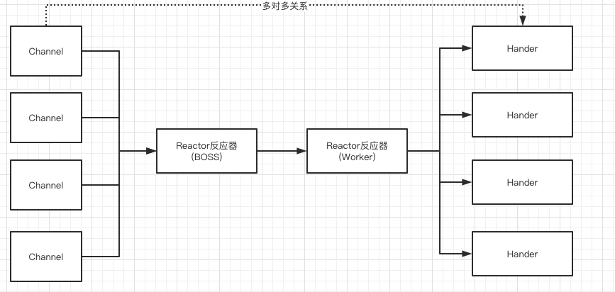
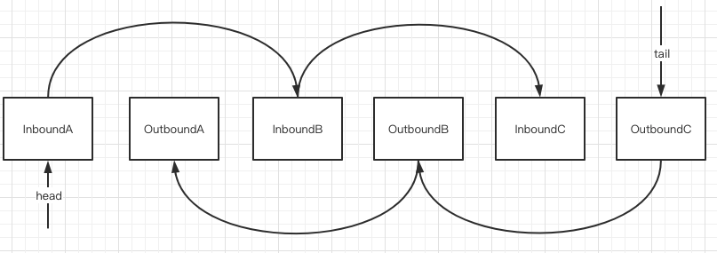

# 050-Netty中的流水线-Pipeline

[TOC]

## Netty中的流水线

Netty反应器模式各个组件的关系

- 反应器或者(SubReactor 子反应器)和通道之间是一对多的关系 : 一个反应器可以查询到很多通道的IO事件
- 通道和Handler 处理器实例之间是多对多关系: 一个通道的IO事件被多个Handler实例处理, 一个Handler处理器实例也能绑定到很多通道, 包括多个通道的IO事件

## Handler与流水线

每一次来自通道的IO事件, , 都会进入一次 ChannelPipeline 的通道流水线

- 如果后面还有其他的Handler入站处理器, 那么IO事件可以交给下一个Handler处理器, 向后流动
- 如果后面没有其他的入站处理器, 这就意味着这个IO事件在此次流水线中的处理结束
- 如果流水线在中间终止了流动, 可以选择不将IO事件交给下一个Handler去处理, 流水线就被终止了

## 流水线是通道的大管家, 为通道管理一大堆Handler小弟

流水线是多例的还是单例的