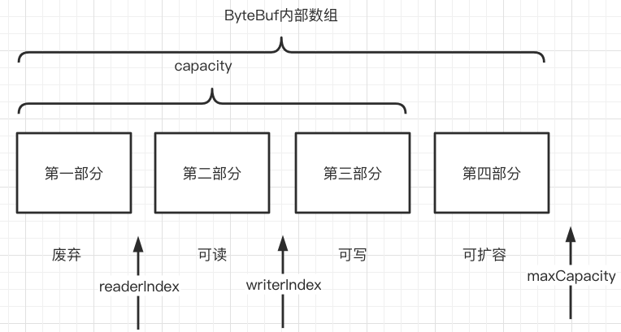
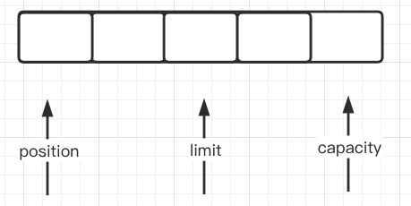

# 020-Netty中的ByteBuf

[TOC]

## ByteBuf的逻辑部分

ByteBuf是一个字节容器, 内部是一个字节数组, 从逻辑上来分, 字节容器内部可以分为四个部分

1. 第一部分是**已用**字节,表示已经使用完的废弃的无效字节
2. 第二部分是**可读**字节,这部分数据是`ByteBuf`保存的有效数据, 从`ByteBuf`中读取的数据都来自这一部分
3. 第三部分是**可写**字节,写入到`ByteBuf`的数据都会写到这一部分中
4. 第四部分是**可扩充**字节, 表示的是该`ByteBuf`最多还可以扩容的大小

## 为什么要这样设计

与JavaNIO的 `ByteBuf`相比, `ByteBuf` 的优势如下

- Pooling 池化技术, 减少了内存复制和GC, 提高效率
- 复合缓冲区类型, 支持零拷贝
- **不需要调用flip()方法区切换读写模式**
- 拓展性好, 例如 StringBuffer
- 可以自定义缓冲区类型
- 读取和写入索引分开
- 方法的链式调用
- 可以进行引用计数, 方便重复使用

