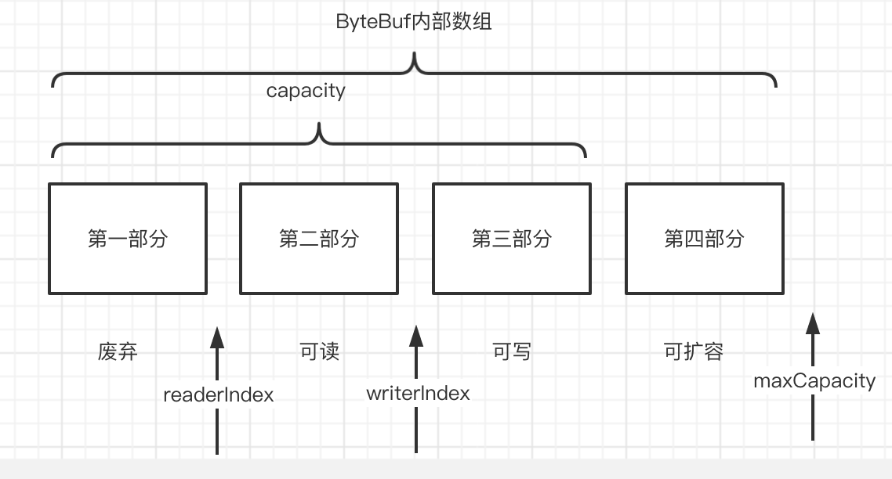

# 020-ByteBuf的逻辑部分

[TOC]

## ByteBuf的逻辑部分

ByteBuf 是一个字节容器， 内部是一个字节数组， 从逻辑上来分， 可以分为四个部分

- ByteBuf内部数组
  - 第一部分 （废弃） ： 第一部分是已读过的字节， 标识已经使用完的废弃的无效字节
  - 第二部分 （可读）： 这部分数据是ByteBuf保存的有效数据， 从ByteBuf中读取的数据都来自这一部分
  - 第三部分 （可写）： 可写字节， 写入到ByteBuf 的数据都会写到这一部分
  - 第四部分 （可扩容）： 可扩容字节， 表示的是该ByteBuf最多还能扩容的大小


## ByteBuf的重要属性

ByteBuf通过三个整形的属性有效地区分可读数据和可写数据， 使得读写之间相互没有冲突， 这三个属性定义在 AbstractByteBuf 抽象中， 分别是

- readerIndex（读指针） ： 读取的起始位置， 与 writerIndex相等时， 不可读
- writerIndex （写指针） ：写入的起始位置，与到 capacity()方法相同时， 不可写
- maxCapacity （最大容量） ： 标识 ByteBuf可以扩容的最大容量， 超过会报错



## API方法

- markReaderIndex ， resetReaderIndex前一个是把当前读指针的位置缓存， 后者是恢复

- markWriterIndex() 与 resetWriterIndex , 前一个是把当前写指针的位置缓存， 后者是恢复

读写操作:

- get()和 set()操作，从给定的索引开始,并且保持索引不变。
- read()和 write()操作，从给定的索引开始，并且会根据已经访问过的字节数对索引进行调整 。
- setBoolean (int , boolean)	设定给定索引处的 Boolean 值
- getBoolean(int)	返回给定索引处的 Boolean 值
- setByte(int index, int value)	设定给定索引处的字节值
- getByte(int)	返回给定索引处的字节
- getUnsignedByte(int )	将给定索引处的无符号字节值作为 short 返回
- setMedium(int index , int value)	设定给定索引处的 24 位的中等 int值
- getMedium(int)	返回给定索引处的 24 位的中等 int 值
- getUnsignedMedium (int)	返回给定索引处的无符号的 24 位的中等 int 值
- setint(int index , int value)	设定给定索引处的 int 值
- getint (int)	返回给定索引处的 int 值
- getUnsignedint(int)	将给定索引处的无符号 int 值作为 long 返回
- setLong(int index, long value)	设定给定索引处的 long 值
- getLong(int)	返回给定索引处的 long 值
- setShort(int index, int value)	设定给定索引处的 short 值
- getShort(int)	返回给定索引处的 short 值
- getUnsignedShort(int)	将给定索引处的无符号 short 值作为 int 返回
- getBytes (int, …)	将该缓冲区中从给定索引开始的数据传送到指定的目的地
- isReadable ()	如果至少有一个字节可供读取，则返回 true
- isWritable ()	如果至少有一个字节可被写入，则返回 true
- readableBytes()	返回可被读取的字节数
- writableBytes()	返回可被写入的字节数
- capacity()	返回 ByteBuf 可容纳的字节数 。在此之后，它会尝试再次扩展直到达到maxCapacity ()
- maxCapacity()	返问 ByteBuf 可以容纳的最大字节数
- hasArray()	如果 ByteBuf 由一个字节数组支撑，则返回 true
- array ()	如果 ByteBuf 由一个字节数组支撑则返问该数组;否则，它将抛出 一个 UnsupportedOperat工
- onException 异常

## 代码实例

```java
    @Test
    public void testWriteRead() {
        ByteBuf buffer = ByteBufAllocator.DEFAULT.buffer();
        print("动作：分配 ByteBuf(9, 100)", buffer);
        buffer.writeBytes(new byte[]{1, 2, 3, 4});
        print("动作：写入4个字节 (1,2,3,4)", buffer);
        Logger.info("start==========:get==========");
        getByteBuf(buffer);
        print("动作：取数据 ByteBuf", buffer);
        Logger.info("start==========:read==========");
        readByteBuf(buffer);
        print("动作：读完 ByteBuf", buffer);
    }
```


```
[main|PrintAttribute.print] |>  after ===========动作：分配 ByteBuf(9, 100)============ 
[main|PrintAttribute.print] |>  1.0 isReadable(): false 
[main|PrintAttribute.print] |>  1.1 readerIndex(): 0 
[main|PrintAttribute.print] |>  1.2 readableBytes(): 0 
[main|PrintAttribute.print] |>  2.0 isWritable(): true 
[main|PrintAttribute.print] |>  2.1 writerIndex(): 0 
[main|PrintAttribute.print] |>  2.2 writableBytes(): 256 
[main|PrintAttribute.print] |>  3.0 capacity(): 256 
[main|PrintAttribute.print] |>  3.1 maxCapacity(): 2147483647 
[main|PrintAttribute.print] |>  3.2 maxWritableBytes(): 2147483647 
[main|PrintAttribute.print] |>  after ===========动作：写入4个字节 (1,2,3,4)============ 
[main|PrintAttribute.print] |>  1.0 isReadable(): true 
[main|PrintAttribute.print] |>  1.1 readerIndex(): 0 
[main|PrintAttribute.print] |>  1.2 readableBytes(): 4 
[main|PrintAttribute.print] |>  2.0 isWritable(): true 
[main|PrintAttribute.print] |>  2.1 writerIndex(): 4 
[main|PrintAttribute.print] |>  2.2 writableBytes(): 252 
[main|PrintAttribute.print] |>  3.0 capacity(): 256 
[main|PrintAttribute.print] |>  3.1 maxCapacity(): 2147483647 
[main|PrintAttribute.print] |>  3.2 maxWritableBytes(): 2147483643 
[main|WriteReadTest.testWriteRead] |>  start==========:get========== 
[main|WriteReadTest.getByteBuf] |>  读取一个字节:1 
[main|WriteReadTest.getByteBuf] |>  读取一个字节:2 
[main|WriteReadTest.getByteBuf] |>  读取一个字节:3 
[main|WriteReadTest.getByteBuf] |>  读取一个字节:4 
[main|PrintAttribute.print] |>  after ===========动作：取数据 ByteBuf============ 
[main|PrintAttribute.print] |>  1.0 isReadable(): true 
[main|PrintAttribute.print] |>  1.1 readerIndex(): 0 
[main|PrintAttribute.print] |>  1.2 readableBytes(): 4 
[main|PrintAttribute.print] |>  2.0 isWritable(): true 
[main|PrintAttribute.print] |>  2.1 writerIndex(): 4 
[main|PrintAttribute.print] |>  2.2 writableBytes(): 252 
[main|PrintAttribute.print] |>  3.0 capacity(): 256 
[main|PrintAttribute.print] |>  3.1 maxCapacity(): 2147483647 
[main|PrintAttribute.print] |>  3.2 maxWritableBytes(): 2147483643 
[main|WriteReadTest.testWriteRead] |>  start==========:read========== 
[main|WriteReadTest.readByteBuf] |>  读取一个字节:1 
[main|WriteReadTest.readByteBuf] |>  读取一个字节:2 
[main|WriteReadTest.readByteBuf] |>  读取一个字节:3 
[main|WriteReadTest.readByteBuf] |>  读取一个字节:4 
[main|PrintAttribute.print] |>  after ===========动作：读完 ByteBuf============ 
[main|PrintAttribute.print] |>  1.0 isReadable(): false 
[main|PrintAttribute.print] |>  1.1 readerIndex(): 4 
[main|PrintAttribute.print] |>  1.2 readableBytes(): 0 
[main|PrintAttribute.print] |>  2.0 isWritable(): true 
[main|PrintAttribute.print] |>  2.1 writerIndex(): 4 
[main|PrintAttribute.print] |>  2.2 writableBytes(): 252 
[main|PrintAttribute.print] |>  3.0 capacity(): 256 
[main|PrintAttribute.print] |>  3.1 maxCapacity(): 2147483647 
[main|PrintAttribute.print] |>  3.2 maxWritableBytes(): 2147483643 
Disconnected from the target VM, address: '127.0.0.1:58821', transport: 'socket'

Process finished with exit code 0

```

