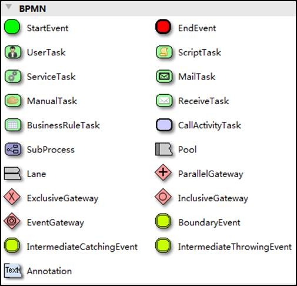

# Activiti7概述

[TOC]

## 2.1 介绍

Alfresco软件在2010年5月17日宣布Activiti业务流程管理（BPM）开源项目的正式启动，其首席架构师由业务流程管理BPM的专家 Tom Baeyens担任，Tom Baeyens就是原来jbpm的架构师，而jbpm是一个非常有名的工作流引擎，当然activiti也是一个工作流引擎。

Activiti是一个工作流引擎， activiti可以将业务系统中复杂的业务流程抽取出来，使用专门的建模语言BPMN2.0进行定义，业务流程按照预先定义的流程进行执行，实现了系统的流程由activiti进行管理，减少业务系统由于流程变更进行系统升级改造的工作量，从而提高系统的健壮性，同时也减少了系统开发维护成本。

官方网站：<https://www.activiti.org/>


经历的版本:


目前版本：Activiti7

### 2.1.1 BPM

BPM（Business Process Management），即业务流程管理，是一种规范化的构造端到端的业务流程，以持续的提高组织业务效率。常见商业管理教育如EMBA、MBA等均将BPM包含在内。

### 2.1.2 BPM软件

BPM软件就是根据企业中业务环境的变化，推进人与人之间、人与系统之间以及系统与系统之间的整合及调整的经营方法与解决方案的IT工具。

通过BPM软件对企业内部及外部的业务流程的整个生命周期进行建模、自动化、管理监控和优化，使企业成本降低，利润得以大幅提升。

BPM软件在企业中应用领域广泛，凡是有业务流程的地方都可以BPM软件进行管理，比如企业人事办公管理、采购流程管理、公文审批流程管理、财务管理等。

### 2.1.3 BPMN

BPMN（Business Process Model AndNotation）- 业务流程模型和符号 是由BPMI（BusinessProcess Management Initiative）开发的一套标准的业务流程建模符号，使用BPMN提供的符号可以创建业务流程。 

2004年5月发布了BPMN1.0规范.BPMI于2005年9月并入OMG（The Object Management Group对象管理组织)组织。OMG于2011年1月发布BPMN2.0的最终版本。

具体发展历史如下: 


BPMN 是目前被各 BPM 厂商广泛接受的 BPM 标准。Activiti 就是使用 BPMN 2.0 进行流程建模、流程执行管理，它包括很多的建模符号，比如：

Event 

用一个圆圈表示，它是流程中运行过程中发生的事情。


活动用圆角矩形表示，一个流程由一个活动或多个活动组成




Bpmn图形其实是通过xml表示业务流程，上边的.bpmn文件使用文本编辑器打开：

```xml
<?xml version="1.0" encoding="UTF-8"?>
<definitions xmlns="http://www.omg.org/spec/BPMN/20100524/MODEL" xmlns:xsi="http://www.w3.org/2001/XMLSchema-instance" xmlns:xsd="http://www.w3.org/2001/XMLSchema" xmlns:activiti="http://activiti.org/bpmn" xmlns:bpmndi="http://www.omg.org/spec/BPMN/20100524/DI" xmlns:omgdc="http://www.omg.org/spec/DD/20100524/DC" xmlns:omgdi="http://www.omg.org/spec/DD/20100524/DI" typeLanguage="http://www.w3.org/2001/XMLSchema" expressionLanguage="http://www.w3.org/1999/XPath" targetNamespace="http://www.activiti.org/test">
  <process id="myProcess" name="My process" isExecutable="true">
    <startEvent id="startevent1" name="Start"></startEvent>
    <userTask id="usertask1" name="创建请假单"></userTask>
    <sequenceFlow id="flow1" sourceRef="startevent1" targetRef="usertask1"></sequenceFlow>
    <userTask id="usertask2" name="部门经理审核"></userTask>
    <sequenceFlow id="flow2" sourceRef="usertask1" targetRef="usertask2"></sequenceFlow>
    <userTask id="usertask3" name="人事复核"></userTask>
    <sequenceFlow id="flow3" sourceRef="usertask2" targetRef="usertask3"></sequenceFlow>
    <endEvent id="endevent1" name="End"></endEvent>
    <sequenceFlow id="flow4" sourceRef="usertask3" targetRef="endevent1"></sequenceFlow>
  </process>
  <bpmndi:BPMNDiagram id="BPMNDiagram_myProcess">
    <bpmndi:BPMNPlane bpmnElement="myProcess" id="BPMNPlane_myProcess">
      <bpmndi:BPMNShape bpmnElement="startevent1" id="BPMNShape_startevent1">
        <omgdc:Bounds height="35.0" width="35.0" x="130.0" y="160.0"></omgdc:Bounds>
      </bpmndi:BPMNShape>
      <bpmndi:BPMNShape bpmnElement="usertask1" id="BPMNShape_usertask1">
        <omgdc:Bounds height="55.0" width="105.0" x="210.0" y="150.0"></omgdc:Bounds>
      </bpmndi:BPMNShape>
      <bpmndi:BPMNShape bpmnElement="usertask2" id="BPMNShape_usertask2">
        <omgdc:Bounds height="55.0" width="105.0" x="360.0" y="150.0"></omgdc:Bounds>
      </bpmndi:BPMNShape>
      <bpmndi:BPMNShape bpmnElement="usertask3" id="BPMNShape_usertask3">
        <omgdc:Bounds height="55.0" width="105.0" x="510.0" y="150.0"></omgdc:Bounds>
      </bpmndi:BPMNShape>
      <bpmndi:BPMNShape bpmnElement="endevent1" id="BPMNShape_endevent1">
        <omgdc:Bounds height="35.0" width="35.0" x="660.0" y="160.0"></omgdc:Bounds>
      </bpmndi:BPMNShape>
      <bpmndi:BPMNEdge bpmnElement="flow1" id="BPMNEdge_flow1">
        <omgdi:waypoint x="165.0" y="177.0"></omgdi:waypoint>
        <omgdi:waypoint x="210.0" y="177.0"></omgdi:waypoint>
      </bpmndi:BPMNEdge>
      <bpmndi:BPMNEdge bpmnElement="flow2" id="BPMNEdge_flow2">
        <omgdi:waypoint x="315.0" y="177.0"></omgdi:waypoint>
        <omgdi:waypoint x="360.0" y="177.0"></omgdi:waypoint>
      </bpmndi:BPMNEdge>
      <bpmndi:BPMNEdge bpmnElement="flow3" id="BPMNEdge_flow3">
        <omgdi:waypoint x="465.0" y="177.0"></omgdi:waypoint>
        <omgdi:waypoint x="510.0" y="177.0"></omgdi:waypoint>
      </bpmndi:BPMNEdge>
      <bpmndi:BPMNEdge bpmnElement="flow4" id="BPMNEdge_flow4">
        <omgdi:waypoint x="615.0" y="177.0"></omgdi:waypoint>
        <omgdi:waypoint x="660.0" y="177.0"></omgdi:waypoint>
      </bpmndi:BPMNEdge>
    </bpmndi:BPMNPlane>
  </bpmndi:BPMNDiagram>
</definitions>

```

## 2.2 使用步骤

### 部署activiti

Activiti是一个工作流引擎（其实就是一堆jar包API），业务系统访问(操作)activiti的接口，就可以方便的操作流程相关数据，这样就可以把工作流环境与业务系统的环境集成在一起。

### 流程定义

使用activiti流程建模工具(activity-designer)定义业务流程(.bpmn文件) 。

.bpmn文件就是业务流程定义文件，通过xml定义业务流程。

###   流程定义部署

activiti部署业务流程定义（.bpmn文件）。

使用activiti提供的api把流程定义内容存储起来，在Activiti执行过程中可以查询定义的内容

Activiti执行把流程定义内容存储在数据库中

### 启动一个流程实例

流程实例也叫：ProcessInstance

启动一个流程实例表示开始一次业务流程的运行。

在员工请假流程定义部署完成后，如果张三要请假就可以启动一个流程实例，如果李四要请假也启动一个流程实例，两个流程的执行互相不影响。

### 用户查询待办任务(Task)

因为现在系统的业务流程已经交给activiti管理，通过activiti就可以查询当前流程执行到哪了，当前用户需要办理什么任务了，这些activiti帮我们管理了，而不需要开发人员自己编写在sql语句查询。

### 用户办理任务

用户查询待办任务后，就可以办理某个任务，如果这个任务办理完成还需要其它用户办理，比如采购单创建后由部门经理审核，这个过程也是由activiti帮我们完成了。

### 流程结束

当任务办理完成没有下一个任务结点了，这个流程实例就完成了。