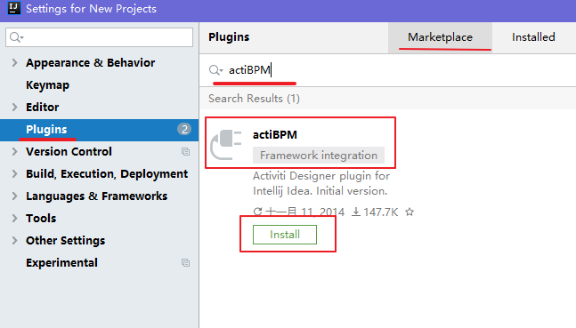
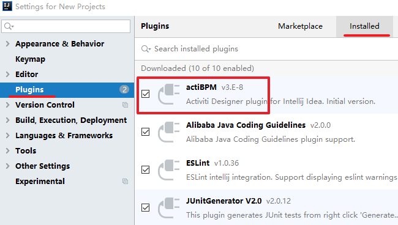
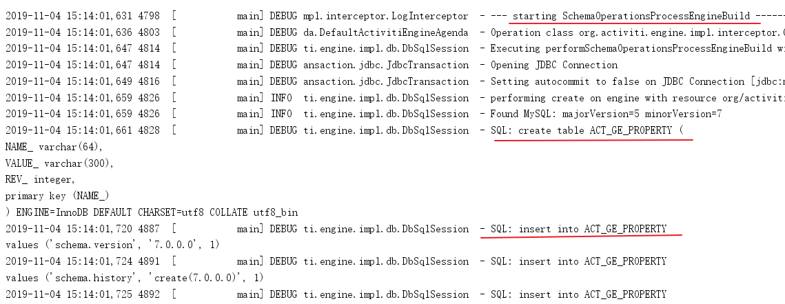
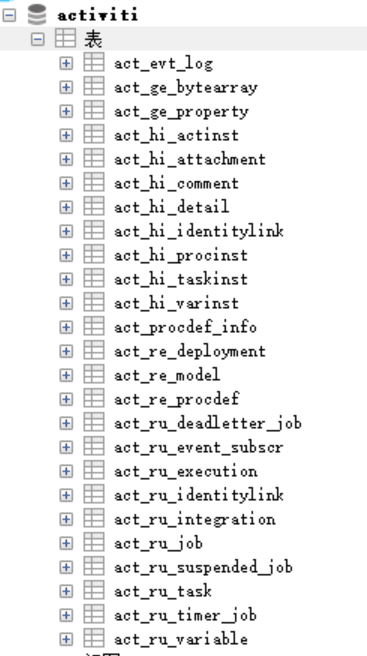

# 三、Activiti环境

## 3.1 开发环境

Jdk1.8或以上版本

Mysql 5及以上的版本

Tomcat8.5

IDEA

**注意：activiti的流程定义工具插件可以安装在IDEA下，也可以安装在Eclipse工具下**

## 3.2 Activiti环境

我们使用：Activiti7.0.0.Beta1  默认支持spring5

### 3.2.1 下载activiti7 

Activiti下载地址：<http://activiti.org/download.html> ，Maven的依赖如下：

 ```xml
<dependencyManagement>
    <dependencies>
        <dependency>
            <groupId>org.activiti</groupId>
            <artifactId>activiti-dependencies</artifactId>
            <version>7.0.0.Beta1</version>
            <scope>import</scope>
            <type>pom</type>
        </dependency>
    </dependencies>
</dependencyManagement>
 ```

**1)**      **Database**：

activiti运行需要有数据库的支持，支持的数据库有：h2, mysql, oracle, postgres, mssql, db2。

###  3.2.2 流程设计器IDEA下安装

在IDEA的File菜单中找到子菜单”Settings”,后面我们再选择左侧的“plugins”菜单，如下图所示：



此时我们就可以搜索到actiBPM插件，它就是Activiti Designer的IDEA版本，我们点击Install安装。

安装好后，页面如下：


提示需要重启idea，点击重启。

重启完成后，再次打开Settings 下的 Plugins（插件列表），点击右侧的Installed（已安装的插件），在列表中看到actiBPM，就说明已经安装成功了，如下图所示：



后面的课程里，我们会使用这个流程设计器进行Activiti的流程设计。

## 3.3 Activiti的数据库支持

Activiti 在运行时需要数据库的支持，使用25张表，把流程定义节点内容读取到数据库表中，以供后续使用。

### 3.3.1 Activiti 支持的数据库

activiti  支持的数据库和版本如下：

| 数据库类型 | 最低版本               | JDBC连接示例                                            | 说明                               |
| ---------- | ---------------------- | ------------------------------------------------------- | ---------------------------------- |
| h2         | 1.3.168                | jdbc:h2:tcp://localhost/activiti                        | 默认配置的数据库                   |
| mysql      | 5.1.21                 | jdbc:mysql://localhost:3306/activiti?autoReconnect=true | 使用 mysql-connector-java 驱动测试 |
| oracle     | 11.2.0.1.0             | jdbc:oracle:thin:@localhost:1521:xe                     |                                    |
| postgres   | 8.1                    | jdbc:postgresql://localhost:5432/activiti               |                                    |
| db2        | DB2 10.1 using db2jcc4 | jdbc:db2://localhost:50000/activiti                     |                                    |
| mssql      | 2008 using sqljdbc4    | jdbc:sqlserver://localhost:1433/activiti                |                                    |

### 3.3.2 在MySQL生成表

#### 3.3.2.1 创建数据库

创建  mysql  数据库  activiti （名字任意）：

CREATE DATABASE activiti DEFAULT CHARACTER SET utf8;

#### 3.3.2.2 使用java代码生成表

##### 1） 创建 java 工程

使用idea 创建 java 的maven工程，取名：activiti01。

##### 2） 加入 maven 依赖的坐标（jar 包）

首先需要在 java 工程中加入 ProcessEngine 所需要的 jar 包，包括：

1) activiti-engine-7.0.0.beta1.jar
2) activiti 依赖的 jar 包： mybatis、 alf4j、 log4j 等

3) activiti 依赖的 spring 包

4) mysql数据库驱动

5) 第三方数据连接池 dbcp
6) 单元测试 Junit-4.12.jar

我们使用 maven 来实现项目的构建，所以应当导入这些 jar 所对应的坐标到 pom.xml 文件中。

完整的依赖内容如下：

```xml
<properties>
    <slf4j.version>1.6.6</slf4j.version>
    <log4j.version>1.2.12</log4j.version>
    <activiti.version>7.0.0.Beta1</activiti.version>
</properties>
<dependencies>
    <dependency>
        <groupId>org.activiti</groupId>
        <artifactId>activiti-engine</artifactId>
        <version>${activiti.version}</version>
    </dependency>
    <dependency>
        <groupId>org.activiti</groupId>
        <artifactId>activiti-spring</artifactId>
        <version>${activiti.version}</version>
    </dependency>
    <!-- bpmn 模型处理 -->
    <dependency>
        <groupId>org.activiti</groupId>
        <artifactId>activiti-bpmn-model</artifactId>
        <version>${activiti.version}</version>
    </dependency>
    <!-- bpmn 转换 -->
    <dependency>
        <groupId>org.activiti</groupId>
        <artifactId>activiti-bpmn-converter</artifactId>
        <version>${activiti.version}</version>
    </dependency>
    <!-- bpmn json数据转换 -->
    <dependency>
        <groupId>org.activiti</groupId>
        <artifactId>activiti-json-converter</artifactId>
        <version>${activiti.version}</version>
    </dependency>
    <!-- bpmn 布局 -->
    <dependency>
        <groupId>org.activiti</groupId>
        <artifactId>activiti-bpmn-layout</artifactId>
        <version>${activiti.version}</version>
    </dependency>
    <!-- activiti 云支持 -->
    <dependency>
        <groupId>org.activiti.cloud</groupId>
        <artifactId>activiti-cloud-services-api</artifactId>
        <version>${activiti.version}</version>
    </dependency>
    <!-- mysql驱动 -->
    <dependency>
        <groupId>mysql</groupId>
        <artifactId>mysql-connector-java</artifactId>
        <version>5.1.40</version>
    </dependency>
    <!-- mybatis -->
    <dependency>
        <groupId>org.mybatis</groupId>
        <artifactId>mybatis</artifactId>
        <version>3.4.5</version>
    </dependency>
    <!-- 链接池 -->
    <dependency>
        <groupId>commons-dbcp</groupId>
        <artifactId>commons-dbcp</artifactId>
        <version>1.4</version>
    </dependency>
    <dependency>
        <groupId>junit</groupId>
        <artifactId>junit</artifactId>
        <version>4.12</version>
    </dependency>
    <!-- log start -->
    <dependency>
        <groupId>log4j</groupId>
        <artifactId>log4j</artifactId>
        <version>${log4j.version}</version>
    </dependency>
    <dependency>
        <groupId>org.slf4j</groupId>
        <artifactId>slf4j-api</artifactId>
        <version>${slf4j.version}</version>
    </dependency>
    <dependency>
        <groupId>org.slf4j</groupId>
        <artifactId>slf4j-log4j12</artifactId>
        <version>${slf4j.version}</version>
    </dependency>
</dependencies>
```

##### 3） 添加log4j日志配置

我们使用log4j日志包，可以对日志进行配置

在resources 下创建log4j.properties

```properties
# Set root category priority to INFO and its only appender to CONSOLE.
#log4j.rootCategory=INFO, CONSOLE debug info warn error fatal
log4j.rootCategory=debug, CONSOLE, LOGFILE
# Set the enterprise logger category to FATAL and its only appender to CONSOLE.
log4j.logger.org.apache.axis.enterprise=FATAL, CONSOLE
# CONSOLE is set to be a ConsoleAppender using a PatternLayout.
log4j.appender.CONSOLE=org.apache.log4j.ConsoleAppender
log4j.appender.CONSOLE.layout=org.apache.log4j.PatternLayout
log4j.appender.CONSOLE.layout.ConversionPattern=%d{ISO8601} %-6r[%15.15t] %-5p %30.30c %x - %m\n
# LOGFILE is set to be a File appender using a PatternLayout.
log4j.appender.LOGFILE=org.apache.log4j.FileAppender
log4j.appender.LOGFILE.File=f:\act\activiti.log
log4j.appender.LOGFILE.Append=true
log4j.appender.LOGFILE.layout=org.apache.log4j.PatternLayout
log4j.appender.LOGFILE.layout.ConversionPattern=%d{ISO8601} %-6r[%15.15t] %-5p %30.30c %x - %m\n
```

##### 4） 添加activiti配置文件

我们使用activiti提供的默认方式来创建mysql的表。

默认方式的要求是在 resources 下创建 activiti.cfg.xml 文件，注意：默认方式目录和文件名不能修改，因为activiti的源码中已经设置，到固定的目录读取固定文件名的文件。

```xml
<?xml version="1.0" encoding="UTF-8"?>
<beans xmlns="http://www.springframework.org/schema/beans"
xmlns:xsi="http://www.w3.org/2001/XMLSchema-instance"
xmlns:context="http://www.springframework.org/schema/context"
xmlns:tx="http://www.springframework.org/schema/tx"
xsi:schemaLocation="http://www.springframework.org/schema/beans
                    http://www.springframework.org/schema/beans/spring-beans.xsd
http://www.springframework.org/schema/contex
http://www.springframework.org/schema/context/spring-context.xsd
http://www.springframework.org/schema/tx
http://www.springframework.org/schema/tx/spring-tx.xsd">
</beans>
```

##### 5） 在 activiti.cfg.xml 中进行配置

默认方式要在在activiti.cfg.xml中bean的名字叫processEngineConfiguration，名字不可修改

在这里有2中配置方式：一种是单独配置数据源，一种是不单独配置数据源

######  1、直接配置processEngineConfiguration 

processEngineConfiguration 用来创建 ProcessEngine，在创建 ProcessEngine 时会执行数据库的操作。 

```xml
<?xml version="1.0" encoding="UTF-8"?>
<beans xmlns="http://www.springframework.org/schema/beans"
       xmlns:xsi="http://www.w3.org/2001/XMLSchema-instance"
       xmlns:context="http://www.springframework.org/schema/context"
       xmlns:tx="http://www.springframework.org/schema/tx"
       xsi:schemaLocation="http://www.springframework.org/schema/beans
                    http://www.springframework.org/schema/beans/spring-beans.xsd
http://www.springframework.org/schema/contex
http://www.springframework.org/schema/context/spring-context.xsd
http://www.springframework.org/schema/tx
http://www.springframework.org/schema/tx/spring-tx.xsd">
    <!-- 默认id对应的值 为processEngineConfiguration -->
    <!-- processEngine Activiti的流程引擎 -->
    <bean id="processEngineConfiguration"
          class="org.activiti.engine.impl.cfg.StandaloneProcessEngineConfiguration">
        <property name="jdbcDriver" value="com.mysql.jdbc.Driver"/>
        <property name="jdbcUrl" value="jdbc:mysql:///activiti"/>
        <property name="jdbcUsername" value="root"/>
        <property name="jdbcPassword" value="123456"/>
        <!-- activiti数据库表处理策略 -->
        <property name="databaseSchemaUpdate" value="true"/>
    </bean>
</beans>
```

###### 2、配置数据源后，在processEngineConfiguration 引用

首先配置数据源

```xml
<?xml version="1.0" encoding="UTF-8"?>
<beans xmlns="http://www.springframework.org/schema/beans"
       xmlns:xsi="http://www.w3.org/2001/XMLSchema-instance"
       xmlns:context="http://www.springframework.org/schema/context"
       xmlns:tx="http://www.springframework.org/schema/tx"
       xsi:schemaLocation="http://www.springframework.org/schema/beans
                    http://www.springframework.org/schema/beans/spring-beans.xsd
http://www.springframework.org/schema/contex
http://www.springframework.org/schema/context/spring-context.xsd
http://www.springframework.org/schema/tx
http://www.springframework.org/schema/tx/spring-tx.xsd">

    <!-- 这里可以使用 链接池 dbcp-->
    <bean id="dataSource" class="org.apache.commons.dbcp.BasicDataSource">
        <property name="driverClassName" value="com.mysql.jdbc.Driver" />
        <property name="url" value="jdbc:mysql:///activiti" />
        <property name="username" value="root" />
        <property name="password" value="123456" />
        <property name="maxActive" value="3" />
        <property name="maxIdle" value="1" />
    </bean>

    <bean id="processEngineConfiguration"
          class="org.activiti.engine.impl.cfg.StandaloneProcessEngineConfiguration">
        <!-- 引用数据源 上面已经设置好了-->
        <property name="dataSource" ref="dataSource" />
        <!-- activiti数据库表处理策略 -->
        <property name="databaseSchemaUpdate" value="true"/>
    </bean>
</beans>
```

##### 6） java类编写程序生成表

创建一个测试类，调用activiti的工具类，生成acitivti需要的数据库表。

直接使用activiti提供的工具类ProcessEngines，会默认读取classpath下的activiti.cfg.xml文件，读取其中的数据库配置，创建 ProcessEngine，在创建ProcessEngine 时会自动创建表。 

代码如下：

```java
package com.itheima.activiti01.test;

import org.activiti.engine.ProcessEngine;
import org.activiti.engine.ProcessEngineConfiguration;
import org.junit.Test;

public class TestDemo {
    /**
     * 生成 activiti的数据库表
     */
    @Test
    public void testCreateDbTable() {
        //使用classpath下的activiti.cfg.xml中的配置创建processEngine
		ProcessEngine processEngine = ProcessEngines.getDefaultProcessEngine();
		System.out.println(processEngine);
    }
}

```

说明：
1、运行以上程序段即可完成 activiti 表创建，通过改变 activiti.cfg.xml 中databaseSchemaUpdate 参数的值执行不同的数据表处理策略。
2 、 上 边 的 方法 getDefaultProcessEngine方法在执行时，从activiti.cfg.xml 中找固定的名称 processEngineConfiguration 。

在测试程序执行过程中，idea的控制台会输出日志，说明程序正在创建数据表，类似如下,注意红线内容：




执行完成后我们查看数据库， 创建了 25 张表，结果如下： 




到这，我们就完成activiti运行需要的数据库和表的创建。

## 3.4 表结构介绍

### 3.4.1 表的命名规则和作用

看到刚才创建的表，我们发现Activiti 的表都以   ACT_   开头。 

第二部分是表示表的用途的两个字母标识。 用途也和服务的 API 对应。
**ACT_RE** ：'RE'表示 repository。 这个前缀的表包含了流程定义和流程静态资源 （图片，规则，等等）。
**ACT_RU**：'RU'表示 runtime。 这些运行时的表，包含流程实例，任务，变量，异步任务，等运行中的数据。 Activiti 只在流程实例执行过程中保存这些数据， 在流程结束时就会删除这些记录。 这样运行时表可以一直很小速度很快。
**ACT_HI**：'HI'表示 history。 这些表包含历史数据，比如历史流程实例， 变量，任务等等。
 **ACT_GE** ： GE 表示 general。 通用数据， 用于不同场景下 

### 3.4.2 Activiti数据表介绍

| **表分类**   | **表名**              | **解释**                                           |
| ------------ | --------------------- | -------------------------------------------------- |
| 一般数据     |                       |                                                    |
|              | [ACT_GE_BYTEARRAY]    | 通用的流程定义和流程资源                           |
|              | [ACT_GE_PROPERTY]     | 系统相关属性                                       |
| 流程历史记录 |                       |                                                    |
|              | [ACT_HI_ACTINST]      | 历史的流程实例                                     |
|              | [ACT_HI_ATTACHMENT]   | 历史的流程附件                                     |
|              | [ACT_HI_COMMENT]      | 历史的说明性信息                                   |
|              | [ACT_HI_DETAIL]       | 历史的流程运行中的细节信息                         |
|              | [ACT_HI_IDENTITYLINK] | 历史的流程运行过程中用户关系                       |
|              | [ACT_HI_PROCINST]     | 历史的流程实例                                     |
|              | [ACT_HI_TASKINST]     | 历史的任务实例                                     |
|              | [ACT_HI_VARINST]      | 历史的流程运行中的变量信息                         |
| 流程定义表   |                       |                                                    |
|              | [ACT_RE_DEPLOYMENT]   | 部署单元信息                                       |
|              | [ACT_RE_MODEL]        | 模型信息                                           |
|              | [ACT_RE_PROCDEF]      | 已部署的流程定义                                   |
| 运行实例表   |                       |                                                    |
|              | [ACT_RU_EVENT_SUBSCR] | 运行时事件                                         |
|              | [ACT_RU_EXECUTION]    | 运行时流程执行实例                                 |
|              | [ACT_RU_IDENTITYLINK] | 运行时用户关系信息，存储任务节点与参与者的相关信息 |
|              | [ACT_RU_JOB]          | 运行时作业                                         |
|              | [ACT_RU_TASK]         | 运行时任务                                         |
|              | [ACT_RU_VARIABLE]     | 运行时变量表                                       |

 