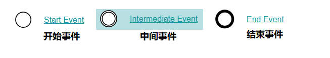
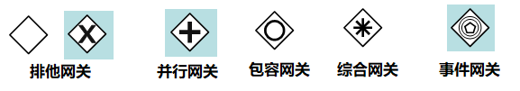

# 050-Activiti入门

[TOC]

在本章内容中，我们来创建一个Activiti工作流，并启动这个流程。

创建Activiti工作流主要包含以下几步：

1、定义流程，按照BPMN的规范，使用流程定义工具，用**流程符号**把整个流程描述出来

2、部署流程，把画好的流程定义文件，加载到数据库中，生成表的数据

3、启动流程，使用java代码来操作数据库表中的内容

## 5.1 流程符号

BPMN 2.0是业务流程建模符号2.0的缩写。

它由Business Process Management Initiative这个非营利协会创建并不断发展。作为一种标识，BPMN 2.0是使用一些**符号**来明确业务流程设计流程图的一整套符号规范，它能增进业务建模时的沟通效率。

目前BPMN2.0是最新的版本，它用于在BPM上下文中进行布局和可视化的沟通。

接下来我们先来了解在流程设计中常见的 符号。

BPMN2.0的**基本符号**主要包含：

### 事件 Event

### 活动 Activity

活动是工作或任务的一个通用术语。一个活动可以是一个任务，还可以是一个当前流程的子处理流程； 其次，你还可以为活动指定不同的类型。常见活动如下：

### 网关 GateWay

网关用来处理决策，有几种常用网关需要了解：

#### 排他网关 (x) 

——只有一条路径会被选择。流程执行到该网关时，按照输出流的顺序逐个计算，当条件的计算结果为true时，继续执行当前网关的输出流；

-  如果多条线路计算结果都是 true，则会执行第一个值为 true 的线路。
- 如果所有网关计算结果没有true，则引擎会抛出异常。
-  排他网关需要和条件顺序流结合使用，default 属性指定默认顺序流，当所有的条件不满足时会执行默认顺序流。

#### 并行网关 (+) 

——所有路径会被同时选择

- 拆分 —— 并行执行所有输出顺序流，为每一条顺序流创建一个并行执行线路。
- 合并 —— 所有从并行网关拆分并执行完成的线路均在此等候，直到所有的线路都执行完成才继续向下执行。

#### 包容网关 (+) 

—— 可以同时执行多条线路，也可以在网关上设置条件

​    拆分 —— 计算每条线路上的表达式，当表达式计算结果为true时，创建一个并行线路并继续执行

​    合并 —— 所有从并行网关拆分并执行完成的线路均在此等候，直到所有的线路都执行完成才继续向下执行。

#### 事件网关 (+) 

—— 专门为中间捕获事件设置的，允许设置多个输出流指向多个不同的中间捕获事件。当流程执行到事件网关后，流程处于等待状态，需要等待抛出事件才能将等待状态转换为活动状态。

### 流向 Flow

流是连接两个流程节点的连线。常见的流向包含以下几种：

