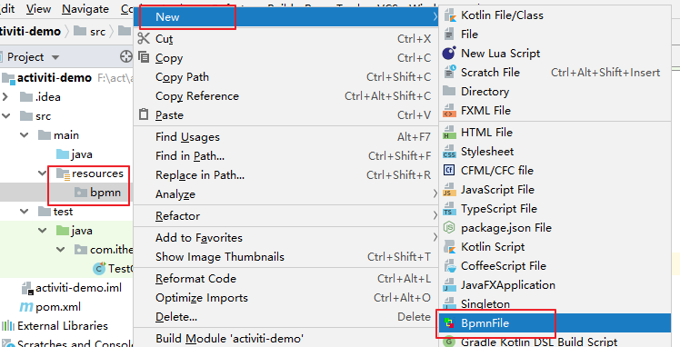
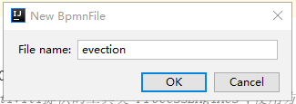
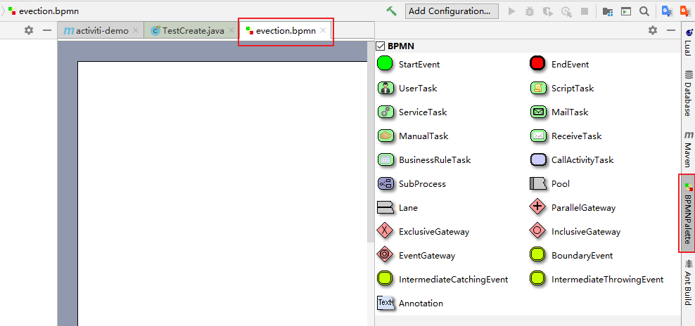
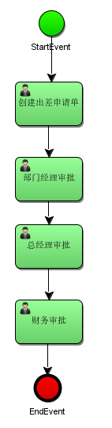
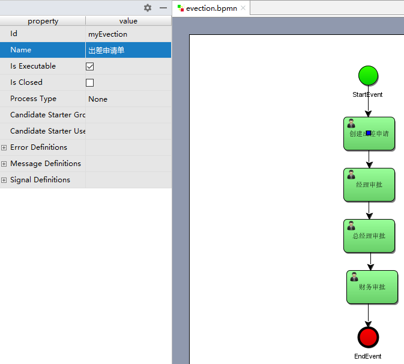
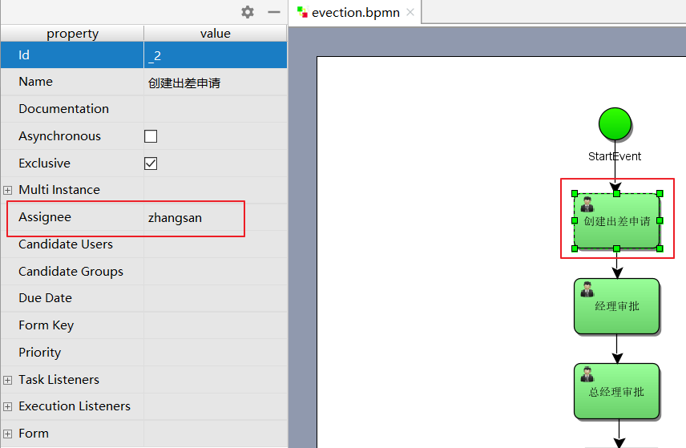

# 060-流程设计器使用

[TOC]

### Activiti-Designer使用

#### Palette（画板）

在idea中安装插件即可使用，画板中包括以下结点：

- Connection—连接

- Event---事件

- Task---任务

- Gateway---网关

- Container—容器

- Boundary event—边界事件

- Intermediate event- -中间事件

流程图设计完毕保存生成.bpmn文件

#### 新建流程(IDEA工具)

首先选中存放图形的目录(选择resources下的bpmn目录)，点击菜单：New  -> BpmnFile，如图：

弹出如下图所示框，输入evection 表示 出差审批流程：

起完名字evection后（默认扩展名为bpmn），就可以看到流程设计页面，如图所示：

左侧区域是绘图区，右侧区域是palette画板区域

鼠标先点击画板的元素即可在左侧绘图

### 绘制流程

使用滑板来绘制流程，通过从右侧把图标拖拽到左侧的画板，最终效果如下：

### 指定流程定义Key

流程定义key即流程定义的标识，通过properties视图查看流程的key

### 指定任务负责人

在properties视图指定每个任务结点的负责人，如：填写出差申请的负责人为 zhangsan

- 经理审批负责人为 jerry

- 总经理审批负责人为 jack

- 财务审批负责人为 rose