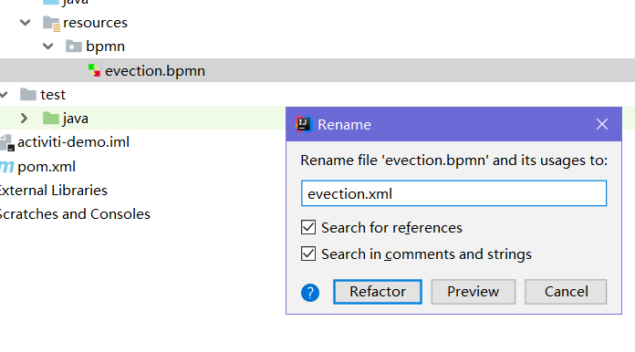
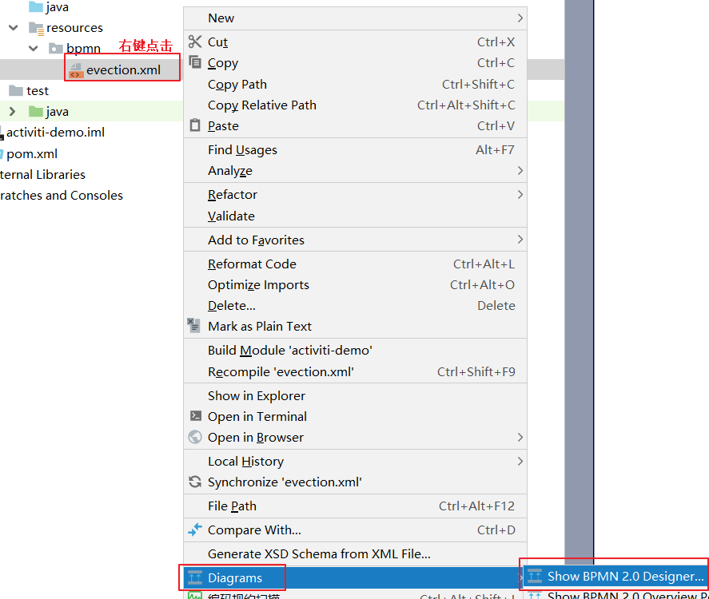
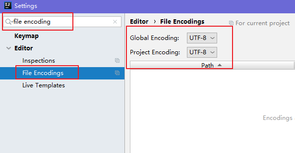
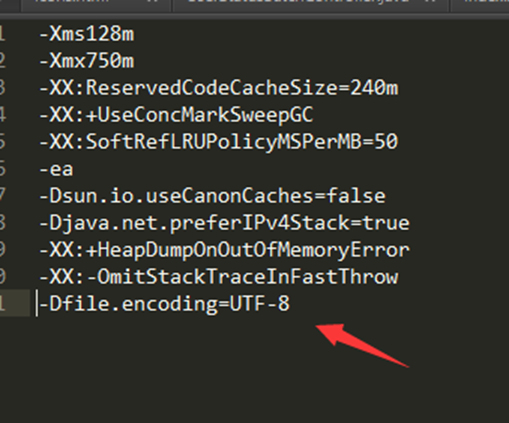
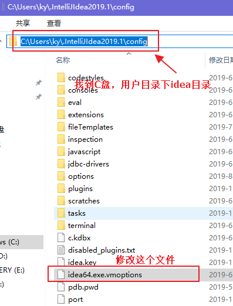
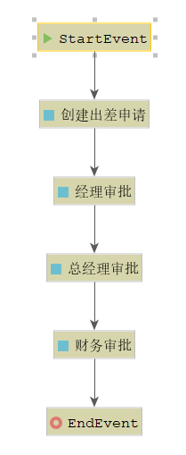
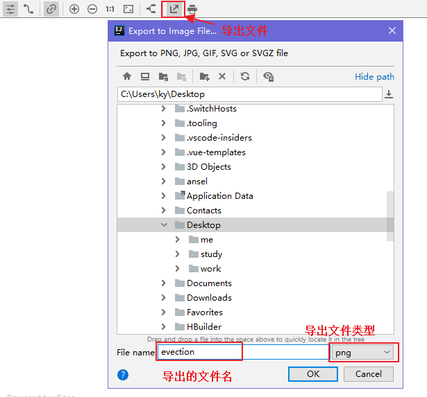

# 060-流程操作

## 6.1 流程定义

### 概述

流程定义是线下按照bpmn2.0标准去描述 业务流程，通常使用idea中的插件对业务流程进行建模。

使用idea下的designer设计器绘制流程，并会生成两个文件：.bpmn和.png

###  .bpmn文件

使用activiti-desinger设计业务流程，会生成.bpmn文件，上面我们已经创建好了bpmn文件

BPMN 2.0根节点是definitions节点。 这个元素中，可以定义多个流程定义（不过我们建议每个文件只包含一个流程定义， 可以简化开发过程中的维护难度）。 注意，definitions元素 最少也要包含xmlns 和 targetNamespace的声明。 targetNamespace可以是任意值，它用来对流程实例进行分类。

流程定义部分：定义了流程每个结点的描述及结点之间的流程流转。

流程布局定义：定义流程每个结点在流程图上的位置坐标等信息。

### 生成.png图片文件

IDEA工具中的操作方式

#### 1、修改文件后缀为xml

首先将evection.bpmn文件改名为evection.xml，如下图：

evection.xml修改前的bpmn文件，效果如下：

#### 2、使用designer设计器打开.xml文件

在evection.xml文件上面，点右键并选择Diagrams菜单，再选择Show BPMN2.0 Designer…

#### 3、查看打开的文件

打开后，却出现乱码，如图：

#### 4、解决中文乱码

1、打开Settings，找到File Encodings，把encoding的选项都选择UTF-8

2、打开IDEA安装路径，找到如下的安装目录

根据自己所安装的版本来决定，我使用的是64位的idea，所以在idea64.exe.vmoptions文件的最后一行追加一条命令： -Dfile.encoding=UTF-8 

如下所示：

一定注意，不要有空格，否则重启IDEA时会打不开，然后 重启IDEA。

如果以上方法已经做完，还出现乱码，就再修改一个文件，并在文件的末尾添加： -Dfile.encoding=UTF-8，然后重启idea，如图：

最后重新在evection.xml文件上面，点右键并选择Diagrams菜单，再选择Show BPMN2.0 Designer…，看到生成图片，如图：

到此，解决乱码问题

#### 5、导出为图片文件

点击Export To File的小图标，打开如下窗口，注意填写文件名及扩展名，选择好保存图片的位置：

然后，我们把png文件拷贝到resources下的bpmn目录，并且把evection.xml改名为evection.bpmn。

