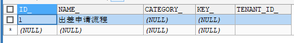
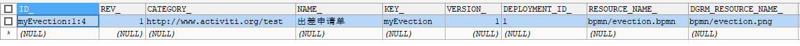
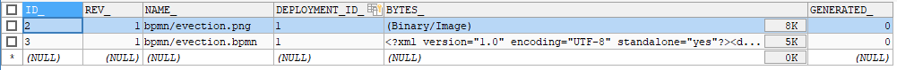

# 6.2 流程定义部署

[TOC]

### 概述

将上面在设计器中定义的流程部署到activiti数据库中，就是流程定义部署。

通过调用activiti的api将流程定义的bpmn和png两个文件一个一个添加部署到activiti中，也可以将两个文件打成zip包进行部署。

### 单个文件部署方式

分别将bpmn文件和png图片文件部署。

```java
package com.itheima.test;

import org.activiti.engine.ProcessEngine;
import org.activiti.engine.ProcessEngines;
import org.activiti.engine.RepositoryService;
import org.activiti.engine.repository.Deployment;
import org.junit.Test;

public class ActivitiDemo {
    /**
     * 部署流程定义
     */
    @Test
    public void testDeployment(){
//        1、创建ProcessEngine
        ProcessEngine processEngine = ProcessEngines.getDefaultProcessEngine();
//        2、得到RepositoryService实例
        RepositoryService repositoryService = processEngine.getRepositoryService();
//        3、使用RepositoryService进行部署
        Deployment deployment = repositoryService.createDeployment()
                .addClasspathResource("bpmn/evection.bpmn") // 添加bpmn资源
                .addClasspathResource("bpmn/evection.png")  // 添加png资源
                .name("出差申请流程")
                .deploy();
//        4、输出部署信息
        System.out.println("流程部署id：" + deployment.getId());
        System.out.println("流程部署名称：" + deployment.getName());
    }
}

```

执行此操作后activiti会将上边代码中指定的bpm文件和图片文件保存在activiti数据库。

### 压缩包部署方式

将evection.bpmn和evection.png压缩成zip包。

```java
@Test
	public void deployProcessByZip() {
		// 定义zip输入流
		InputStream inputStream = this
				.getClass()
				.getClassLoader()
				.getResourceAsStream(
						"bpmn/evection.zip");
		ZipInputStream zipInputStream = new ZipInputStream(inputStream);
		// 获取repositoryService
		RepositoryService repositoryService = processEngine
				.getRepositoryService();
		// 流程部署
		Deployment deployment = repositoryService.createDeployment()
				.addZipInputStream(zipInputStream)
				.deploy();
		System.out.println("流程部署id：" + deployment.getId());
		System.out.println("流程部署名称：" + deployment.getName());
	}

```

执行此操作后activiti会将上边代码中指定的bpm文件和图片文件保存在activiti数据库。

### 操作数据表

流程定义部署后操作activiti的3张表如下：

- act_re_deployment     流程定义部署表，每部署一次增加一条记录

- act_re_procdef            流程定义表，部署每个新的流程定义都会在这张表中增加一条记录

- act_ge_bytearray        流程资源表 

接下来我们来看看，写入了什么数据：

```sql
SELECT * FROM act_re_deployment #流程定义部署表，记录流程部署信息
```

#### 结果：



```sql
SELECT * FROM act_re_procdef #流程定义表，记录流程定义信息
```

#### 结果：

注意，KEY 这个字段是用来唯一识别不同流程的关键字



```sql
SELECT * FROM act_ge_bytearray #资源表 
```

#### 结果：




####  注意：

**act_re_deployment**和**act_re_procdef**一对多关系，一次部署在流程部署表生成一条记录，但一次部署可以部署多个流程定义，每个流程定义在流程定义表生成一条记录。

**每一个流程定义在act_ge_bytearray会存在两个资源记录，bpmn和png。**

建议：一次部署一个流程，这样部署表和流程定义表是一对一有关系，方便读取流程部署及流程定义信息。

