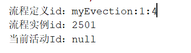

# 6.3 启动流程实例

流程定义部署在activiti后就可以通过工作流管理业务流程了，也就是说上边部署的出差申请流程可以使用了。

针对该流程，启动一个流程表示发起一个新的出差申请单，这就相当于java类与java对象的关系，类定义好后需要new创建一个对象使用，当然可以new多个对象。对于请出差申请流程，张三发起一个出差申请单需要启动一个流程实例，出差申请单发起一个出差单也需要启动一个流程实例。

代码如下：

```java
    /**
     * 启动流程实例
     */
    @Test
    public void testStartProcess(){
//        1、创建ProcessEngine
        ProcessEngine processEngine = ProcessEngines.getDefaultProcessEngine();
//        2、获取RunTimeService
        RuntimeService runtimeService = processEngine.getRuntimeService();
//        3、根据流程定义Id启动流程
        ProcessInstance processInstance = runtimeService
                .startProcessInstanceByKey("myEvection");
//        输出内容
        System.out.println("流程定义id：" + processInstance.getProcessDefinitionId());
        System.out.println("流程实例id：" + processInstance.getId());
        System.out.println("当前活动Id：" + processInstance.getActivityId());
    }

```

输出内容如下：



**操作数据表**

act_hi_actinst     流程实例执行历史

act_hi_identitylink  流程的参与用户历史信息

act_hi_procinst      流程实例历史信息

act_hi_taskinst       流程任务历史信息

act_ru_execution   流程执行信息

act_ru_identitylink  流程的参与用户信息

act_ru_task              任务信息

