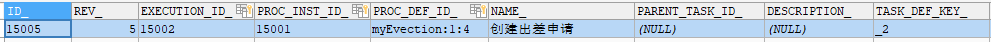

# 070-流程实例

[TOC]

### 什么是流程实例

**流程实例**（ProcessInstance）代表流程定义的执行实例。

一个流程实例包括了所有的运行节点。我们可以利用这个对象来了解当前流程实例的进度等信息。

例如：用户或程序按照流程定义内容发起一个流程，这就是一个流程实例。

流程定义和流程实例的图解：


### 启动流程实例 并添加Businesskey（业务标识）

流程定义部署在activiti后，就可以在系统中通过activiti去管理该流程的执行，执行流程表示流程的一次执行。

比如部署系统出差流程后，如果某用户要申请出差这时就需要执行这个流程，如果另外一个用户也要申请出差则也需要执行该流程，每个执行互不影响，每个执行是单独的流程实例。

启动流程实例时，指定的businesskey，就会在act_ru_execution #流程实例的执行表中存储businesskey。

Businesskey：业务标识，通常为业务表的主键，业务标识和流程实例一一对应。业务标识来源于业务系统。存储业务标识就是根据业务标识来关联查询业务系统的数据。

比如：出差流程启动一个流程实例，就可以将出差单的id作为业务标识存储到activiti中，将来查询activiti的流程实例信息就可以获取出差单的id从而关联查询业务系统数据库得到出差单信息。

```java
    /**
     * 启动流程实例，添加businessKey
     */
    @Test
    public void addBusinessKey(){
//        1、得到ProcessEngine
        ProcessEngine processEngine = ProcessEngines.getDefaultProcessEngine();
//        2、得到RunTimeService
        RuntimeService runtimeService = processEngine.getRuntimeService();
//        3、启动流程实例，同时还要指定业务标识businessKey，也就是出差申请单id，这里是1001
        ProcessInstance processInstance = runtimeService.startProcessInstanceByKey("myEvection","1001");
//        4、输出processInstance相关属性
        System.out.println("业务id=="+processInstance.getBusinessKey());

    }
```

Activiti的act_ru_execution中存储业务标识：


### 操作数据库表

启动流程实例，操作如下数据库表：

```sql
SELECT * FROM act_ru_execution #流程实例执行表，记录当前流程实例的执行情况
```


说明：

流程实例执行，如果当前只有一个分支时，一个流程实例只有一条记录且执行表的主键id和流程实例id相同，如果当前有多个分支正在运行则该执行表中有多条记录，存在执行表的主键和流程实例id不相同的记录。**不论当前有几个分支总会有一条记录的执行表的主键和流程实例**id**相同** 

一个流程实例运行完成，此表中与流程实例相关的记录删除。

```sql
SELECT * FROM act_ru_task #任务执行表，记录当前执行的任务
```



说明：启动流程实例，流程当前执行到第一个任务结点，此表会插入一条记录表示当前任务的执行情况，如果任务完成则记录删除。

```sql
SELECT * FROM act_ru_identitylink #任务参与者，记录当前参与任务的用户或组
```


 

```sql
SELECT * FROM act_hi_procinst #流程实例历史表
```


流程实例启动，会在此表插入一条记录，流程实例运行完成记录也不会删除。

```sql
 SELECT * FROM act_hi_taskinst  #任务历史表，记录所有任务
```


开始一个任务，不仅在act_ru_task表插入记录，也会在历史任务表插入一条记录，任务历史表的主键就是任务id，任务完成此表记录不删除。

```sql
 SELECT * FROM act_hi_actinst  #活动历史表，记录所有活动
```


 

活动包括任务，所以此表中不仅记录了任务，还记录了流程执行过程的其它活动，比如开始事件、结束事件。

### 查询流程实例

流程在运行过程中可以查询流程实例的状态，当前运行结点等信息。

```java
@Test
	public void queryProcessInstance() {
		// 流程定义key
		String processDefinitionKey = "evection";
        ProcessEngine processEngine = ProcessEngines.getDefaultProcessEngine();
		// 获取RunTimeService
		RuntimeService runtimeService = processEngine.getRuntimeService();
		List<ProcessInstance> list = runtimeService
				.createProcessInstanceQuery()
				.processDefinitionKey(processDefinitionKey)//
				.list();

		for (ProcessInstance processInstance : list) {
			System.out.println("----------------------------");
			System.out.println("流程实例id："
					+ processInstance.getProcessInstanceId());
			System.out.println("所属流程定义id："
					+ processInstance.getProcessDefinitionId());
			System.out.println("是否执行完成：" + processInstance.isEnded());
			System.out.println("是否暂停：" + processInstance.isSuspended());
			System.out.println("当前活动标识：" + processInstance.getActivityId());
		}
	}

```


#### 关联BusinessKey

需求：

在activiti实际应用时，查询流程实例列表时可能要显示出业务系统的一些相关信息，比如：查询当前运行的出差流程列表需要将出差单名称、出差天数等信息显示出来，出差天数等信息在业务系统中存在，而并没有在activiti数据库中存在，所以是无法通过activiti的api查询到出差天数等信息。

 

实现：

在查询流程实例时，通过businessKey（业务标识 ）关联查询业务系统的出差单表，查询出出差天数等信息。

通过下面的代码就可以获取activiti中所对应实例保存的业务Key。而这个业务Key一般都会保存相关联的业务操作表的主键，再通过主键ID去查询业务信息，比如通过出差单的ID，去查询更多的请假信息（出差人，出差时间，出差天数，出差目的地等）

```java
String businessKey = processInstance.getBusinessKey(); 
```

在activiti的act_ru_execution表，字段BUSINESS_KEY就是存放业务KEY的。


### 挂起、激活流程实例

某些情况可能由于流程变更需要将当前运行的流程暂停而不是直接删除，流程暂停后将不会继续执行。

#### 全部流程实例挂起

操作流程定义为挂起状态，该流程定义下边所有的流程实例全部暂停：

流程定义为挂起状态该流程定义将不允许启动新的流程实例，同时该流程定义下所有的流程实例将全部挂起暂停执行。

```java
/**
     * 全部流程实例挂起与激活
     */
    @Test
    public void SuspendAllProcessInstance(){
//        获取processEngine
        ProcessEngine processEngine = ProcessEngines.getDefaultProcessEngine();
//        获取repositoryService
        RepositoryService repositoryService = processEngine.getRepositoryService();
//        查询流程定义的对象
        ProcessDefinition processDefinition = repositoryService.createProcessDefinitionQuery().
                processDefinitionKey("myEvection").
                singleResult();
//        得到当前流程定义的实例是否都为暂停状态
        boolean suspended = processDefinition.isSuspended();
//        流程定义id
        String processDefinitionId = processDefinition.getId();
//        判断是否为暂停
        if(suspended){
//         如果是暂停，可以执行激活操作 ,参数1 ：流程定义id ，参数2：是否激活，参数3：激活时间
            repositoryService.activateProcessDefinitionById(processDefinitionId,
                    true,
                    null
            );
            System.out.println("流程定义："+processDefinitionId+",已激活");
        }else{
//          如果是激活状态，可以暂停，参数1 ：流程定义id ，参数2：是否暂停，参数3：暂停时间
            repositoryService.suspendProcessDefinitionById(processDefinitionId,
                    true,
                    null);
            System.out.println("流程定义："+processDefinitionId+",已挂起");
        }

    }

```

#### 单个流程实例挂起

操作流程实例对象，针对单个流程执行挂起操作，某个流程实例挂起则此流程不再继续执行，完成该流程实例的当前任务将报异常。

```java
/**
     * 单个流程实例挂起与激活
     */
    @Test
    public void SuspendSingleProcessInstance(){
//        获取processEngine
        ProcessEngine processEngine = ProcessEngines.getDefaultProcessEngine();
//        RuntimeService
        RuntimeService runtimeService = processEngine.getRuntimeService();
//        查询流程定义的对象
        ProcessInstance processInstance = runtimeService.
                createProcessInstanceQuery().
                processInstanceId("15001").
                singleResult();
//        得到当前流程定义的实例是否都为暂停状态
        boolean suspended = processInstance.isSuspended();
//        流程定义id
        String processDefinitionId = processInstance.getId();
//        判断是否为暂停
        if(suspended){
//         如果是暂停，可以执行激活操作 ,参数：流程定义id
            runtimeService.activateProcessInstanceById(processDefinitionId);
            System.out.println("流程定义："+processDefinitionId+",已激活");
        }else{
//          如果是激活状态，可以暂停，参数：流程定义id
            runtimeService.suspendProcessInstanceById( processDefinitionId);
            System.out.println("流程定义："+processDefinitionId+",已挂起");
        }

    }

    /**
     * 测试完成个人任务
     */
    @Test
    public void completTask(){
//        获取引擎
        ProcessEngine processEngine = ProcessEngines.getDefaultProcessEngine();
//        获取操作任务的服务 TaskService
        TaskService taskService = processEngine.getTaskService();
//        完成任务,参数：流程实例id,完成zhangsan的任务
        Task task = taskService.createTaskQuery()
                .processInstanceId("15001")
                .taskAssignee("rose")
                .singleResult();


        System.out.println("流程实例id="+task.getProcessInstanceId());
        System.out.println("任务Id="+task.getId());
        System.out.println("任务负责人="+task.getAssignee());
        System.out.println("任务名称="+task.getName());
        taskService.complete(task.getId());
    }
```

