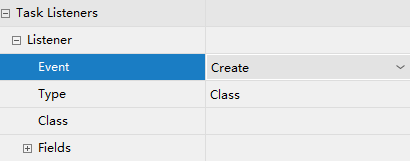

# 080-个人任务

[TOC]

### 2.1、分配任务负责人

#### 2.1.1、固定分配

在进行业务流程建模时指定固定的任务负责人， 如图：


并在 properties 视图中，填写 Assignee 项为任务负责人。 

#### 2.1.2、表达式分配

由于固定分配方式，任务只管一步一步执行任务，执行到每一个任务将按照 bpmn 的配置去分配任务负责人。 

##### 2.1.2.1、UEL 表达式 

Activiti 使用 UEL 表达式， UEL 是 java EE6 规范的一部分， UEL（Unified Expression Language）即 统一表达式语言， activiti 支持两个 UEL 表达式： UEL-value 和 UEL-method。 

###### 1）UEL-value 定义

如图： 


assignee 这个变量是 activiti 的一个流程变量，

或者使用这种方式定义：

如图：


 user 也是 activiti 的一个流程变量， user.assignee 表示通过调用 user 的 getter 方法获取值。 

###### 2）UEL-method 方式

如图： 


userBean 是 spring 容器中的一个 bean，表示调用该 bean 的 getUserId()方法。 

###### 3）UEL-method 与 UEL-value 结合 

再比如：
${ldapService.findManagerForEmployee(emp)}
ldapService 是 spring 容器的一个 bean，findManagerForEmployee 是该 bean 的一个方法，emp 是 activiti
流程变量， emp 作为参数传到 ldapService.findManagerForEmployee 方法中。 

###### 4）其它

表达式支持解析基础类型、 bean、 list、 array 和 map，也可作为条件判断。
如下：
${order.price > 100 && order.price < 250} 


##### 2.1.2.2、编写代码配置负责人 

###### 1)定义任务分配流程变量 

如图：


###### 2)设置流程变量 

在启动流程实例时设置流程变量，如下： 

```java
 /**
     * 设置流程负责人
     */
    @Test
    public void assigneeUEL(){
//      获取流程引擎
        ProcessEngine processEngine = ProcessEngines.getDefaultProcessEngine();
//        获取 RuntimeService
        RuntimeService runtimeService = processEngine.getRuntimeService();
//        设置assignee的取值，用户可以在界面上设置流程的执行
        Map<String,Object> assigneeMap = new HashMap<>();
        assigneeMap.put("assignee0","张三");
        assigneeMap.put("assignee1","李经理");
        assigneeMap.put("assignee2","王总经理");
        assigneeMap.put("assignee3","赵财务");
//        启动流程实例，同时还要设置流程定义的assignee的值
        runtimeService.startProcessInstanceByKey("myEvection1",assigneeMap);
//       输出
        System.out.println(processEngine.getName());
    }
```

执行成功后，可以在act_ru_variable表中看到刚才map中的数据


##### 2.1.2.3、注意事项 

由于使用了表达式分配，必须保证在任务执行过程表达式执行成功，比如：
某个任务使用了表达式${order.price > 100 && order.price < 250}，当执行该任务时必须保证 order 在
流程变量中存在，否则 activiti 异常。 

#### 2.1.3、监听器分配

可以使用监听器来完成很多Activiti流程的业务。

在本章我们使用监听器的方式来指定负责人，那么在流程设计时就不需要指定assignee。

任务监听器是发生对应的任务相关事件时执行自定义 java 逻辑 或表达式。
任务相当事件包括：  



Event的选项包含：

```
Create：任务创建后触发
Assignment：任务分配后触发
Delete：任务完成后触发
All：所有事件发生都触发
```

定义任务监听类，且类必须实现 org.activiti.engine.delegate.TaskListener 接口 

```java
public class MyTaskListener implements TaskListener {
    @Override
    public void notify(DelegateTask delegateTask) {
        if(delegateTask.getName().equals("创建出差申请")&&
                delegateTask.getEventName().equals("create")){
            //这里指定任务负责人
            delegateTask.setAssignee("张三");
        }
    }
} 
```

DelegateTask对象的内容如下：


##### 2.1.3.1、注意事项 

使用监听器分配方式，按照监听事件去执行监听类的 notify 方法，方法如果不能正常执行也会影响
任务的执行。 

### 2.2、查询任务

#### 查询任务负责人的待办任务 

代码如下：

```java
// 查询当前个人待执行的任务
@Test
public void findPersonalTaskList() {
    // 流程定义key
    String processDefinitionKey = "myEvection1";
    // 任务负责人
    String assignee = "张三";
    // 获取TaskService
    TaskService taskService = processEngine.getTaskService();
    List<Task> taskList = taskService.createTaskQuery()
    	.processDefinitionKey(processDefinitionKey)
    	.includeProcessVariables()
        .taskAssignee(assignee)
        .list();
    for (Task task : taskList) {
        System.out.println("----------------------------");
        System.out.println("流程实例id： " + task.getProcessInstanceId());
        System.out.println("任务id： " + task.getId());
        System.out.println("任务负责人： " + task.getAssignee());
        System.out.println("任务名称： " + task.getName());
    }
}
```

#### 关联 businessKey 

需求：
在 activiti 实际应用时，查询待办任务可能要显示出业务系统的一些相关信息。

比如：查询待审批出差任务列表需要将出差单的日期、 出差天数等信息显示出来。

出差天数等信息在业务系统中存在，而并没有在 activiti 数据库中存在，所以是无法通过 activiti 的 api 查询到出差天数等信息。
实现：
在查询待办任务时，通过 businessKey（业务标识 ）关联查询业务系统的出差单表，查询出出差天数等信息。 

```java
@Test
    public void findProcessInstance(){
//        获取processEngine
        ProcessEngine processEngine = ProcessEngines.getDefaultProcessEngine();
//        获取TaskService
        TaskService taskService = processEngine.getTaskService();
//        获取RuntimeService
        RuntimeService runtimeService = processEngine.getRuntimeService();
//        查询流程定义的对象
        Task task = taskService.createTaskQuery()
                .processDefinitionKey("myEvection1")
                .taskAssignee("张三")
                .singleResult();
//        使用task对象获取实例id
        String processInstanceId = task.getProcessInstanceId();
//          使用实例id，获取流程实例对象
        ProcessInstance processInstance = runtimeService.createProcessInstanceQuery()
                .processInstanceId(processInstanceId)
                .singleResult();
//        使用processInstance，得到 businessKey
        String businessKey = processInstance.getBusinessKey();

        System.out.println("businessKey=="+businessKey);

    }
```

### 2.3、办理任务

注意：在实际应用中，完成任务前需要校验任务的负责人是否具有该任务的办理权限 。

```java
/**
  * 完成任务，判断当前用户是否有权限
  */
    @Test
    public void completTask() {
        //任务id
        String taskId = "15005";
//        任务负责人
        String assingee = "张三";
        //获取processEngine
        ProcessEngine processEngine = ProcessEngines.getDefaultProcessEngine();
        // 创建TaskService
        TaskService taskService = processEngine.getTaskService();
//        完成任务前，需要校验该负责人可以完成当前任务
//        校验方法：
//        根据任务id和任务负责人查询当前任务，如果查到该用户有权限，就完成
        Task task = taskService.createTaskQuery()
                .taskId(taskId)
                .taskAssignee(assingee)
                .singleResult();
        if(task != null){
            taskService.complete(taskId);
            System.out.println("完成任务");
        }
    }
```

