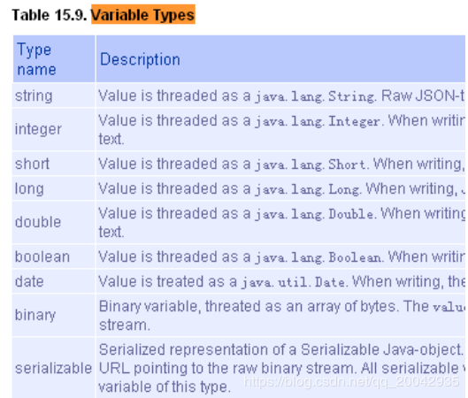
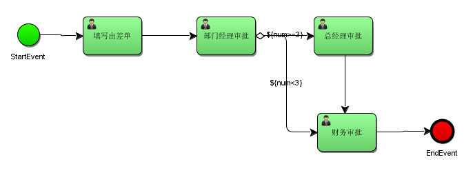
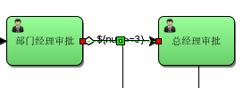
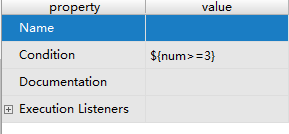
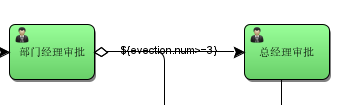
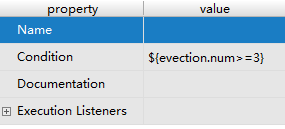
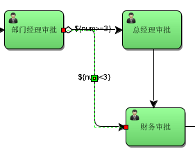
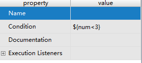
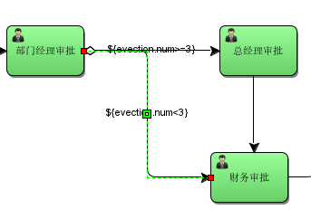
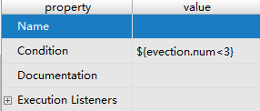

# 090-流程变量-ProcessVariable

[TOC]

### 3.1、什么是流程变量 

流程变量在 activiti 中是一个非常重要的角色，流程运转有时需要靠流程变量，业务系统和 activiti结合时少不了流程变量，流程变量就是 activiti 在管理工作流时根据管理需要而设置的变量。

比如：在出差申请流程流转时如果出差天数大于 3 天则由总经理审核，否则由人事直接审核， 出差天数就可以设置为流程变量，在流程流转时使用。 

**注意：虽然流程变量中可以存储业务数据可以通过activiti的api查询流程变量从而实现 查询业务数据，但是不建议这样使用，因为业务数据查询由业务系统负责，activiti设置流程变量是为了流程执行需要而创建。**

### 3.2、流程变量类型 

如果将 pojo 存储到流程变量中，必须实现序列化接口 serializable，为了防止由于新增字段无法反序列化，需要生成 serialVersionUID。 



### 3.3、流程变量作用域 

流程变量的作用域可以

- 可以是一个流程实例(processInstance)，

- 可以是一个任务(task)
- 可以是一个执行实例(execution)的变量

#### 3.3.1、globa变量

流程变量的默认作用域是流程实例(ProcessInstance)。当一个流程变量的作用域为流程实例时，可以称为 global 变量

注意：

如：    Global变量：userId（变量名）、zhangsan（变量值）

global 变量中变量名不允许重复，设置相同名称的变量，后设置的值会覆盖前设置的变量值。

#### 3.3.2、local变量

任务和执行实例仅仅是针对一个任务和一个执行实例范围，范围没有流程实例大， 称为 local 变量。

Local 变量由于在不同的任务或不同的执行实例中，作用域互不影响，变量名可以相同没有影响。Local 变量名也可以和 global 变量名相同，没有影响。 

### 3.4、流程变量的使用方法

#### 3.4.1、在属性上使用UEL表达式

可以在 assignee 处设置 UEL 表达式，表达式的值为任务的负责人

>  比如： ${assignee}， assignee 就是一个流程变量名称。

Activiti获取UEL表达式的值，即流程变量assignee的值 ，将assignee的值作为任务的负责人进行任务分配

#### 3.4.2、在连线上使用UEL表达式

可以在连线上设置UEL表达式，决定流程走向。

比如：${price<10000} 。price就是一个流程变量名称，uel表达式结果类型为布尔类型。

如果UEL表达式是true，要决定 流程执行走向。

### 3.5、使用Global变量控制流程

#### 3.5.1、需求

员工创建出差申请单，由部门经理审核，部门经理审核通过后出差3天及以下由人财务直接审批，3天以上先由总经理审核，总经理审核通过再由财务审批。



#### 3.5.2、流程定义

1）、出差天数大于等于3连线条件



也可以使用对象参数命名，如evection.num：




2）、出差天数小于3连线条件



也可以使用对象参数命名，如：



#### 3.5.3、设置global流程变量

在部门经理审核前设置流程变量，变量值为出差单信息（包括出差天数），部门经理审核后可以根据流程变量的值决定流程走向。

在设置流程变量时，可以在启动流程时设置，也可以在任务办理时设置

##### 3.5.3.1、创建POJO对象

创建出差申请pojo对象

```java
package com.itheima.demo.pojo;

import java.io.Serializable;
import java.util.Date;

/**
 * 出差申请 pojo
 */
public class Evection implements Serializable {
    /**
     * 主键id
     */
    private Long id;
    /**
     * 出差申请单名称
     */
    private String evectionName;
    /**
     * 出差天数
     */
    private Double num;
    /**
     * 预计开始时间
     */
    private Date beginDate;
    /**
     * 预计结束时间
     */
    private Date endDate;
    /**
     * 目的地
     */
    private String destination;
    /**
     * 出差事由
     */
    private String reson;

    public Long getId() {
        return id;
    }

    public void setId(Long id) {
        this.id = id;
    }

    public String getEvectionName() {
        return evectionName;
    }

    public void setEvectionName(String evectionName) {
        this.evectionName = evectionName;
    }

    public Date getBeginDate() {
        return beginDate;
    }

    public void setBeginDate(Date beginDate) {
        this.beginDate = beginDate;
    }

    public Date getEndDate() {
        return endDate;
    }

    public void setEndDate(Date endDate) {
        this.endDate = endDate;
    }

    public String getDestination() {
        return destination;
    }

    public void setDestination(String destination) {
        this.destination = destination;
    }

    public String getReson() {
        return reson;
    }

    public void setReson(String reson) {
        this.reson = reson;
    }

    public Double getNum() {
        return num;
    }

    public void setNum(Double num) {
        this.num = num;
    }
}

```

##### 3.5.3.2、启动流程时设置变量

在启动流程时设置流程变量，变量的作用域是整个流程实例。

通过Map<key,value>设置流程变量，map中可以设置多个变量，这个key就是流程变量的名字。

```java
    /**
     * 启动流程实例,设置流程变量的值
     */
    @Test
    public void startProcess(){
//        获取流程引擎
        ProcessEngine processEngine = ProcessEngines.getDefaultProcessEngine();
//        获取RunTimeService
        RuntimeService runtimeService = processEngine.getRuntimeService();
//        流程定义key
        String key = "myEvection2";
//       创建变量集合
        Map<String, Object> map = new HashMap<>();
//        创建出差pojo对象
        Evection evection = new Evection();
//        设置出差天数
        evection.setNum(2d);
//      定义流程变量，把出差pojo对象放入map
        map.put("evection",evection);
//      设置assignee的取值，用户可以在界面上设置流程的执行
        map.put("assignee0","张三");
        map.put("assignee1","李经理");
        map.put("assignee2","王总经理");
        map.put("assignee3","赵财务");
//        启动流程实例，并设置流程变量的值（把map传入）
        ProcessInstance processInstance = runtimeService
                .startProcessInstanceByKey(key, map);
//      输出
        System.out.println("流程实例名称="+processInstance.getName());
        System.out.println("流程定义id=="+processInstance.getProcessDefinitionId());

    }
    /**
     * 完成任务，判断当前用户是否有权限
     */
    @Test
    public void completTask() {
        //任务id
        String key = "myEvection2";
//        任务负责人
        String assingee = "张三";
        //获取processEngine
        ProcessEngine processEngine = ProcessEngines.getDefaultProcessEngine();
        // 创建TaskService
        TaskService taskService = processEngine.getTaskService();
//        完成任务前，需要校验该负责人可以完成当前任务
//        校验方法：
//        根据任务id和任务负责人查询当前任务，如果查到该用户有权限，就完成
        Task task = taskService.createTaskQuery()
                .processDefinitionKey(key)
                .taskAssignee(assingee)
                .singleResult();
        if(task != null){
            taskService.complete(task.getId());
            System.out.println("任务执行完成");
        }
    }
```

说明：

startProcessInstanceByKey(processDefinitionKey, variables)

流程变量作用域是一个流程实例，流程变量使用Map存储，同一个流程实例设置变量map中key相同，后者覆盖前者。

##### 3.5.3.2、任务办理时设置变量

在完成任务时设置流程变量，该流程变量只有在该任务完成后其它结点才可使用该变量，它的作用域是整个流程实例，如果设置的流程变量的key在流程实例中已存在相同的名字则后设置的变量替换前边设置的变量。

这里需要在创建出差单任务完成时设置流程变量

```java
    /**
     * 完成任务，判断当前用户是否有权限
     */
    @Test
    public void completTask() {
        //任务id
        String key = "myEvection2";
//        任务负责人
        String assingee = "张三";
//       获取processEngine
        ProcessEngine processEngine = ProcessEngines.getDefaultProcessEngine();
//       创建TaskService
        TaskService taskService = processEngine.getTaskService();
//       创建变量集合
        Map<String, Object> map = new HashMap<>();
//        创建出差pojo对象
        Evection evection = new Evection();
//        设置出差天数
        evection.setNum(2d);
//      定义流程变量
        map.put("evection",evection);
//        完成任务前，需要校验该负责人可以完成当前任务
//        校验方法：
//        根据任务id和任务负责人查询当前任务，如果查到该用户有权限，就完成
        Task task = taskService.createTaskQuery()
                .processDefinitionKey(key)
                .taskAssignee(assingee)
                .singleResult();
        if(task != null){
            //完成任务是，设置流程变量的值
            taskService.complete(task.getId(),map);
            System.out.println("任务执行完成");
        }
    }
```

说明：

通过当前任务设置流程变量，需要指定当前任务id，如果当前执行的任务id不存在则抛出异常。

任务办理时也是通过map<key,value>设置流程变量，一次可以设置多个变量。

##### 3.5.3.3、通过当前流程实例设置

通过流程实例id设置全局变量，该流程实例必须未执行完成。

```java
    @Test
    public void setGlobalVariableByExecutionId(){
//    当前流程实例执行 id，通常设置为当前执行的流程实例
        String executionId="2601";
//     获取processEngine
        ProcessEngine processEngine = ProcessEngines.getDefaultProcessEngine();
//        获取RuntimeService
        RuntimeService runtimeService = processEngine.getRuntimeService();
//        创建出差pojo对象
        Evection evection = new Evection();
//        设置天数
        evection.setNum(3d);
//      通过流程实例 id设置流程变量
        runtimeService.setVariable(executionId, "evection", evection);
//      一次设置多个值
//      runtimeService.setVariables(executionId, variables)
    }

```

注意：

executionId必须当前未结束 流程实例的执行id，通常此id设置流程实例 的id。也可以通runtimeService.getVariable()获取流程变量。

##### 3.5.3.4、通过当前任务设置

```java
@Test
	public void setGlobalVariableByTaskId(){
		
		//当前待办任务id
		String taskId="1404";
//     获取processEngine
        ProcessEngine processEngine = ProcessEngines.getDefaultProcessEngine();
		TaskService taskService = processEngine.getTaskService();
		Evection evection = new Evection();
		evection.setNum(3);
		//通过任务设置流程变量
		taskService.setVariable(taskId, "evection", evection);
		//一次设置多个值 
		//taskService.setVariables(taskId, variables)
	}

```

注意：

任务id必须是当前待办任务id，act_ru_task中存在。如果该任务已结束，会报错

也可以通过taskService.getVariable()获取流程变量。

#### 3.5.4、测试

正常测试：

​       设置流程变量的值大于等于3天

​       设计流程变量的值小于3天

异常测试：

​       流程变量不存在

​       流程变量的值为空NULL，price属性为空

​       UEL表达式都不符合条件  

​      不设置连线的条件

#### 3.5.5、注意事项

1、  如果UEL表达式中流程变量名不存在则报错。

2、  如果UEL表达式中流程变量值为空NULL，流程不按UEL表达式去执行，而流程结束 。

3、  如果UEL表达式都不符合条件，流程结束 

4、  如果连线不设置条件，会走flow序号小的那条线

#### 3.5.6、操作数据库表

设置流程变量会在当前执行流程变量表插入记录，同时也会在历史流程变量表也插入记录。

 ```sql
//当前流程变量表
SELECT * FROM act_ru_variable 
 ```

记录当前运行流程实例可使用的流程变量，包括 global和local变量

Id_：主键

Type_：变量类型

Name_：变量名称 

Execution_id_：所属流程实例执行id，global和local变量都存储

Proc_inst_id_：所属流程实例id，global和local变量都存储 

Task_id_：所属任务id，local变量存储

Bytearray_：serializable类型变量存储对应act_ge_bytearray表的id

Double_：double类型变量值

Long_：long类型变量值

Text_：text类型变量值 

```sql
 #历史流程变量表
SELECT * FROM act_hi_varinst 
```

记录所有已创建的流程变量，包括 global和local变量

字段意义参考当前流程变量表。

### 3.6、设置local流程变量

#### 3.6.1、任务办理时设置

 任务办理时设置local流程变量，当前运行的流程实例只能在该任务结束前使用，任务结束该变量无法在当前流程实例使用，可以通过查询历史任务查询。

```java
/*
*处理任务时设置local流程变量
*/
@Test
public void completTask() {
   //任务id
   String taskId = "1404";
//  获取processEngine
    ProcessEngine processEngine = ProcessEngines.getDefaultProcessEngine();
    TaskService taskService = processEngine.getTaskService();
//  定义流程变量
   Map<String, Object> variables = new HashMap<String, Object>();
   Evection evection = new Evection ();
   evection.setNum(3d);
// 定义流程变量
   Map<String, Object> variables = new HashMap<String, Object>();
//  变量名是holiday，变量值是holiday对象
    variables.put("evection", evection);
//  设置local变量，作用域为该任务
    taskService.setVariablesLocal(taskId, variables);
//  完成任务
   taskService.complete(taskId);
}
```


​       说明：

设置作用域为任务的local变量，每个任务可以设置同名的变量，互不影响。

#### 3.6.2、通过当前任务设置

```java
@Test
public void setLocalVariableByTaskId(){
//   当前待办任务id
    String taskId="1404";
//  获取processEngine
    ProcessEngine processEngine = ProcessEngines.getDefaultProcessEngine();
    TaskService taskService = processEngine.getTaskService();
    Evection evection = new Evection ();
    evection.setNum(3d);
//  通过任务设置流程变量
    taskService.setVariableLocal(taskId, "evection", evection);
//  一次设置多个值 
    //taskService.setVariablesLocal(taskId, variables)
}
```

注意：

任务id必须是当前待办任务id，act_ru_task中存在。

#### 3.6.3、  Local变量测试1

如果上边例子中设置global变量改为设置local变量是否可行？为什么？

 Local变量在任务结束后无法在当前流程实例执行中使用，如果后续的流程执行需要用到此变量则会报错。

####  3.6.4、  Local变量测试2

在部门经理审核、总经理审核、财务审核时设置local变量，可通过historyService查询每个历史任务时将流程变量的值也查询出来。

 代码如下：

```java
// 创建历史任务查询对象
      HistoricTaskInstanceQuery historicTaskInstanceQuery = historyService.createHistoricTaskInstanceQuery();
      // 查询结果包括 local变量
      historicTaskInstanceQuery.includeTaskLocalVariables();
for (HistoricTaskInstance historicTaskInstance : list) {
         System.out.println("==============================");
         System.out.println("任务id：" + historicTaskInstance.getId());
         System.out.println("任务名称：" + historicTaskInstance.getName());
         System.out.println("任务负责人：" + historicTaskInstance.getAssignee());
     System.out.println("任务local变量："+ historicTaskInstance.getTaskLocalVariables());

}
```

注意：查询历史流程变量，特别是查询pojo变量需要经过反序列化，不推荐使用。