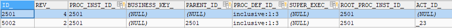
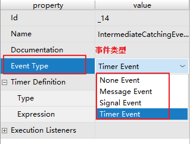

# 110-网关-Gateway

[TOC]

## 网关

网关用来控制流程的流向

- 排他网关
- 并行网关
- 包含网关
- 事件网关

### 5.1 排他网关ExclusiveGateway

#### 5.1.1  什么是排他网关：

排他网关，用来在流程中实现决策。 当流程执行到这个网关，所有分支都会判断条件是否为true，如果为true则执行该分支，

**注意**：排他网关只会选择一个为true的分支执行。如果有两个分支条件都为true，排他网关会选择id值较小的一条分支去执行。

为什么要用排他网关？

不用排他网关也可以实现分支，如：在连线的condition条件上设置分支条件。

在连线设置condition条件的缺点：如果条件都不满足，流程就结束了(是异常结束)。

如果 使用排他网关决定分支的走向，如下：


 

如果从网关出去的线所有条件都不满足则系统抛出异常。

```java
org.activiti.engine.ActivitiException: No outgoing sequence flow of the exclusive gateway 'exclusivegateway1' could be selected for continuing the process
   at org.activiti.engine.impl.bpmn.behavior.ExclusiveGatewayActivityBehavior.leave(ExclusiveGatewayActivityBehavior.java:85)
```


#### 5.1.2  流程定义

 排他网关图标，红框内：


 

#### 5.1.3  测试 

在部门经理审核后，走排他网关，从排他网关出来的分支有两条，一条是判断出差天数是否大于3天，另一条是判断出差天数是否小于等于3天。

设置分支条件时，如果所有分支条件都不是true，报错：

```java
org.activiti.engine.ActivitiException: No outgoing sequence flow of the exclusive gateway 'exclusivegateway1' could be selected for continuing the process

       at org.activiti.engine.impl.bpmn.behavior.ExclusiveGatewayActivityBehavior.leave(ExclusiveGatewayActivityBehavior.java:85)

```

### 5.2 并行网关ParallelGateway

#### 5.2.1  什么是并行网关

并行网关允许将流程分成多条分支，也可以把多条分支汇聚到一起，并行网关的功能是基于进入和外出顺序流的：

#### l  fork分支：

 并行后的所有外出顺序流，为每个顺序流都创建一个并发分支。

#### l  join汇聚： 

所有到达并行网关，在此等待的进入分支， 直到所有进入顺序流的分支都到达以后， 流程就会通过汇聚网关。

注意，如果同一个并行网关有多个进入和多个外出顺序流， 它就同时具有分支和汇聚功能。 这时，网关会先汇聚所有进入的顺序流，然后再切分成多个并行分支。

**与其他网关的主要区别是，并行网关不会解析条件。** **即使顺序流中定义了条件，也会被忽略。**

例子：


说明：

技术经理和项目经理是两个execution分支，在act_ru_execution表有两条记录分别是技术经理和项目经理，act_ru_execution还有一条记录表示该流程实例。

待技术经理和项目经理任务全部完成，在汇聚点汇聚，通过parallelGateway并行网关。

并行网关在业务应用中常用于会签任务，会签任务即多个参与者共同办理的任务。

#### 5.2.2  流程定义

并行网关图标，红框内：


 

#### 5.2.3  测试

当执行到并行网关数据库跟踪如下：

当前任务表：SELECT * FROM act_ru_task


上图中：有两个任务当前执行。

查询流程实例执行表：SELECT * FROM act_ru_execution 


上图中，说明当前流程实例有多个分支(两个)在运行。

对并行任务的执行：

并行任务执行不分前后，由任务的负责人去执行即可。

执行技术经理任务后，查询当前任务表 SELECT * FROM act_ru_task   


已完成的技术经理任务在当前任务表act_ru_task_已被删除。

在流程实例执行表：SELECT * FROM act_ru_execution有中多个分支存在且有并行网关的汇聚结点。


有并行网关的汇聚结点：说明有一个分支已经到汇聚，等待其它的分支到达。

当所有分支任务都完成，都到达汇聚结点后：

流程实例执行表：SELECT * FROM act_ru_execution，执行流程实例已经变为总经理审批，说明流程执行已经通过并行网关


总结：所有分支到达汇聚结点，并行网关执行完成。         

### 5.3    包含网关InclusiveGateway

#### 5.3.1  什么是包含网关

包含网关可以看做是排他网关和并行网关的结合体。 

和排他网关一样，你可以在外出顺序流上定义条件，包含网关会解析它们。 但是主要的区别是包含网关可以选择多于一条顺序流，这和并行网关一样。

包含网关的功能是基于进入和外出顺序流的：

##### l  分支fork： 

所有外出顺序流的条件都会被解析，结果为true的顺序流会以并行方式继续执行， 会为每个顺序流创建一个分支。

##### l  汇聚join：

 所有并行分支到达包含网关，会进入等待状态， 直到每个包含流程token的进入顺序流的分支都到达。 这是与并行网关的最大不同。换句话说，包含网关只会等待被选中执行了的进入顺序流。 在汇聚之后，流程会穿过包含网关继续执行。

#### 5.3.2  流程定义：

出差申请大于等于3天需要由项目经理审批，小于3天由技术经理审批，出差申请必须经过人事经理审批。

 包含网关图标，红框内：

 

定义流程：


注意：通过包含网关的每个分支的连线上设置condition条件。

#### 5.3.3  测试

如果包含网关设置的条件中，流程变量不存在，报错;

```java
org.activiti.engine.ActivitiException: Unknown property used in expression: ${evection.num>=3}
```

需要在流程启动时设置流程变量evection.num。

1）、当流程执行到第一个包含网关后，会根据条件判断，当前要走哪几个分支：

流程实例执行表：SELECT * FROM act_ru_execution


第一条记录：包含网关分支。

后两条记录代表两个要执行的分支：

ACT_ID = "_13" 代表 项目经理神品

ACT_ID = "_5" 代表 人事经理审批

当前任务表：ACT_RU_TASK


上图中，项目经理审批、人事经理审批 都是当前的任务，在并行执行。

如果有一个分支执行先走到汇聚结点的分支，要等待其它执行分支走到汇聚。

2）、先执行项目经理审批，然后查询当前任务表：ACT_RU_TASK


当前任务还有人事经理审批需要处理。

流程实例执行表：SELECT * FROM act_ru_execution


发现人事经理的分支还存在，而项目经理分支已经走到ACT_ID = _18的节点。而ACT_ID=__18就是第二个包含网关

这时，因为有2个分支要执行，包含网关会等所有分支走到汇聚才能执行完成。

3）、执行人事经理审批

然后查询当前任务表：ACT_RU_TASK


当前任务表已经不是人事经理审批了，说明人事经理审批已经完成。 

流程实例执行表：SELECT * FROM act_ru_execution



包含网关执行完成，分支和汇聚就从act_ru_execution删除。

小结：在分支时，需要判断条件，**符合条件的分支，将会执行**，符合条件的分支最终才进行汇聚。

### 5.4 事件网关EventGateway

事件网关允许根据事件判断流向。网关的每个外出顺序流都要连接到一个中间捕获事件。 当流程到达一个基于事件网关，网关会进入等待状态：会暂停执行。与此同时，会为每个外出顺序流创建相对的事件订阅。

事件网关的外出顺序流和普通顺序流不同，这些顺序流不会真的"执行"， 相反它们让流程引擎去决定执行到事件网关的流程需要订阅哪些事件。 要考虑以下条件：

1. 事件网关必须有两条或以上外出顺序流；
2. 事件网关后，只能使用intermediateCatchEvent类型（activiti不支持基于事件网关后连接ReceiveTask）
3. 连接到事件网关的中间捕获事件必须只有一个入口顺序流。 

#### 5.4.1流程定义

事件网关图标，红框内


intermediateCatchEvent：


intermediateCatchEvent支持的事件类型：

- Message Event: 消息事件

- Singal Event：  信号事件

- Timer Event：  定时事件




使用事件网关定义流程：

