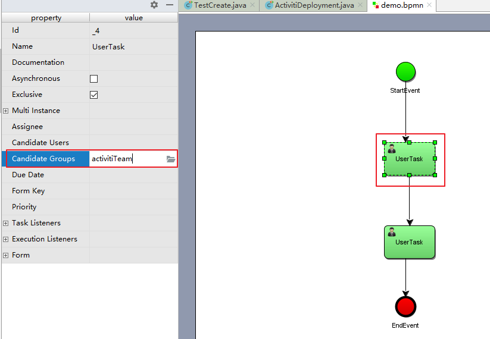

# Activiti与Spring整合开发

[TOC]

## 1.1 Activiti与Spring整合的配置

### 1)、在pom.xml文件引入坐标

如下

```xml
<properties>
        <slf4j.version>1.6.6</slf4j.version>
        <log4j.version>1.2.12</log4j.version>
</properties>
<dependencies>
    <dependency>
        <groupId>org.activiti</groupId>
        <artifactId>activiti-engine</artifactId>
        <version>7.0.0.Beta1</version>
    </dependency>
    <dependency>
        <groupId>org.activiti</groupId>
        <artifactId>activiti-spring</artifactId>
        <version>7.0.0.Beta1</version>
    </dependency>
    <dependency>
        <groupId>org.activiti</groupId>
        <artifactId>activiti-bpmn-model</artifactId>
        <version>7.0.0.Beta1</version>
    </dependency>
    <dependency>
        <groupId>org.activiti</groupId>
        <artifactId>activiti-bpmn-converter</artifactId>
        <version>7.0.0.Beta1</version>
    </dependency>
    <dependency>
        <groupId>org.activiti</groupId>
        <artifactId>activiti-json-converter</artifactId>
        <version>7.0.0.Beta1</version>
    </dependency>
    <dependency>
        <groupId>org.activiti</groupId>
        <artifactId>activiti-bpmn-layout</artifactId>
        <version>7.0.0.Beta1</version>
    </dependency>
    <dependency>
        <groupId>org.activiti.cloud</groupId>
        <artifactId>activiti-cloud-services-api</artifactId>
        <version>7.0.0.Beta1</version>
    </dependency>
    <dependency>
        <groupId>aspectj</groupId>
        <artifactId>aspectjweaver</artifactId>
        <version>1.5.4</version>
    </dependency>
    <dependency>
        <groupId>mysql</groupId>
        <artifactId>mysql-connector-java</artifactId>
        <version>5.1.40</version>
    </dependency>
    <dependency>
        <groupId>junit</groupId>
        <artifactId>junit</artifactId>
        <version>4.12</version>
    </dependency>
    <dependency>
        <groupId>org.springframework</groupId>
        <artifactId>spring-test</artifactId>
        <version>5.0.7.RELEASE</version>
    </dependency>
    <!-- log start -->
    <dependency>
        <groupId>log4j</groupId>
        <artifactId>log4j</artifactId>
        <version>${log4j.version}</version>
    </dependency>
    <dependency>
        <groupId>org.slf4j</groupId>
        <artifactId>slf4j-api</artifactId>
        <version>${slf4j.version}</version>
    </dependency>
    <dependency>
        <groupId>org.slf4j</groupId>
        <artifactId>slf4j-log4j12</artifactId>
        <version>${slf4j.version}</version>
    </dependency>
    <dependency>
        <groupId>org.slf4j</groupId>
        <artifactId>slf4j-nop</artifactId>
        <version>${slf4j.version}</version>
    </dependency>
    <!-- log end -->
    <dependency>
        <groupId>org.mybatis</groupId>
        <artifactId>mybatis</artifactId>
        <version>3.4.5</version>
    </dependency>
    <dependency>
        <groupId>commons-dbcp</groupId>
        <artifactId>commons-dbcp</artifactId>
        <version>1.4</version>
    </dependency>
</dependencies>
<repositories>
    <repository>
        <id>alfresco</id>
        <name>Activiti Releases</name>
        <url>https://artifacts.alfresco.com/nexus/content/repositories/activiti-releases/</url>
        <releases>
            <enabled>true</enabled>
        </releases>
    </repository>
</repositories>
```

在Activiti中核心类的是ProcessEngine流程引擎，与Spring整合就是让Spring来管理ProcessEngine

通过org.activiti.spring.SpringProcessEngineConfiguration 与Spring整合方式来创建ProcessEngine对象。 

 创建spring与activiti的整合配置文件：activiti-spring.xml（名称不固定）

### 2)、创建activiti-spring.xml

```xml
<beans xmlns="http://www.springframework.org/schema/beans"
       xmlns:xsi="http://www.w3.org/2001/XMLSchema-instance"
       xmlns:tx="http://www.springframework.org/schema/tx"
       xmlns:aop="http://www.springframework.org/schema/aop"
       xsi:schemaLocation="http://www.springframework.org/schema/beans
        http://www.springframework.org/schema/beans/spring-beans.xsd
        http://www.springframework.org/schema/tx
        http://www.springframework.org/schema/tx/spring-tx.xsd
        http://www.springframework.org/schema/aop
        http://www.springframework.org/schema/aop/spring-aop.xsd">
    <!-- 数据源 -->
    <bean id="dataSource" class="org.apache.commons.dbcp.BasicDataSource">
        <property name="driverClassName" value="com.mysql.jdbc.Driver"/>
        <property name="url" value="jdbc:mysql://localhost:3306/activiti"/>
        <property name="username" value="root"/>
        <property name="password" value="123456"/>
        <property name="maxActive" value="3"/>
        <property name="maxIdle" value="1"/>
    </bean>
    <!-- 工作流引擎配置bean -->
    <bean id="processEngineConfiguration" class="org.activiti.spring.SpringProcessEngineConfiguration">
        <!-- 数据源 -->
        <property name="dataSource" ref="dataSource"/>
        <!-- 使用spring事务管理器 -->
        <property name="transactionManager" ref="transactionManager"/>
        <!-- 数据库策略 -->
        <property name="databaseSchemaUpdate" value="drop-create"/>
    </bean>
    <!-- 流程引擎 -->
    <bean id="processEngine" class="org.activiti.spring.ProcessEngineFactoryBean">
        <property name="processEngineConfiguration" ref="processEngineConfiguration"/>
    </bean>
    <!-- 资源服务service -->
    <bean id="repositoryService" factory-bean="processEngine" factory-method="getRepositoryService"/>
    <!-- 流程运行service -->
    <bean id="runtimeService" factory-bean="processEngine"  factory-method="getRuntimeService"/>
    <!-- 任务管理service -->
    <bean id="taskService" factory-bean="processEngine" factory-method="getTaskService"/>
    <!-- 历史管理service -->
    <bean id="historyService" factory-bean="processEngine" factory-method="getHistoryService"/>
    <!-- 事务管理器 -->
    <bean id="transactionManager" class="org.springframework.jdbc.datasource.DataSourceTransactionManager">
        <property name="dataSource" ref="dataSource"/>
    </bean>
    <!-- 通知 -->
    <tx:advice id="txAdvice" transaction-manager="transactionManager">
        <tx:attributes>
            <!-- 传播行为 -->
            <tx:method name="save*" propagation="REQUIRED"/>
            <tx:method name="insert*" propagation="REQUIRED"/>
            <tx:method name="delete*" propagation="REQUIRED"/>
            <tx:method name="update*" propagation="REQUIRED"/>
            <tx:method name="find*" propagation="SUPPORTS" read-only="true"/>
            <tx:method name="get*" propagation="SUPPORTS" read-only="true"/>
        </tx:attributes>
    </tx:advice>
    <!-- 切面，根据具体项目修改切点配置
    <aop:config proxy-target-class="true">
        <aop:advisor advice-ref="txAdvice"
                     pointcut="execution(*com.itheima.service.impl..(..))"/>
    </aop:config>-->
</beans>
```

databaseSchemaUpdate的取值内容：

flase：       默认值。activiti在启动时，会对比数据库表中保存的版本，如果没有表或者版本不匹配，将抛出异常。（生产环境常用）
true：        activiti会对数据库中所有表进行更新操作。如果表不存在，则自动创建。（开发时常用）
create_drop： 在activiti启动时创建表，在关闭时删除表（必须手动关闭引擎，才能删除表）。（单元测试常用）
drop-create： 在activiti启动时删除原来的旧表，然后在创建新表（不需要手动关闭引擎）。

## 1.2 测试Activiti与Spring整合

### 1）、测试代码

```java
/**
   测试activiti与spring整合是否成功
**/
@RunWith(SpringJUnit4ClassRunner.class)
@ContextConfiguration(locations = "classpath:activiti-spring.xml")
 public class ActivitiTest {
     @Autowired
     private RepositoryService repositoryService;
     
     @Test
     public void test01(){
         System.out.println("部署对象:"+repositoryService);
     }
 }
```

### 2）、执行流程分析

下面我们一起来分析Activiti与Spring整合加载的过程。

1、加载activiti-spring.xml配置文件

2、加载SpringProcessEngineConfiguration对象，这个对象它需要依赖注入dataSource对象和transactionManager对象。

3、加载ProcessEngineFactoryBean工厂来创建ProcessEngine对象，而ProcessEngineFactoryBean工厂又需要依赖注入processEngineConfiguration对象。

4、processEngine对象来负责创建我们的Service对象，从而简化Activiti的开发过程。

# 二、Activiti7与SpringBoot整合开发

Activiti7发布正式版之后，它与SpringBoot2.x已经完全支持整合开发。

## 2.1     SpringBoot整合Activiti7的配置

为了能够实现SpringBoot与Activiti7整合开发，首先我们要引入相关的依赖支持。

在工程的pom.xml文件中引入相关的依赖，其中activiti的依赖是：activiti-spring-boot-starter。

具体依赖如下所示：

```xml
<parent>
    <groupId>org.springframework.boot</groupId>
    <artifactId>spring-boot-starter-parent</artifactId>
    <version>2.1.0.RELEASE</version>
</parent>
<properties>
    <project.build.sourceEncoding>UTF-8</project.build.sourceEncoding>
    <project.reporting.outputEncoding>UTF-8</project.reporting.outputEncoding>
    <java.version>1.8</java.version>
</properties>
<dependencies>
    <dependency>
        <groupId>org.springframework.boot</groupId>
        <artifactId>spring-boot-starter-web</artifactId>
    </dependency>
    <dependency>
        <groupId>org.springframework.boot</groupId>
        <artifactId>spring-boot-starter-jdbc</artifactId>
    </dependency>
    <dependency>
        <groupId>org.springframework.boot</groupId>
        <artifactId>spring-boot-starter-test</artifactId>
    </dependency>
    <dependency>
        <groupId>org.activiti</groupId>
        <artifactId>activiti-spring-boot-starter</artifactId>
        <version>7.0.0.Beta2</version>
    </dependency>
    <dependency>
        <groupId>mysql</groupId>
        <artifactId>mysql-connector-java</artifactId>
        <version>5.1.29</version>
    </dependency>
    <dependency>
        <groupId>org.projectlombok</groupId>
        <artifactId>lombok</artifactId>
    </dependency>
</dependencies>
<build>
    <plugins>
        <plugin>
            <groupId>org.springframework.boot</groupId>
            <artifactId>spring-boot-maven-plugin</artifactId>
        </plugin>
    </plugins>
</build>
```

通过该pom.xml文件所导入的坐标，我们就可以实现activiti7与Springboot整合。

## 2.2    SpringBoot的application.yml文件配置

为了能够实现Activiti7生成的表放到Mysql数据库中，需要在配置文件application.yml中添加相关的配置

注意：activiti7默认没有开启数据库历史记录，需要手动配置开启

```yaml
spring:
  datasource:
    url: jdbc:mysql:///activiti?useUnicode=true&characterEncoding=utf8&serverTimezone=GMT
    username: root
    password: 123456
    driver-class-name: com.mysql.jdbc.Driver
  activiti:
    #1.flase：默认值。activiti在启动时，对比数据库表中保存的版本，如果没有表或者版本不匹配，将抛出异常
    #2.true： activiti会对数据库中所有表进行更新操作。如果表不存在，则自动创建
    #3.create_drop： 在activiti启动时创建表，在关闭时删除表（必须手动关闭引擎，才能删除表）
    #4.drop-create： 在activiti启动时删除原来的旧表，然后在创建新表（不需要手动关闭引擎）
    database-schema-update: true
    #检测历史表是否存在 activiti7默认没有开启数据库历史记录 启动数据库历史记录
    db-history-used: true
    #记录历史等级 可配置的历史级别有none, activity, audit, full
    #none：不保存任何的历史数据，因此，在流程执行过程中，这是最高效的。
    #activity：级别高于none，保存流程实例与流程行为，其他数据不保存。
    #audit：除activity级别会保存的数据外，还会保存全部的流程任务及其属性。audit为history的默认值。
    #full：保存历史数据的最高级别，除了会保存audit级别的数据外，还会保存其他全部流程相关的细节数据，包括一些流程参数等。
    history-level: full
    #校验流程文件，默认校验resources下的processes文件夹里的流程文件
    check-process-definitions: false
```

## 2.3 编写启动类

```java
package com.itheima;

import org.springframework.boot.SpringApplication;
import org.springframework.boot.autoconfigure.SpringBootApplication;

@SpringBootApplication
public class ActApplication {
    public static void main(String[] args) {
        SpringApplication.run(ActApplication.class,args);
    }
}

```

## 2.4    添加SpringSecurity安全框架整合配置

因为Activiti7与SpringBoot整合后，默认情况下，集成了SpringSecurity安全框架，这样我们就要去准备SpringSecurity整合进来的相关用户权限配置信息。

SpringBoot的依赖包已经将SpringSecurity的依赖包也添加进项目中。

### 2.4.1  添加SecurityUtil类

为了能够快速实现SpringSecurity安全框架的配置，所添加的一个组件。

```java
package com.itheima.utils;

import org.slf4j.Logger;
import org.slf4j.LoggerFactory;
import org.springframework.beans.factory.annotation.Autowired;
import org.springframework.beans.factory.annotation.Qualifier;
import org.springframework.security.core.Authentication;
import org.springframework.security.core.GrantedAuthority;
import org.springframework.security.core.context.SecurityContextHolder;
import org.springframework.security.core.context.SecurityContextImpl;
import org.springframework.security.core.userdetails.UserDetails;
import org.springframework.security.core.userdetails.UserDetailsService;
import org.springframework.stereotype.Component;

import java.util.Collection;


@Component
public class SecurityUtil {
    private Logger logger = LoggerFactory.getLogger(SecurityUtil.class);

     @Autowired
     @Qualifier("myUserDetailsService")
     private UserDetailsService userDetailsService;
 
    public void logInAs(String username) {
     UserDetails user = userDetailsService.loadUserByUsername(username);

     if (user == null) {
         throw new IllegalStateException("User " + username + " doesn't exist, please provide a valid user");
     }
     logger.info("> Logged in as: " + username);

     SecurityContextHolder.setContext(
             new SecurityContextImpl(
                     new Authentication() {
                         @Override
                         public Collection<? extends GrantedAuthority> getAuthorities() {
                             return user.getAuthorities();
                         }
                         @Override
                         public Object getCredentials() {
                             return user.getPassword();
                         }
                         @Override
                         public Object getDetails() {
                             return user;
                         }
                         @Override
                         public Object getPrincipal() {
                             return user;
                         }
                         @Override
                         public boolean isAuthenticated() {
                             return true;
                         }
                         @Override
                         public void setAuthenticated(boolean isAuthenticated) throws IllegalArgumentException { }
                         @Override
                         public String getName() {
                             return user.getUsername();
                         }
     }));
     org.activiti.engine.impl.identity.Authentication.setAuthenticatedUserId(username);
 }
  }
```

这个类可以从我们下载的Activiti7官方提供的Example中找到。

### 2.4.2  添加DemoApplicationConfig类

在Activiti7官方下载的Example中找到DemoApplicationConfig类，它的作用是为了实现SpringSecurity框架的用户权限的配置，这样我们就可以在系统中使用用户权限信息。

本次项目中基本是在文件中定义出来的用户信息，当然也可以是数据库中查询的用户权限信息。

后面处理流程时用到的任务负责人，需要添加在这里

```java
package com.itheima.config;

import org.slf4j.Logger;
import org.slf4j.LoggerFactory;
import org.springframework.context.annotation.Bean;
import org.springframework.context.annotation.Configuration;
import org.springframework.security.core.authority.SimpleGrantedAuthority;
import org.springframework.security.core.userdetails.User;
import org.springframework.security.core.userdetails.UserDetailsService;
import org.springframework.security.crypto.bcrypt.BCryptPasswordEncoder;
import org.springframework.security.crypto.password.PasswordEncoder;
import org.springframework.security.provisioning.InMemoryUserDetailsManager;

import java.util.Arrays;
import java.util.List;
import java.util.stream.Collectors;

@Configuration
public class DemoApplicationConfiguration {
    private Logger logger = LoggerFactory.getLogger(DemoApplicationConfiguration.class);
     @Bean
     public UserDetailsService myUserDetailsService() {
         InMemoryUserDetailsManager inMemoryUserDetailsManager = new InMemoryUserDetailsManager();
         //这里添加用户，后面处理流程时用到的任务负责人，需要添加在这里
         String[][] usersGroupsAndRoles = {
                 {"jack", "password", "ROLE_ACTIVITI_USER", "GROUP_activitiTeam"},
                 {"rose", "password", "ROLE_ACTIVITI_USER", "GROUP_activitiTeam"},
                 {"tom", "password", "ROLE_ACTIVITI_USER", "GROUP_activitiTeam"},
                 {"other", "password", "ROLE_ACTIVITI_USER", "GROUP_otherTeam"},
                 {"system", "password", "ROLE_ACTIVITI_USER"},
                 {"admin", "password", "ROLE_ACTIVITI_ADMIN"},
         };

         for (String[] user : usersGroupsAndRoles) {
             List<String> authoritiesStrings = Arrays.asList(Arrays.copyOfRange(user, 2, user.length));
             logger.info("> Registering new user: " + user[0] + " with the following Authorities[" + authoritiesStrings + "]");
             inMemoryUserDetailsManager.createUser(new User(user[0], passwordEncoder().encode(user[1]),
                     authoritiesStrings.stream().map(s -> new SimpleGrantedAuthority(s)).collect(Collectors.toList())));
         }

         return inMemoryUserDetailsManager;
     }
     @Bean
     public PasswordEncoder passwordEncoder() {
         return new BCryptPasswordEncoder();
     }
}
```

##  2.5 创建Bpmn文件

Activiti7可以自动部署流程，前提是在resources目录下，创建一个新的目录processes，用来放置bpmn文件。

创建一个简单的Bpmn流程文件，并设置任务的用户组Candidate Groups。

Candidate Groups中的内容与上面DemoApplicationConfiguration类中出现的用户组名称要保持一致，可以填写：activitiTeam 或者 otherTeam。

这样填写的好处：当不确定到底由谁来负责当前任务的时候，只要是Groups内的用户都可以拾取这个任务



## 2.6    使用Junit方式测试


```java
package com.itheima.test;

import com.itheima.utils.SecurityUtil;
import org.activiti.api.process.model.ProcessInstance;
import org.activiti.api.process.model.builders.ProcessPayloadBuilder;
import org.activiti.api.process.runtime.ProcessRuntime;
import org.activiti.api.runtime.shared.query.Page;
import org.activiti.api.runtime.shared.query.Pageable;
import org.activiti.api.task.model.Task;
import org.activiti.api.task.model.builders.TaskPayloadBuilder;
import org.activiti.api.task.runtime.TaskRuntime;
import org.activiti.engine.repository.ProcessDefinition;
import org.junit.Test;
import org.junit.runner.RunWith;
import org.springframework.beans.factory.annotation.Autowired;
import org.springframework.boot.test.context.SpringBootTest;
import org.springframework.test.context.junit4.SpringRunner;

@RunWith(SpringRunner.class)
@SpringBootTest
 public class Actviti7DemoApplicationTests {
     @Autowired
     private ProcessRuntime processRuntime;
     @Autowired
     private TaskRuntime taskRuntime;
     @Autowired
     private SecurityUtil securityUtil;

    @Test
    public void testActBoot(){
        System.out.println(taskRuntime);
    }

    /**
     * 查看流程定义
     */
    @Test
    public void contextLoads() {
        securityUtil.logInAs("system");
        Page<org.activiti.api.process.model.ProcessDefinition> processDefinitionPage =
                processRuntime.processDefinitions(Pageable.of(0, 10));
        System.out.println("可用的流程定义数量：" + processDefinitionPage.getTotalItems());
        for (org.activiti.api.process.model.ProcessDefinition pd : processDefinitionPage.getContent()) {
            System.out.println("流程定义：" + pd);
        }
    }


    /**
     * 启动流程实例
     */
    @Test
    public void testStartProcess() {
        securityUtil.logInAs("system");
        ProcessInstance pi = processRuntime.start(ProcessPayloadBuilder.
                start().
                withProcessDefinitionKey("myProcess").
                build());
        System.out.println("流程实例ID：" + pi.getId());
    }


    /**
     **查询任务，并完成自己的任务
     **/
    @Test
    public void testTask() {
        securityUtil.logInAs("jack");
        Page<Task> taskPage=taskRuntime.tasks(Pageable.of(0,10));
        if (taskPage.getTotalItems()>0){
            for (Task task:taskPage.getContent()){
                taskRuntime.claim(TaskPayloadBuilder.
                        claim().
                        withTaskId(task.getId()).build());
                System.out.println("任务："+task);
                taskRuntime.complete(TaskPayloadBuilder.
                        complete().
                        withTaskId(task.getId()).build());
            }
        }
        Page<Task> taskPage2=taskRuntime.tasks(Pageable.of*(0,10));
        if (taskPage2.getTotalItems()>0){
            System.out.println("任务："+taskPage2.getContent());
        }
    }
}
```

