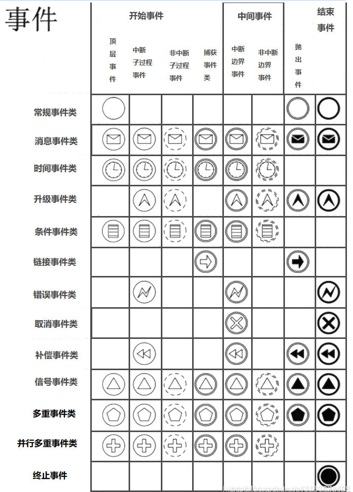
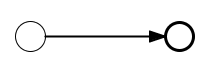
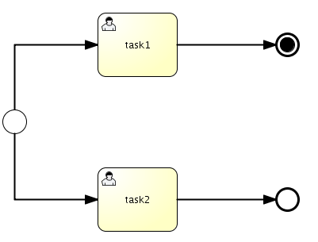
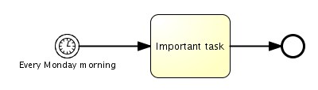
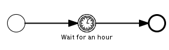

# 021-流对象-事件

[TOC]

## 参考文章 

http://www.mossle.com/docs/jbpm4devguide/html/bpmn2.html

https://www.activiti.org/userguide/#bpmnCustomExtensions



### 根据位置分类

- 开始事件 : 开始事件表示流程的开始
- 中间事件 : 边界事件 :出现在流程中可以单独展示的事件 / 附属于每个流程节点的事件 
- 结束事件 : 标志流程的结束

## 根据特征分类

- 捕获事件(Catching) : 等待符合一定条件触发执行,所有的开始事件都是捕获事件
- 抛出事件(Throwing) : 执行到节点自动执行并抛出结果

根据事件定义分类:

- 定时事件

  - 指定时间(timeDate)
  - 指定持续事件(timeDuration)
  - 周期执行(timeCycle)


```xml
<timeEventDefinition>
	<timeDate>2018-01-01T10:10:10</timeDate>
</timeEventDefinition>
```

- 错误事件
- 信号事件
- 消息事件


##空启动事件



一个空开始事件像下面这样定义。id是必填的，name是可选的。

```xml
<endEvent id="end" name="myEnd" />
```

##终止结束事件



 终止结束事件会结束整个流程实例，而空结束事件只会结束当前流程路径。 他们都不会抛出任何事情 当到达结束事件的时候。

 上图中 task1完成后到达的事件就是终止结束事件,Task2 到达的结束事件是空结束事件

 流程定义文件定义:

```xml
<endEvent id="terminateEnd" name="myTerminateEnd">
  <terminateEventDefinition/>
</endEvent>
```

## 定时启动事件

定时启动事件用来表示流程需要在指定时间启动。 可以指定一个特殊的时间点（比如，2010年10月10日下午5点）， 但是也可以用一个通常的时间（比如，每个周五的半夜）。


使用定时启动事件，要添加一个timerEventDefinition元素 在开始事件元素下面：

```xml
<startEvent name="Every Monday morning" id="myStart">
  <timerEventDefinition/>
</startEvent>
```

**timeDate**: 指定一个固定时间， 这时定时器会触发，流程会继续。默认的时间格式是 "dd/MM/yyyy hh:mm:ss"。这是引擎范围的，可以通过设置 配置中的jbpm.duedatetime.format属性来改变。

```xml
<startEvent id="myStartEvent" >
  <timerEventDefinition>
    <timeDate>10/10/2099 00:00:00</timeDate>
  </timerEventDefinition>
</startEvent>
```

注意，在使用固定事件时，流程只用在一个单独的事件。 在流程实例创建之后，定时启动事件不会再次触发。

**timeCycle**: 指定一个延迟时间段， 相对于流程进入定时器事件时。可以用两种定义方式：

时间段表达式：

```
quantity [business] {second | seconds | minute | minutes |
                     hour | hours | day | days | week |
                     weeks | month | months | year | years}
```

 BPMN2定时启动事件也可以理解"业务时间"。 这允许，比如定义一个"业务日期"作为周期，从早九点到晚五点。 这样，从下午5点到上午9点的时间就不会被计算， 当事件触发的事件被计算的时候。 请参考jPDL用户手册，获得更多信息，关于如何自定义业务日历。 下面的例子演示了定时启动事件会启动给一个新流程实例 每隔5个小时。

```
<startEvent id="myStartEvent" >
  <timerEventDefinition>
    <timeCycle>5 hours</timeCycle>
  </timerEventDefinition>
</startEvent>
```

**Cron 表达式**： 虽然时间段表达式已经很好的覆盖了 延迟定义，有时，它们不太好用。 当，比如，一个流程实例应该在每个周五晚上23点执行， cron表达式允许一个更自然的方式来定义这种重复的行为的发生。

jBPM中实现的定时启动事件也拥有如下的特性：

声明了定时启动事件的流程定义，也可以当做一个无启动事件启动。 这就是说，比如调用 executionService.startProcessInstanceByKey(key)也是可以的。
定时启动事件的内部实现是一个定时任务。这意味着 必须配置job executor，定时启动事件才能工作。 这种实现的优点是，定时启动事件的触发是事务性的 （比如，如果定时启动事件后的一个服务任务失败了， 事务就会回滚，定时启动事件就会稍后执行） 并且可以应付服务器崩溃。（比如，当服务器备份时， 定时启动事件会由job executor获取， 就像什么也没有发生一样）。
当一个拥有定时启动事件的流程定义发布新版本时， 旧版本的定时启动事件的任务会被从系统中删除。这意味着 只有最新版本的流程定义会被使用 来创建一个流程实例。

下面的例子演示了定时启动事件会在 每周五的23点启动一个新的流程实例

```xml
<startEvent id="myStartEvent" >
  <timerEventDefinition>
    <timeCycle>0 0 23 ? * FRI</timeCycle>
</timerEventDefinition>
</startEvent>
```

## 中间事件

中间事件用来表示在流程执行过程中发生的事件（比如， 在流程启动之后，在它完成之前）。中间事件看起来就像 一个有着双边线的圆圈，圆圈中的图标表示了事件的类型。
这儿有好多种中间事件类型，比如定时器事件，触发事件，传播事件，等等。 中间事件既可以抛出也可以捕获：
**抛出**：当一个流程到达事件中， 它会立刻触发一个对应的触发器（一个激活，一个错误，等等）。 抛出事件用图形表示起来就是使用黑色填充的图标。
**捕获**：当一个流程到达事件中， 它会等待一个对应的触发器发生（一个错误，一个定时器，等等）。 捕获事件用图形表示起来就是没有使用黑色填充的图标（比如，内部是白色的）。

内部定时器事件用来表示一个流程的延迟。 直接的用例是收集数据， 只在没有人工作的晚上执行大量的逻辑，等等。

注意，一个内部定时器只能是一个捕获事件（抛出一个定时器事件时没有意义的）。 下面的图形中演示了内部定时器事件的图形形式。

```xml
<intermediateCatchEvent id="myTimer" name="Wait for an hour">
  <timerEventDefinition>
    <timeCycle>1 hour</timeCycle>
  </timerEventDefinition>
</intermediateCatchEvent>
```

有两种方法可以来指定延迟，使用timeCycle 或 a timeDate。在上面例子中，使用的是 timeCycle 。
下面的延迟定义也是可以用的（这与启动定时器是相同的）。
**timeDate**: 指定一个固定时间， 这时定时器会触发，流程会继续。默认的时间格式是 "dd/MM/yyyy hh:mm:ss"。这是引擎范围的，可以通过设置 配置中的jbpm.duedatetime.format属性来改变。

```x,;
<intermediateCatchEvent id="myTimer" >
  <timerEventDefinition>
    <timeDate>10/10/2099 00:00:00</timeDate>
  </timerEventDefinition>
</intermediateCatchEvent>
```

## 内部捕获事件：定时器

内部定时器事件用来表示一个流程的延迟。 直接的用例是收集数据， 只在没有人工作的晚上执行大量的逻辑，等等。

注意，一个内部定时器只能是一个捕获事件（抛出一个定时器事件时没有意义的）。 下面的图形中演示了内部定时器事件的图形形式。

定义一个内部定时器事件，在XML里像是这样：

```xml
<intermediateCatchEvent id="myTimer" name="Wait for an hour">
  <timerEventDefinition>
    <timeCycle>1 hour</timeCycle>
  </timerEventDefinition>
</intermediateCatchEvent>
```

指定延迟的属性:

- timeCycle : 指定一个固定时间， 这时定时器会触发，流程会继续。默认的时间格式是 "dd/MM/yyyy hh:mm:ss"。这是引擎范围的，可以通过设置 配置中的jbpm.duedatetime.format属性来改变。

```xml
<intermediateCatchEvent id="myTimer" >
  <timerEventDefinition>
    <timeDate>10/10/2099 00:00:00</timeDate>
  </timerEventDefinition>
</intermediateCatchEvent>
```

- timeDate :指定一个延迟时间段， 相对于流程进入定时器事件时。可以用两种定义方式：
  时间段表达式：

```xml
quantity [business] {second | seconds | minute | minutes |
                     hour | hours | day | days | week |
                     weeks | month | months | year | years}
                
```

```xml
<intermediateCatchEvent id="intermediateTimer" >
  <timerEventDefinition>
    <timeCycle>5 hours</timeCycle>
  </timerEventDefinition>
</intermediateCatchEvent>
                 
```

Cron 表达式：

```xml
<intermediateCatchEvent id="intermediateTimer" >
  <timerEventDefinition>
    <timeCycle>0 0 23 ? * FRI</timeCycle>
      </timerEventDefinition>
</intermediateCatchEvent>
```

