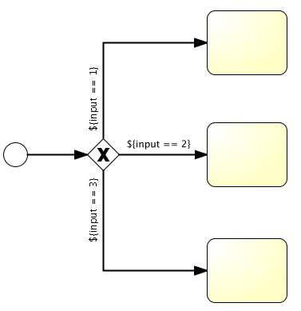

# 024-流对象-网关-单向网关

[TOC]

## 单向网关(Exclusive Gateway)

也叫排他网关,用来描述流程中的**选择**,当一个执行流到达这个网关后,会经过计算,得到执行流



```xml
<exclusiveGateway id="exclusiveGw" name="Exclusive Gateway" />
<sequenceFlow id="flow2" sourceRef="exclusiveGw" targetRef="theTask1">
  <conditionExpression xsi:type="tFormalExpression">${input == 1}</conditionExpression>
</sequenceFlow>
<sequenceFlow id="flow3" sourceRef="exclusiveGw" targetRef="theTask2">
  <conditionExpression xsi:type="tFormalExpression">${input == 2}</conditionExpression>
</sequenceFlow>
<sequenceFlow id="flow4" sourceRef="exclusiveGw" targetRef="theTask3">
  <conditionExpression xsi:type="tFormalExpression">${input == 3}</conditionExpression>
</sequenceFlow>
```

