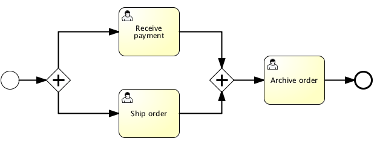

# 025-流对象-网关-并行网关

[TOC]

## 什么是并行网关

并行网关表示流程的并发,并行网关可以让一个执行流变成多个同时进行的并发执行流,也可以让多个执行流合并为一个执行流.

因此并行网关对执行流有两种行为:

- fork 分岔 : 表示每条从并行网关出来的顺序流建立一个并行的顺序流
- join 合并 : 表示所有到达并行网关的并行执行流将被合并

**值得注意的是:**
同一个并行网关,允许同事出现分岔和合并两种情况,当多个执行流到达这种并行网关时,并行网关会先将这些执行流合并,然后进行分岔




```xml

<startEvent id="theStart" />
<sequenceFlow id="flow1" sourceRef="theStart" targetRef="fork" />

<parallelGateway id="fork" />
<sequenceFlow sourceRef="fork" targetRef="receivePayment" />
<sequenceFlow sourceRef="fork" targetRef="shipOrder" />

<userTask id="receivePayment" name="Receive Payment" />
<sequenceFlow sourceRef="receivePayment" targetRef="join" />

<userTask id="shipOrder" name="Ship Order" />
<sequenceFlow sourceRef="shipOrder" targetRef="join" />

<parallelGateway id="join" />
<sequenceFlow sourceRef="join" targetRef="archiveOrder" />

<userTask id="archiveOrder" name="Archive Order" />
<sequenceFlow sourceRef="archiveOrder" targetRef="theEnd" />

<endEvent id="theEnd" />

```

执行下面的代码
```java
ProcessInstance pi = runtimeService.startProcessInstanceByKey("forkJoin");
TaskQuery query = taskService.createTaskQuery()
                         .processInstanceId(pi.getId())
                         .orderByTaskName()
                         .asc();

List<Task> tasks = query.list();
assertEquals(2, tasks.size());

Task task1 = tasks.get(0);
assertEquals("Receive Payment", task1.getName());
Task task2 = tasks.get(1);
assertEquals("Ship Order", task2.getName());
```


当前两个 Task 完成后,第二个并行网关就会合并两个执行流,这时只有一个输出顺序刘,没有并行的 两个执行流路径 ,仅仅只有`Archive Order` Task 是激活的.