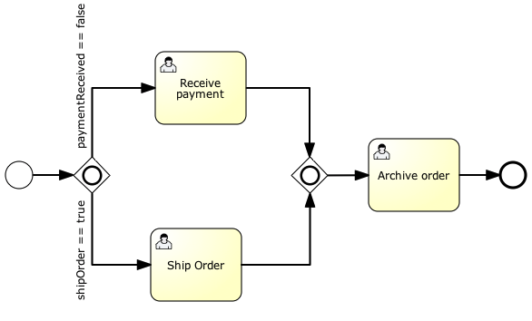

## 026-流对象-网关-兼容网关

[TOC]

## 什么是兼容网关

就像是单向网关与并行网关的结合体,可以为兼容网关的输出循序流定义条件,如果其中一条顺序流符合条件,就会创建一条新的执行流.

与单向网关比:

- 兼容网关可以创建多条顺序流,如果多个条件都符合,也只会选择第一个定义的顺序流

与兼容网关比:

- 同样拥有 fork (分岔)
- 同样拥有 join (合并)

兼容网关更新家灵活,在实际应用中,由于无法确定条件导致无法在单向网关和并行网关中做出选择时,可以使用兼容网关




定义一个兼容网关:

```
<inclusiveGateway id="myInclusiveGateway" />
```

```xml

<startEvent id="theStart" />
<sequenceFlow id="flow1" sourceRef="theStart" targetRef="fork" />

<inclusiveGateway id="fork" />
<sequenceFlow sourceRef="fork" targetRef="receivePayment" >
  <conditionExpression xsi:type="tFormalExpression">${paymentReceived == false}</conditionExpression>
</sequenceFlow>
<sequenceFlow sourceRef="fork" targetRef="shipOrder" >
  <conditionExpression xsi:type="tFormalExpression">${shipOrder == true}</conditionExpression>
</sequenceFlow>

<userTask id="receivePayment" name="Receive Payment" />
<sequenceFlow sourceRef="receivePayment" targetRef="join" />

<userTask id="shipOrder" name="Ship Order" />
<sequenceFlow sourceRef="shipOrder" targetRef="join" />

<inclusiveGateway id="join" />
<sequenceFlow sourceRef="join" targetRef="archiveOrder" />

<userTask id="archiveOrder" name="Archive Order" />
<sequenceFlow sourceRef="archiveOrder" targetRef="theEnd" />

<endEvent id="theEnd" />

```

```java
HashMap<String, Object> variableMap = new HashMap<String, Object>();
          variableMap.put("receivedPayment", true);
          variableMap.put("shipOrder", true);
          ProcessInstance pi = runtimeService.startProcessInstanceByKey("forkJoin");
TaskQuery query = taskService.createTaskQuery()
                         .processInstanceId(pi.getId())
                         .orderByTaskName()
                         .asc();

List<Task> tasks = query.list();
assertEquals(1, tasks.size());

Task task = tasks.get(0);
assertEquals("Ship Order", task.getName());

```

当 task 被完成后,第二个兼容网关会合并两个执行流,仅仅只有`Archive Order` 任务存在

