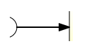
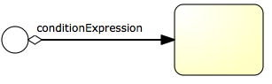
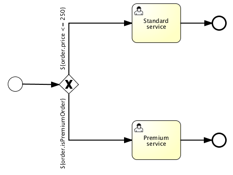
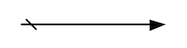

# Sequence Flow 顺序流

- 条件顺序流
- 默认顺序流

序列流是流程的两个元素之间的连接器。在进程执行期间访问元素之后，将遵循所有传出序列流。这意味着bpmn 2.0的默认性质是并行的：两个传出序列流将创建两个独立的并行执行路径。

##图示



## XML

```
<sequenceFlow id="flow1" sourceRef="theStart" targetRef="theTask" />

```

### 条件顺序流

具有条件的顺序流,中间具有条件表达式:



```xml
<sequenceFlow id="flow" sourceRef="theStart" targetRef="theTask">
  <conditionExpression xsi:type="tFormalExpression">
    <![CDATA[${order.price > 100 && order.price < 250}]]>
  </conditionExpression>
</sequenceFlow>
```

其中`order.price`会调用 JavaBean的 get方法

```xml
<conditionExpression xsi:type="tFormalExpression">
  <![CDATA[${order.isStandardOrder()}]]>
</conditionExpression>
```

上面的`isStandardOrder()`是 JavaBean 的方法


### 默认顺序流(Default sequence flow)

BPMN2 的 Task 和 GateWay 都可以拥有一个默认的顺所有bpmn 2.0任务和网关都可以有默认的序列流。仅当且仅当无法选择其他序列流时，才选择此序列流作为该活动的传出序列流。默认序列流的条件总是被忽略。
图示:


```xml
<exclusiveGateway id="exclusiveGw" name="Exclusive Gateway" default="flow2" />
<sequenceFlow id="flow1" sourceRef="exclusiveGw" targetRef="task1">
  <conditionExpression xsi:type="tFormalExpression">${conditionA}</conditionExpression>
</sequenceFlow>
<sequenceFlow id="flow2" sourceRef="exclusiveGw" targetRef="task2"/>
<sequenceFlow id="flow3" sourceRef="exclusiveGw" targetRef="task3">
  <conditionExpression xsi:type="tFormalExpression">${conditionB}</conditionExpression>
</sequenceFlow>

```

