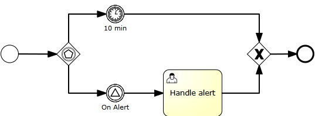

## 事件网关

在流程中,如果需要根据事件来决定流程的走向,那么久可以使用事件网关(Event Based Gateway).
事件网关会根据它所连接的中间 Catching 事件来决定流程的走向,
事件网关看上去存在流程走向的选择问题,但是实际上,执行流并不会通过从事件网关出来的顺序流,当流程到达事件网关时,Activiti 会为全部中间 Catching 事件创建相应的数据,如果某一事件先被触发,那么流程将会网事件所处的方法执行.

###例子

以下流程是具有基于事件的网关的流程的示例。当执行到达基于事件的网关时，进程执行将被挂起。此外，进程实例订阅了警报信号事件，并创建了一个计时器，该计时器在10分钟后触发。这会有效地导致流程引擎等待10分钟等待信号事件。如果信号在10分钟内出现，计时器将被取消，信号发出后继续执行。如果未触发信号，则在计时器之后继续执行，并且取消信号订阅。




```xml
<definitions id="definitions"
	xmlns="http://www.omg.org/spec/BPMN/20100524/MODEL"
	xmlns:activiti="http://activiti.org/bpmn"
	targetNamespace="Examples">

	<signal id="alertSignal" name="alert" />

	<process id="catchSignal">

		<startEvent id="start" />

		<sequenceFlow sourceRef="start" targetRef="gw1" />

		<eventBasedGateway id="gw1" />

		<sequenceFlow sourceRef="gw1" targetRef="signalEvent" />
		<sequenceFlow sourceRef="gw1" targetRef="timerEvent" />

		<intermediateCatchEvent id="signalEvent" name="Alert">
			<signalEventDefinition signalRef="alertSignal" />
		</intermediateCatchEvent>

		<intermediateCatchEvent id="timerEvent" name="Alert">
			<timerEventDefinition>
				<timeDuration>PT10M</timeDuration>
			</timerEventDefinition>
		</intermediateCatchEvent>

		<sequenceFlow sourceRef="timerEvent" targetRef="exGw1" />
		<sequenceFlow sourceRef="signalEvent" targetRef="task" />

		<userTask id="task" name="Handle alert"/>

		<exclusiveGateway id="exGw1" />

		<sequenceFlow sourceRef="task" targetRef="exGw1" />
		<sequenceFlow sourceRef="exGw1" targetRef="end" />

		<endEvent id="end" />
</process>
</definitions>
```