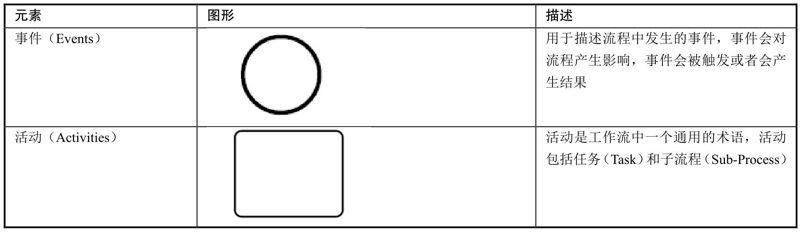
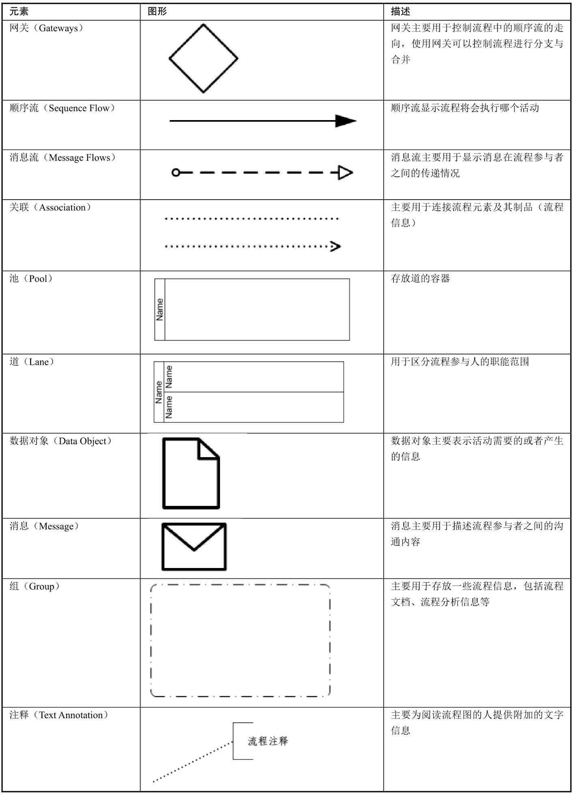

# 010-BPMN2.0规范概述

[TOC]

BPMN 2.0规范定义了业务流程的符号以及模型，并且为流程定义设定了转换格式，目的是为了让流程的定义实现可移植性，那么用户可以在不同的供应商环境中定义流程，并且这些流程可以移植到其他遵守BPMN 2.0规范的供应商环境中。

BPMN 2.0在以下方面扩展了BPMN 1.2：

- 规范了流程元素的执行语法
- 定义了流程模型和流程图的扩展机制
- 细化了事件的组成
- 扩展了参与者的交互定义
- 定义了编排模型

##  BPMN2.0元素

- 流对象(FlowObjects) : 在一个业务流程中,流对象是用于定义行为的图像元素
  - 活动(Activities)
  - 事件(Events)
  - 网关(Gateways)
- 连接对象(Connecting Object) :将流对象链接到一起,表示数据的流转
- 数据(Data) : 主要用于连接流对象,主要有4种连接流对象的方式
  - 顺序流(Sequence)
  - 消息流(Message flows)
  - 关联(Associations)
  - 数据关联(Data Assocications)
- 泳道(Swimlanes):提供两种途径用于组织基础的模型元素, 分别是池和用到 , 对业务做范围维度的区分,一般通过不同纬度做区分,比如角色,或者部门来区分流程的范围

- 描述对象(制品)(Artifacts) : 不影响流程的运行,只是对流程做了一些可读性的描述

## 图示





## 流程定义文件

流程定义文件可以将 BPMN 2.0规范
其约束文件引用:

```xml
xmlns:xsi="http://www.w3.org/2001/XMLSchema-instance"
xsi:schemaLocation="http://www.omg.org/spec/BPMN/20100524/MODEL                http://www.omg.org/spec/BPMN/2.0/20100501/BPMN20.xsd
```

所有的节点都定义在根节点 <definitions />上,下面是一个最简单的流程定义文件:

```xml
xmlns:xsi="http://www.w3.org/2001/XMLSchema-instance"
xsi:schemaLocation="http://www.omg.org/spec/BPMN/20100524/MODEL
<definitions
  xmlns="http://www.omg.org/spec/BPMN/20100524/MODEL"
  xmlns:activiti="http://activiti.org/bpmn"
  targetNamespace="Examples">

  <process id="myProcess" name="My First Process">
    ..
  </process>

</definitions>
```

可以看出 `process`节点有两个属性:

- id : 必选,通过以下方式可以使用该属性启动一个流程实例,默认使用流程实例的最新版本

```java
ProcessInstance processInstance = runtimeService.startProcessInstanceByKey("myProcess");
```

- name,非必填,流程引擎底层不适用这个属性,主要使用来友好用户交互


