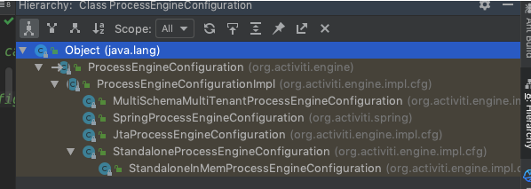

# 流程引擎配置

## ProcessEngneConfiguration

- 通过读取 `activiti.cfg.xml`构建配置对象(ProcessEngine)
- 提供了多个静态方法创建配置对象
- 实现了几个基于不同场景的子类,配置方式非常灵活
- ProcessEngeConfiguration
  - ProcessEngineConfigurationImpl 抽象类,抽取了公用的方法
    - MultiSchemaMultiTenantProcessEngineConfiguration
    - SpringProcessEngineConfiguration 与 Spring 集成构建流程引擎的配置类,Spring 拓展了包括事务/数据源/自动加载流程定义文件等
    - JtaProcessEngineConfiguration
    - StandaloneProcessEngineConfiguration 独立引擎配置对象,可以通过 new的方式创建并使用 geter 或者 setter 设置属性
      - StandaloneInMemprovessEngineConfiguration 基于内存作为数据库的配置对象
- ProcessEngine 对象为为们提供了
  - RepositoryService
  - RuntimeService
  - xxxServive

