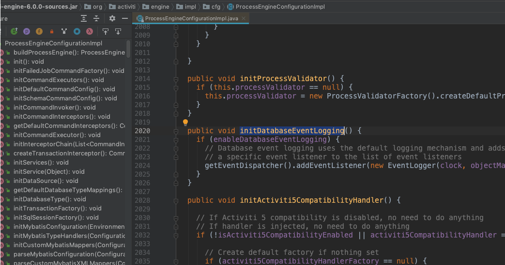

# 历史记录配置
- 配置历史记录级别(HistoryLevel)
- 基于 DB 的事件日志(Event logging)

## 配置流程历史记录级别
- 配置 HistoryLevel
当流程正常运行结束以后,历史记录存储的级别,Activiti 里有四个级别:
	- none : 不记录历史流程,性能比较高,流程结束后不可读取,适用于业务不重要,并发高的情况
	- activiti : 归档流程实例和活动实例,流程变量不同步
	- audit: 默认值,在 activiti 基础上同步变量值,保存表单属性
	- full: 性能较差,记录所有实例和变量细节变化

配置示例:

```xml
    <bean id="processEngineConfiguration"
          class="org.activiti.engine.impl.cfg.StandaloneInMemProcessEngineConfiguration">

        <property name="commandInvoker" ref="commondInvoker"/>
        <property name="history" value="none"/>
        <property name="history" value="activity"/>
        <property name="history" value="audit"/>
        <property name="history" value="full"/>
    </bean>

    <bean id="commondInvoker" class="invoker.MDCCommandInvoker"></bean>
```

## 配置基于 DB数据库的事件日志
- 配置 Event Logging 开启
- 性能影响大,将日志记录在数据库
- 默认记录所有数据的变化过程,表记录快速增长
- 日志内容为 JSON,建议存入 mongoDB 和 Elastic Search

```xml
<?xml version="1.0" encoding="UTF-8"?>

<beans xmlns="http://www.springframework.org/schema/beans"
       xmlns:xsi="http://www.w3.org/2001/XMLSchema-instance"
       xsi:schemaLocation="http://www.springframework.org/schema/beans
  http://www.springframework.org/schema/beans/spring-beans.xsd">

    <bean id="processEngineConfiguration"
          class="org.activiti.engine.impl.cfg.StandaloneInMemProcessEngineConfiguration">

        <property name="commandInvoker" ref="commondInvoker"/>
        <!-- 默认为 false -->
<!--        <property name="enableDatabaseEventLogging" value="false"/>-->
        <property name="enableDatabaseEventLogging" value="true"/>
    </bean>

    <bean id="commondInvoker" class="invoker.MDCCommandInvoker"></bean>

</beans>
```

查询某个示例的事件日志
```
        List<EventLogEntry> eventLogEntries = activitiRule.getManagementService()
                .getEventLogEntriesByProcessInstanceId(processInstance.getProcessInstanceId());
```

## 这个配置在源码中的影响

可以从源码中看到:
这个配置属性控制了一个监听器的注册:`org.activiti.engine.impl.event.logger.EventLogger`

通过查看其源码:

```java
public class EventLogger implements ActivitiEventListener {
	
	private static final Logger logger = LoggerFactory.getLogger(EventLogger.class);
	
	private static final String EVENT_FLUSHER_KEY = "eventFlusher";
	
	protected Clock clock;
	protected ObjectMapper objectMapper;
	
	// Mapping of type -> handler
	protected Map<ActivitiEventType, Class<? extends EventLoggerEventHandler>> eventHandlers 
		= new HashMap<ActivitiEventType, Class<? extends EventLoggerEventHandler>>();
	
	// Listeners for new events
	protected List<EventLoggerListener> listeners;
	
	public EventLogger() {
		initializeDefaultHandlers();
	}
	
	public EventLogger(Clock clock, ObjectMapper objectMapper) {
		this();
		this.clock = clock;
		this.objectMapper = objectMapper;
	}
//可以看到初始化时注册了一系列 Handler,实际上在这些 Handler 中将事件的记录进行处理
	protected void initializeDefaultHandlers() {
	//任务创建对应的 Handler
	  addEventHandler(ActivitiEventType.TASK_CREATED, TaskCreatedEventHandler.class);
		//任务完成对应的 Handler
		addEventHandler(ActivitiEventType.TASK_COMPLETED, TaskCompletedEventHandler.class);
		addEventHandler(ActivitiEventType.TASK_ASSIGNED, TaskAssignedEventHandler.class);
		
		addEventHandler(ActivitiEventType.SEQUENCEFLOW_TAKEN, SequenceFlowTakenEventHandler.class);
		
		addEventHandler(ActivitiEventType.ACTIVITY_COMPLETED, ActivityCompletedEventHandler.class);
		addEventHandler(ActivitiEventType.ACTIVITY_STARTED, ActivityStartedEventHandler.class);
		addEventHandler(ActivitiEventType.ACTIVITY_SIGNALED, ActivitySignaledEventHandler.class);
		addEventHandler(ActivitiEventType.ACTIVITY_MESSAGE_RECEIVED, ActivityMessageEventHandler.class);
		addEventHandler(ActivitiEventType.ACTIVITY_COMPENSATE, ActivityCompensatedEventHandler.class);
		addEventHandler(ActivitiEventType.ACTIVITY_ERROR_RECEIVED, ActivityErrorReceivedEventHandler.class);
		
		addEventHandler(ActivitiEventType.VARIABLE_CREATED, VariableCreatedEventHandler.class);
		addEventHandler(ActivitiEventType.VARIABLE_DELETED, VariableDeletedEventHandler.class);
		addEventHandler(ActivitiEventType.VARIABLE_UPDATED, VariableUpdatedEventHandler.class);
  }
```
当事件完成后,会写入数据库存储