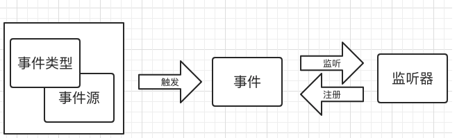
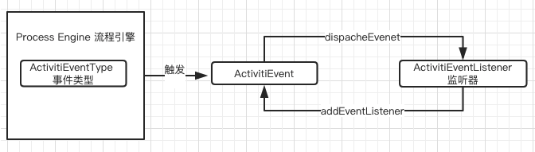

# 事件处理以及监听器配置
官方文档: https://www.activiti.org/userguide/#eventDispatcher
- 事件以及监听器原理
- 事件的配置方式
- Activiti的事件监听

##事件以及监听器原理


从上图中可以看出,流程引擎会通过事件类型以及事件源触发指定的事件,这个事件往往绑定了一个或者多个监听器,当事件触发时,会调用这些监听器执行事件,下面是上图对应的类:



- ActivitiEvent 事件对象 (所有事件对象的顶级接口)
- ActivitiEventListener 监听器 (所有监听器顶级接口)
- ActviitiEventType 事件类型 (枚举类型)

##事件的配置方式
- 配置文件配置 Listener
	- eventListeners:监听所有事件的派发通知
	- typedEventListeners:监听指定事件类型的通知
- 流程定义文件提供了对事件的监听
	- activiti:eventListener: 一般只监听特定流程的事件

我们写一个简单的监听器:
``` java
public class ProcessEventListener implements ActivitiEventListener {
    private static final Logger LOGGER = LoggerFactory.getLogger(ProcessEventListener.class);
    /**
     * 事件触发
     * @param event
     */
    public void onEvent(ActivitiEvent event) {
        ActivitiEventType type = event.getType();
        String executionId = event.getExecutionId();
        String processDefinitionId = event.getProcessDefinitionId();
        String processInstanceId = event.getProcessInstanceId();
        LOGGER.info("流程启动: type:[{}],executionId:[{}],processDefinitionId[{}],processInstanceId:[{}]"
                ,type,executionId,processDefinitionId,processInstanceId);
    }
}
```
### eventListeners 配置文件注册:

单元测试类:
```java
public class ConfigEventListenerTest {

    private static final Logger LOGGER = LoggerFactory.getLogger(ConfigEventListenerTest.class);

    @Rule
    public ActivitiRule activitiRule = new ActivitiRule("activiti.eventListener.cfg.xml");


    @Test
    @Deployment(resources = {"second_approve.bpmn20.xml"})
    public void test() {
        ProcessInstance processInstance = activitiRule
                .getRuntimeService()
                .startProcessInstanceByKey("second_approve");
        assert(processInstance !=null);

    }

}
```
配置文件`activiti.eventListener.cfg.xml`

```xml
    <bean id="processEngineConfiguration"
          class="org.activiti.engine.impl.cfg.StandaloneInMemProcessEngineConfiguration">
        <!-- 第一种方式 -->
        <property name="eventListeners">
            <list>
                <bean class="cn.eccto.activiti.event.ProcessEventListener"/>
            </list>
        </property>
    </bean>
```

部分输出结果,可以看出输出了所有的事件类型:
```
2019-04-21 08:47:35.902 [main] INFO  cn.eccto.activiti.event.ProcessEventListener ProcessDefinitionId= , executionId= - 流程启动: type:[ENGINE_CREATED],executionId:[null],processDefinitionId[null],processInstanceId:[null]
2019-04-21 08:47:35.912 [main] INFO  cn.eccto.activiti.event.ProcessEventListener ProcessDefinitionId= , executionId= - 流程启动: type:[ENTITY_CREATED],executionId:[null],processDefinitionId[null],processInstanceId:[null]
2019-04-21 08:47:35.912 [main] INFO  cn.eccto.activiti.event.ProcessEventListener ProcessDefinitionId= , executionId= - 流程启动: type:[ENTITY_INITIALIZED],executionId:[null],processDefinitionId[null],processInstanceId:[null]
2019-04-21 08:47:35.920 [main] INFO  cn.eccto.activiti.event.ProcessEventListener ProcessDefinitionId= , executionId= - 流程启动: type:[ENTITY_CREATED],executionId:[null],processDefinitionId[null],processInstanceId:[null]
2019-04-21 08:47:35.920 [main] INFO  cn.eccto.activiti.event.ProcessEventListener ProcessDefinitionId= , executionId= - 流程启动: type:[ENTITY_INITIALIZED],executionId:[null],processDefinitionId[null],processInstanceId:[null]
2019-04-21 08:47:35.920 [main] INFO  cn.eccto.activiti.event.ProcessEventListener ProcessDefinitionId= , executionId= - 流程启动: type:[ENTITY_CREATED],executionId:[null],processDefinitionId[null],processInstanceId:[null]
2019-04-21 08:47:37.549 [main] INFO  cn.eccto.activiti.event.ProcessEventListener ProcessDefinitionId= , executionId= - 流程启动: type:[ENTITY_CREATED],executionId:[null],processDefinitionId[second_approve:1:4],processInstanceId:[null]

```

### TypedEventListener 监听器
修改配置文件,单元测试依然沿用上面的
```xml
    <bean id="processEngineConfiguration"
          class="org.activiti.engine.impl.cfg.StandaloneInMemProcessEngineConfiguration">
        <!-- 第二种方式 -->
        <property name="typedEventListeners">
            <map>
                <!-- 指定事件类型 ActivitiEventType 中的静态变量-->
                <entry key="ENTITY_CREATED">
                    <list>
                        <bean class="cn.eccto.activiti.event.ProcessEventListener"/>
                    </list>
                </entry>
            </map>
        </property>
    </bean>
```
可以根据配置的 entry key 配置项配置事件类型的静态变量指定只有部分事件触发

部分输出,我们可以看出只打印出了流程启动类型的事件
```
2019-04-21 08:43:57.737 [main] INFO  cn.eccto.activiti.event.ProcessEventListener ProcessDefinitionId= , executionId= - 流程启动: type:[ENTITY_CREATED],executionId:[null],processDefinitionId[null],processInstanceId:[null]
2019-04-21 08:43:57.744 [main] INFO  cn.eccto.activiti.event.ProcessEventListener ProcessDefinitionId= , executionId= - 流程启动: type:[ENTITY_CREATED],executionId:[null],processDefinitionId[null],processInstanceId:[null]
2019-04-21 08:43:57.744 [main] INFO  cn.eccto.activiti.event.ProcessEventListener ProcessDefinitionId= , executionId= - 流程启动: type:[ENTITY_CREATED],executionId:[null],processDefinitionId[null],processInstanceId:[null]

```

## 通过写代码配置监听:
手动注册监听器并手动触发:

```java
    @Test
    @Deployment(resources = {"second_approve.bpmn20.xml"})
    public void test() {
        RuntimeService runtimeService = activitiRule.getRuntimeService();
        runtimeService.addEventListener(new CustomEventListener());
        ProcessInstance processInstance = runtimeService.startProcessInstanceByKey("second_approve");
        assert(processInstance !=null);

        //手动触发事件
        runtimeService.dispatchEvent(new ActivitiEventImpl(ActivitiEventType.CUSTOM));
    }
```

监听器我们只做了简单的处理:

```java
public class CustomEventListener implements ActivitiEventListener {
    private static final Logger LOGGER = LoggerFactory.getLogger(ProcessEventListener.class);


    public void onEvent(ActivitiEvent event) {
        if (ActivitiEventType.CUSTOM.equals(event.getType())){
            LOGGER.info("触发了自定义的监听器");
        }
    }

```

打印结果:

```
2019-04-21 09:01:12.604 [main] INFO  cn.eccto.activiti.event.ProcessEventListener  - 触发了自定义的监听器
2019-04-21 09:01:12.604 [main] INFO  cn.eccto.activiti.event.ProcessEventListener  - 触发了自定义的监听器
```