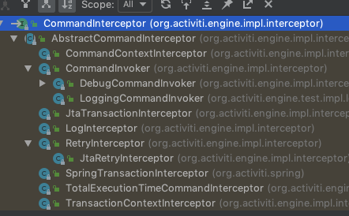

## 命令拦截器

Activiti 命令拦截器使用了命令模式和拦截器模式,这两个常用的设计模式可以参考

# 继承结构


可以看出:

- `CommandInterceptor`是命令拦截器的顶层接口
  - `AbstractCommendInterceptor `是实现顶层抽象接口的抽象类,主要封装了一些通用的实现
  - `CommandInvoker` 是默认的拦截器执行器 
    - `DebugCommandInvoker` 使用 DEBUG 模式看到更多执行输出是使用
    - `LoggingCommandInvoker` 测试环境下,输出 LOG 信息内容
  - `JtaTransactionInterceptor` Jta事务拦截器
    `LogInterceptor` 日志拦截器
  - `RetryInterceptor` 重试拦截器,尝试执行与上次一样的操作,尝试次数和超时时间可以配置
  - `SpringTransactionInterceptor` Spring 事务拦截器
  - `TotalExecutionTimeCommandInterceptor` 执行总时间拦截器
  - `TransactionContextInterceptor` 事务上下文拦截器

## 配置 Intereceptor

- customPreCommandInterceptor : 配置在默认拦截器之前
- customPostCommandInterceptor : 配置在默认拦截器之后
- commandInvoker : 配置执行器


```xml
    <bean id="processEngineConfiguration"
          class="org.activiti.engine.impl.cfg.StandaloneInMemProcessEngineConfiguration">
<!-- 默认拦截器之后-->
<!--        <property name="customPostCommandInterceptors">-->
<!--            <list>-->
<!--                <bean class="cn.eccto.activiti.interceptor.MyCommandInterceptor"/>-->
<!--            </list>-->
<!--        </property>-->
<!-- 默认拦截器之前-->
        <property name="customPreCommandInterceptors">
            <list>
                <bean class="cn.eccto.activiti.interceptor.MyCommandInterceptor"/>
            </list>
        </property>
    </bean>
```

那么,默认拦截器有哪些呢?通过查看源码:

## 默认拦截器

`org.activiti.engine.impl.cfg.ProcessEngineConfigurationImpl `中

```java
  public void initCommandInterceptors() {
    if (commandInterceptors == null) {
      commandInterceptors = new ArrayList<CommandInterceptor>();
      if (customPreCommandInterceptors != null) {
	  //添加配置的默认拦截器之前执行的拦截器
        commandInterceptors.addAll(customPreCommandInterceptors);
      }
	  //默认拦截器
      commandInterceptors.addAll(getDefaultCommandInterceptors());
      if (customPostCommandInterceptors != null) {
	  	  //添加配置的默认拦截器之后执行的拦截器
        commandInterceptors.addAll(customPostCommandInterceptors);
      }
      commandInterceptors.add(commandInvoker);
    }
  }
```

我们可以看到`getDefaultCommandInterceptors`获取到了所有默认的拦截器:

```java
  public Collection<? extends CommandInterceptor> getDefaultCommandInterceptors() {
    List<CommandInterceptor> interceptors = new ArrayList<CommandInterceptor>();
    interceptors.add(new LogInterceptor());

    CommandInterceptor transactionInterceptor = createTransactionInterceptor();
    if (transactionInterceptor != null) {
      interceptors.add(transactionInterceptor);
    }

    if (commandContextFactory != null) {
      interceptors.add(new CommandContextInterceptor(commandContextFactory, this));
    }

    if (transactionContextFactory != null) {
      interceptors.add(new TransactionContextInterceptor(transactionContextFactory));
    }

    return interceptors;
  }
```