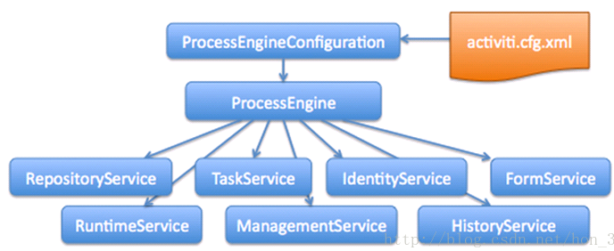

#  010-流程引擎以及服务

## 服务列表

| 序号 | Service名称       | 主要作用                                           |
| ---- | ----------------- | -------------------------------------------------- |
| 1    | RepositoryService | 流程部署、流程定义                                 |
| 2    | TaskService       | 对流程实例进行管理和控制                           |
| 3    | IdentityService   | 流程角色数据管理，如用户组、用户以及它们之间的关系 |
| 4    | formService       | 表单服务                                           |
| 5    | RuntimeService    | 在流程运行时对流程实例进行管理与控制               |
| 6    | ManagementService | 对流程引擎进行管理与维护                           |
| 7    | HistoryService    | 流程历史数据、查询、删除                           |
| 8    | DynamicBpmSerivce | 动态流程定义模型修改                               |
下面的章节将会逐一介绍