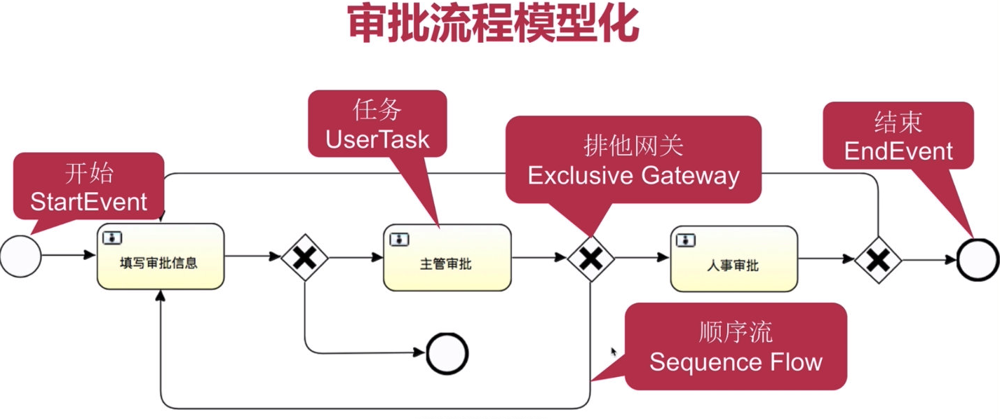
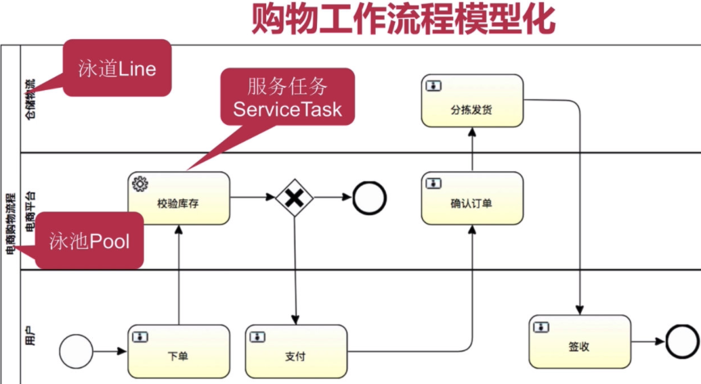

# 工作流介绍

-  **工作流(WorkFlow)** 是对工作流程以及其他各操作步骤之间的业务规则的抽象/概况/描述.
	- 我的理解: 工作流就是描述一个工作的流程,是对流程的抽象
- **工作流建模**是将工作流程中的工作如何前后组织在一起的逻辑规则,在计算机中以恰当的模型描述并对其实施计算
	- 我的理解: 对一个工作流程的抽象,以便在计算机中完成
- **工作流要解决的问题**为了实现某个业务目标,利用计算机在多个参与者之间按照某种预定规则自动传递文档/信息或者任务
	- 我的理解:解决人工流程的不可控性/历史留痕等问题
- **主流的工作流引擎** 
	- Activiti :
		- 稳定/老牌/成熟/满足BPMN2、xPDL、jPDL等规范（由PVM实现）
		- 用户众多,社区活跃,趋势良好
		- 基于 Spring/Mybatis/等常用互联网技术栈
		- 事务管理: MyBatis自带/Spring集成事务
	- jBPM   :
		- 目前仅支持BPMN2 xml
		- 有专门的技术团队和开发者
		- 默认没有对 Spring的支持
		- Bitronix，基于JTA事务管理

**本笔记基于 Activiti 6 ,主要是 BPMN2 规范**

下面的例子是一个简单的工作流:

## 工作流举例

## 模型举例

