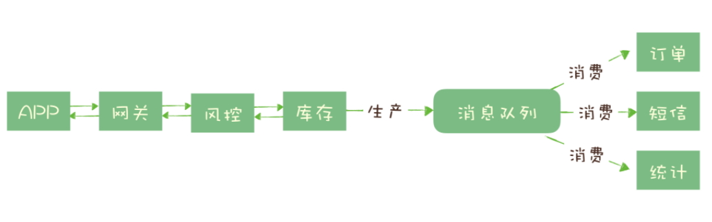

# 020-异步处理

[TOC]

## 前言

如何设计一个秒杀系统?

秒杀系统需要解决的核心问题是，如何利用有限的服务器资源，尽可能多地处理短时间内的海量请求。

我们知道，处理一个秒杀请求包含了很多步骤，例如：

- 风险控制；
- 库存锁定；
- 生成订单；
- 短信通知；
- 更新统计数据。

如果没有任何优化，正常的处理流程是：App 将请求发送给网关，依次调用上述 5 个流程，然后将结果返回给 APP。**这是同步方式**

对于对于这 5 个步骤来说，能否决定秒杀成功，实际上只有风险控制和库存锁定这 2 个步骤。只要用户的秒杀请求通过风险控制，并在服务端完成库存锁定，就可以给用户返回秒杀结果了，对于后续的生成订单、短信通知和更新统计数据等步骤，并不一定要在秒杀请求中处理完成。

所以当服务端完成前面 2 个步骤，确定本次请求的秒杀结果后，就可以马上给用户返回响应，然后把请求的数据放入消息队列中，由消息队列异步地进行后续的操作。(**这里体现了异步处理**)

处理一个秒杀请求，从 5 个步骤减少为 2 个步骤，这样不仅响应速度更快，并且

- 在秒杀期间，我们可以把大量的服务器资源用来处理秒杀请求。
- 秒杀结束后再把资源用于处理后面的步骤，充分利用有限的服务器资源处理更多的秒杀请求

这样的好处是

- 可以更快地返回结果；
- 减少等待，自然实现了步骤之间的并发，提升系统总体的性能。