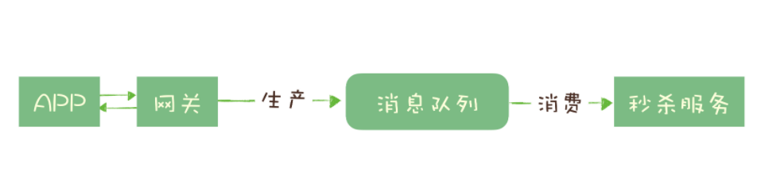
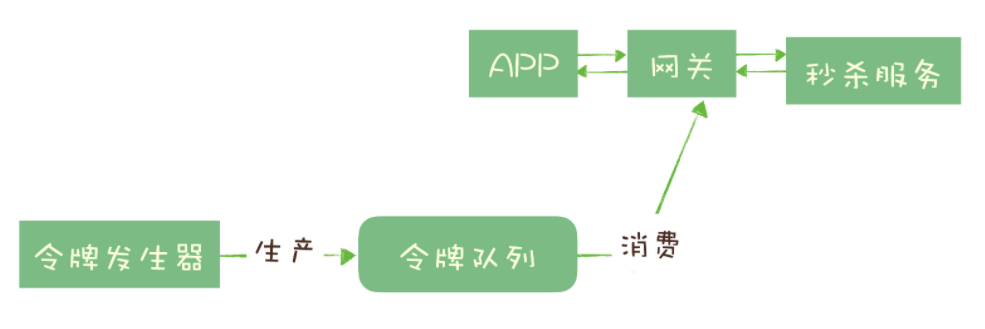

# 030-削峰填谷

[TOC]

## 前言

继续说我们的秒杀系统，我们已经使用消息队列实现了部分工作的异步处理，但我们还面临一个问题：

**如何避免过多的请求压垮我们的秒杀系统？**

一个设计健壮的程序有自我保护的能力，也就是说，它应该可以在海量的请求下，还能在自身能力范围内尽可能多地处理请求，拒绝处理不了的请求并且保证自身运行正常。不幸的是，现实中很多程序并没有那么“健壮”，而直接拒绝请求返回错误对于用户来说也是不怎么好的体验。

因此，我们需要设计一套足够健壮的架构来将后端的服务保护起来。

**我们的设计思路是，使用消息队列隔离网关和后端服务，以达到流量控制和保护后端服务的目的。**

加入消息队列后，整个秒杀流程变为：

1. **网关在收到请求后，将请求放入请求消息队列；**
2. **后端服务从请求消息队列中获取 APP 请求，完成后续秒杀处理过程，然后返回结果。**

秒杀开始后，当短时间内大量的秒杀请求到达网关时，不会直接冲击到后端的秒杀服务，而是先堆积在消息队列中，后端服务按照自己的最大处理能力，从消息队列中消费请求进行处理。

- **对于超时的请求可以直接丢弃**，APP 将超时无响应的请求处理为秒杀失败即可。

- **运维人员还可以随时增加秒杀服务的实例数量进行水平扩容**，而不用对系统的其他部分做任何更改。

这种设计的优点是：能根据下游的处理能力自动调节流量，达到“**削峰填谷**”的作用。但这样做同样是有代价的：

- 增加了系统调用链环节，导致总体的响应时延变长。
- 上下游系统都要将同步调用改为异步消息，增加了系统的复杂度。

#### 使用基于消息队列的令牌桶实现削峰

令牌桶控制流量的原理是：单位时间内只发放固定数量的令牌到令牌桶中，规定服务在处理请求之前必须先从令牌桶中拿出一个令牌，如果令牌桶中没有令牌，则拒绝请求。这样就保证单位时间内，能处理的请求不超过发放令牌的数量，起到了流量控制的作用。 

实现的方式也很简单，不需要破坏原有的调用链，只要网关在处理 APP 请求时增加一个获取令牌的逻辑。

令牌桶可以简单地用一个有固定容量的消息队列加一个“令牌发生器”来实现：

- 令牌发生器按照预估的处理能力，匀速生产令牌并放入令牌队列（如果队列满了则丢弃令牌）
- 网关在收到请求时去令牌队列消费一个令牌，获取到令牌则继续调用后端秒杀服务，如果获取不到令牌则直接返回秒杀失败。