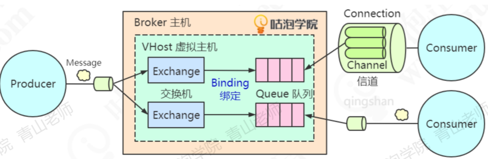

# 040-RabbitMQ的工作模型简介

由于RabbitMQ实现了AMQP协议,所以RabbitMQ的工作模型也是基于AMQP的



## 核心组件

- [Broker](#Broker)
- [Connection](#Connection)
- [Channel:消息信道](#Channel:消息信道)
- [Queue](#Queue)
- [Consumer](#Consumer)
- [Exchange](#Exchange)
- [Vhost](#Vhost)

### Broker

RabbitMQ的默认端口是5672, 这台RabbitMQ的服务器我们就叫做Broker主机

### Connection

无论是生产者发送消息还是消费者消费消息,都需要跟Broker之间建立一个连接,这个链接是TCP场链接

### Channel:消息信道

所有的生产者发送消息和消费者接受消息,都直接创建和释放TCP长连接的话,对于Broker来说肯定会造成很大的性能损耗,会浪费时间

所以在AMQP里面引入了Channel的概念, 它是一个虚拟的连接 ,叫做消息信道

- 我们可以在保持TCP场链接时创建和释放Channel,大大减少资源损耗
- 对于每一个客户端线程来说,它持有一个Channel信道
- Channel是RabbitMQ中原生API里面最重要的编程接口,我们调用交换机,队列,绑定关系,发送消息,消费消息,调用的都是Channel中的方法

### Queue

连接到Broker之后,我们就可以发消息了

Queue是Broker中的对象,它真正存储着消息,使用Mnesia数据库来进行存储,默认的存储路径为

```
c:\Users\用户名\AppData\Roaming\db\rabbit@用户名-mesia
```

### Consumer

消费者获取消息有两种模式

- pull模式(主动权在客户端)

  - 对应的方法是basicGet
  - 消息存放在服务端,只有消费者主动获取才能拿到消息,如果每隔一段时间获取一次,消息的实时性就会降低

  - 优点是可以根据客户端的消费能力进行消费

- push模式(主动权在MQ)

  - 对应的方法是basicConsume
  - 优点是实时性强,只要生产者发送消息到服务器,就马上推送给消费者消息保存在客户端
  - 缺点是如果消费端消费不过来,可能会造成消息挤压

值得注意的是

- RabbitMQ 支持 Pull 和 Push模式
- Kafka和RocketMQ只支持Pull模式

由于队列的FIFO特性,只要确定前一条消息被消费者接受之后,Broker才会把这条信息从数据库删除,继续投递下一条消息

一个消费者可以监听多个队列,一个队列也可以被多个消费者监听

在生产环境中,一个消费者只处理一个队列的信息,如果需要提高处理消息的能力,可以增加多个消费者,这个时候,消息会在多个消费者之间轮询

### Exchange

消息路由组件

#### 解决什么问题

如果要把一个消息发给多个队列,被多个消费者消费时

#### Excange做什么

Exchange不存储消息,只是消息的转发器,仅仅只根据规则分消息

#### Exchange和队列的关系

Exchange和队列是多对多的绑定关系,也就是说一个交换机的消息一个路由给多个队列,一个队列也可以用来接收多个交换机的消息

 [050-RabbitMQ的路由方式简介.md](050-RabbitMQ的路由方式简介.md) 

### Vhost

当想在同一个Broker中虚拟出多个虚拟主机时使用

虚拟主机除了可以提高硬件的资源利用率外,还实现了资源隔离和权限控制,它的作用类似于编程语言的namespace和queue

不同的业务应该有它们自己的vhost,然后再创建专属的用户,给用户分配对应的vhost权限,给超级管理员分配所有的vhost权限

RabbitMQ的默认Vhost是"/"