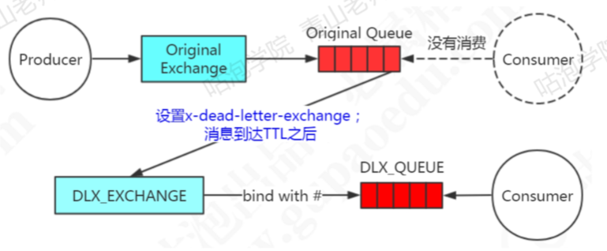

# 060-RabbitMQ延迟消费模型

- [消息的过期时间TTL](#消息的过期时间TTL)
- [死信与死信队列](#死信与死信队列)
- [延迟队列另外选择-rabbitmq-delayed-message-exchange](#延迟队列另外选择-rabbitmq-delayed-message-exchange)

## 消息的过期时间TTL

```
x-message-ttl
```

设置方式

```java
@Bean("oriUseQueue")
public Queue queue() {
  Map<String, Object> map = new HashMap<String, Object>();
  // 10秒钟后成为死信
  map.put("x-message-ttl", 10000); 
  // 队列中的消息变成死信后，进入死信交换机
  map.put("x-dead-letter-exchange", "GP_DEAD_LETTER_EXCHANGE"); 
  return new Queue("GP_ORI_USE_QUEUE", true, false, false, map);
}
```

## 死信与死信队列

消息过期之后,如果没有任何配置,就会直接被丢弃

队列在创建的时候可以指定一个死信交换机DLX(Dead Letter Exchange)死信交换机绑定的队列被称为死信队列DLQ(Dead Letter Queue)

如果消息过期了,队列指定了DLX,就会发送到DLX

如果DLX绑定了DLQ,就会路由到DLQ



#### 实例


```java
public class DlxConsumer {

    public static void main(String[] args) throws Exception {
        ConnectionFactory factory = new ConnectionFactory();
        factory.setUri(ResourceUtil.getKey("rabbitmq.uri"));
        // 建立连接
        Connection conn = factory.newConnection();
        // 创建消息通道
        Channel channel = conn.createChannel();

        // 指定队列的死信交换机
        Map<String,Object> arguments = new HashMap<String,Object>();
        arguments.put("x-dead-letter-exchange","GP_DEAD_LETTER_EXCHANGE");
        // arguments.put("x-expires",9000L); // 设置队列的TTL
        // arguments.put("x-max-length", 4); // 如果设置了队列的最大长度，超过长度时，先入队的消息会被发送到DLX

        // 声明队列（默认交换机AMQP default，Direct）
        // String queue, boolean durable, boolean exclusive, boolean autoDelete, Map<String, Object> arguments
        channel.queueDeclare("GP_ORI_USE_QUEUE", false, false, false, arguments);

        // 声明死信交换机
        channel.exchangeDeclare("GP_DEAD_LETTER_EXCHANGE","topic", false, false, false, null);
        // 声明死信队列
        channel.queueDeclare("GP_DEAD_LETTER_QUEUE", false, false, false, null);
        // 绑定，此处 Dead letter routing key 设置为 #
        channel.queueBind("GP_DEAD_LETTER_QUEUE","GP_DEAD_LETTER_EXCHANGE","#");
        System.out.println(" Waiting for message....");

        // 创建消费者
        Consumer consumer = new DefaultConsumer(channel) {
            @Override
            public void handleDelivery(String consumerTag, Envelope envelope, AMQP.BasicProperties properties,
                                       byte[] body) throws IOException {
                String msg = new String(body, "UTF-8");
                System.out.println("Received message : '" + msg + "'");
            }
        };

        // 开始获取消息
        // String queue, boolean autoAck, Consumer callback
        channel.basicConsume("GP_DEAD_LETTER_QUEUE", true, consumer);
    }
}
```

#### 死信队列实现延迟消息的缺点

- 如果是统一用队列来设置消息的TTL,当梯度非常多的情况下,例如1分钟,2分钟,5分钟,我们需要创建多个交换机来路由消息
- 如果单独设置消息的TTL,则可能造成队列中的消息阻塞
  - 前一台消息没有被消费,后面的无法投递,比如第一条的TTL是30min, 第二条的是10min,10分钟后,即使第二条消息应该投递了,但是由于第一条消息还未出队,所以无法投递
- 可能出现一定的额时间误差

## 延迟队列另外选择-rabbitmq-delayed-message-exchange

