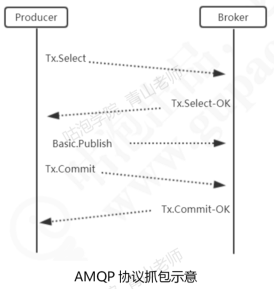

#  031-影响可靠性的第一阶段-生产者发送到Broker

## 目录

- [图示](#图示)

- [生产者发送消息到Broker会出现什么问题](#生产者发送消息到Broker会出现什么问题)
  - [代码实例-Java-api](#代码实例-Java-api)
  - [事务模式的缺点](#事务模式的缺点)

- [服务端确认-确认(Confirm)模式](#服务端确认-确认(Confirm)模式)
  - [普通的确认模式](#普通的确认模式)
  - [批量确认模式](#批量确认模式)
  - [异步确认模式](#异步确认模式)

## 图示


## 生产者发送消息到Broker会出现什么问题

生产者发送消息到Broker,为什么会失败

- 网络连接
- Broker自身的问题,如硬盘故障,硬盘写满了等等

#### 解决办法

这个时候生产者不能确定自己是否发送成功, 这个时候 RabbitMQ提供了两种服务端确认机制,在生产者发送消息给RabbitMQ的服务端的时候,服务端会通过以下两种方式返回一个应答,只要生产者收到了这个应答,就知道消息发送成功了

- [服务端确认-事务(Transaction)模式](#服务端确认-事务(Transaction)模式)

- [服务端确认-确认(Confirm)模式](#服务端确认-确认(Confirm)模式)

## 服务端确认-事务(Transaction)模式

在事务模式里,只有收到了服务端的Commit-OK的指令,才能提交成功,可以解决生产者和服务端确认的问题

#### 事务模式的流程图



- Prodicer先发送请求给Broker,询问是否可以使用事务模式
- Broker回复可以
- 只有收到了服务端的Commit-OK的指令.才能提交成功

#### 代码实例-Java-api

生产者

```java
public class TransactionProducer {
    private final static String QUEUE_NAME = "ORIGIN_QUEUE";

    public static void main(String[] args) throws Exception {
        ConnectionFactory factory = new ConnectionFactory();
        factory.setUri(ResourceUtil.getKey("rabbitmq.uri"));

        // 建立连接
        Connection conn = factory.newConnection();
        // 创建消息通道
        Channel channel = conn.createChannel();

        String msg = "Hello world, Rabbit MQ";
        // 声明队列（默认交换机AMQP default，Direct）
        // String queue, boolean durable, boolean exclusive, boolean autoDelete, Map<String, Object> arguments
        channel.queueDeclare(QUEUE_NAME, false, false, false, null);

        try {
            channel.txSelect();
            // 发送消息，发布了4条，但只确认了3条
            // String exchange, String routingKey, BasicProperties props, byte[] body
            channel.basicPublish("", QUEUE_NAME, null, (msg).getBytes());
            channel.txCommit();
            channel.basicPublish("", QUEUE_NAME, null, (msg).getBytes());
            channel.txCommit();
            channel.basicPublish("", QUEUE_NAME, null, (msg).getBytes());
            channel.txCommit();
            channel.basicPublish("", QUEUE_NAME, null, (msg).getBytes());
            int i =1/0;//故意报错,这条消息不会加入队列
            channel.txCommit();
            channel.basicPublish("", QUEUE_NAME, null, (msg).getBytes());
            channel.txCommit();
            System.out.println("消息发送成功");
        } catch (Exception e) {
          //捕获后进行回滚
            channel.txRollback();
            System.out.println("消息已经回滚");
        }

        channel.close();
        conn.close();
    }
}
```

#### 事务模式的缺点

它是阻塞的,一条消息没有发送完毕,不能发送下一条消息,它会乍看RabbitMQ服务器的性能,不建议在生产环境使用

#### SpringBoot中的设置

```java
rabbitTemplate.setChannelTransacted(true);
```

## 服务端确认-确认(Confirm)模式

- [普通的确认模式](#普通的确认模式)
- [批量确认模式](#批量确认模式)
- [异步确认模式](#异步确认模式)

### 普通的确认模式

生产者调用调用`channel.confirmSelect`的方式将信道设置为Confirm模式,然后发送消息

一旦消息被投递到交换机之后(跟是否路由到队列没有关系),RabbitMQ就会发送一个确认(Basic.Ack)给生产者,也就是调用

```
channel.waitForConfirms(); //返回true则表示确认了
```

这样生产者就知道消息被服务端接受了,如果网络错误,会抛出异常

#### 普通确认模式代码实例

```java
public class NormalConfirmProducer {

    private final static String QUEUE_NAME = "ORIGIN_QUEUE";

    public static void main(String[] args) throws Exception {
        ConnectionFactory factory = new ConnectionFactory();
        factory.setUri(ResourceUtil.getKey("rabbitmq.uri"));

        // 建立连接
        Connection conn = factory.newConnection();
        // 创建消息通道
        Channel channel = conn.createChannel();

        String msg = "Hello world, Rabbit MQ ,Normal Confirm";
        // 声明队列（默认交换机AMQP default，Direct）
        // String queue, boolean durable, boolean exclusive, boolean autoDelete, Map<String, Object> arguments
        channel.queueDeclare(QUEUE_NAME, false, false, false, null);

        // 开启发送方确认模式
        channel.confirmSelect();
        channel.basicPublish("", QUEUE_NAME, null, msg.getBytes());
        // 普通Confirm，发送一条，确认一条
        if (channel.waitForConfirms()) {
            System.out.println("消息发送成功" );
        }else{
            System.out.println("消息发送失败");
        }

        channel.close();
        conn.close();
    }
}

```

逐一确认效率太低,所以引入了批量确认

## 批量确认模式

```java
/**
	批量确认代码实例
 */
public class BatchConfirmProducer {
    private final static String QUEUE_NAME = "ORIGIN_QUEUE";

    public static void main(String[] args) throws Exception {
        ConnectionFactory factory = new ConnectionFactory();
        factory.setUri(ResourceUtil.getKey("rabbitmq.uri"));

        // 建立连接
        Connection conn = factory.newConnection();
        // 创建消息通道
        Channel channel = conn.createChannel();

        String msg = "Hello world, Rabbit MQ ,Batch Confirm";
        // 声明队列（默认交换机AMQP default，Direct）
        // String queue, boolean durable, boolean exclusive, boolean autoDelete, Map<String, Object> arguments
        channel.queueDeclare(QUEUE_NAME, false, false, false, null);

        try {
            channel.confirmSelect();
            for (int i = 0; i < 5; i++) {
                // 发送消息
                // String exchange, String routingKey, BasicProperties props, byte[] body
                channel.basicPublish("", QUEUE_NAME, null, (msg +"-"+ i).getBytes());
            }
            // 批量确认结果，ACK如果是Multiple=True，代表ACK里面的Delivery-Tag之前的消息都被确认了
            // 比如5条消息可能只收到1个ACK，也可能收到2个（抓包才看得到）
            // 直到所有信息都发布，只要有一个未被Broker确认就会IOException
            channel.waitForConfirmsOrDie();
            System.out.println("消息发送完毕，批量确认成功");
        } catch (Exception e) {
            // 发生异常，可能需要对所有消息进行重发
            e.printStackTrace();
        }

        channel.close();
        conn.close();
    }
}


```

只要`channel.waitForConfirmsOrDie();`没有抛出错误,就代表都被服务端接受了

#### 批量确认模式的缺点

- 批量确认的数量,对于不同的业务,多少次消息确认一次是一个问题,如果发送了999,最后一条报错则需要重发

为了解决这个问题,引入了异步确认模式

## 异步确认模式

异步确认模式

- 首先要维护一个未确认消息的Set
- 添加确认监听器
- 每次确认的个数是服务端决定的,每次确认完我们从Set中移除

```java
/**
 * 消息生产者，测试异步Confirm模式
 */
public class AsyncConfirmProducer {
    private final static String QUEUE_NAME = "ORIGIN_QUEUE";

    public static void main(String[] args) throws Exception {
        ConnectionFactory factory = new ConnectionFactory();
        factory.setUri(ResourceUtil.getKey("rabbitmq.uri"));

        // 建立连接
        Connection conn = factory.newConnection();
        // 创建消息通道
        Channel channel = conn.createChannel();

        String msg = "Hello world, Rabbit MQ, Async Confirm";
        // 声明队列（默认交换机AMQP default，Direct）
        // String queue, boolean durable, boolean exclusive, boolean autoDelete, Map<String, Object> arguments
        channel.queueDeclare(QUEUE_NAME, false, false, false, null);

        // 用来维护未确认消息的deliveryTag
        final SortedSet<Long> confirmSet = Collections.synchronizedSortedSet(new TreeSet<Long>());

        // 这里不会打印所有响应的ACK；ACK可能有多个，有可能一次确认多条，也有可能一次确认一条
        // 异步监听确认和未确认的消息
        // 如果要重复运行，先停掉之前的生产者，清空队列
        channel.addConfirmListener(new ConfirmListener() {
            public void handleNack(long deliveryTag, boolean multiple) throws IOException {
                System.out.println("Broker未确认消息，标识：" + deliveryTag);
                if (multiple) {
                    // headSet表示后面参数之前的所有元素，全部删除
                    confirmSet.headSet(deliveryTag + 1L).clear();
                } else {
                    confirmSet.remove(deliveryTag);
                }
                // 这里添加重发的方法
            }
            public void handleAck(long deliveryTag, boolean multiple) throws IOException {
                // 如果true表示批量执行了deliveryTag这个值以前（小于deliveryTag的）的所有消息，如果为false的话表示单条确认
                System.out.println(String.format("Broker已确认消息，标识：%d，多个消息：%b", deliveryTag, multiple));
                if (multiple) {
                    // headSet表示后面参数之前的所有元素，全部删除
                    confirmSet.headSet(deliveryTag + 1L).clear();
                } else {
                    // 只移除一个元素
                    confirmSet.remove(deliveryTag);
                }
                System.out.println("未确认的消息:"+confirmSet);
            }
        });

        // 开启发送方确认模式
        channel.confirmSelect();
        for (int i = 0; i < 10; i++) {
            long nextSeqNo = channel.getNextPublishSeqNo();
            // 发送消息
            // String exchange, String routingKey, BasicProperties props, byte[] body
            channel.basicPublish("", QUEUE_NAME, null, (msg +"-"+ i).getBytes());
            confirmSet.add(nextSeqNo);
        }
        System.out.println("所有消息:"+confirmSet);

        // 这里注释掉的原因是如果先关闭了，可能收不到后面的ACK
        //channel.close();
        //conn.close();
    }
}


```

SpringBoot

Comfirm模式是在Channel上开启的,RabbitTemplate对Channel进行了封装

```java
@Bean
public RabbitTemplate rabbitTemplate(ConnectionFactory connectionFactory) {
  RabbitTemplate rabbitTemplate = new RabbitTemplate(connectionFactory);
  rabbitTemplate.setMandatory(true);
  rabbitTemplate.setReturnCallback(new RabbitTemplate.ReturnCallback(){
    public void returnedMessage(Message message,
                                int replyCode,
                                String replyText,
                                String exchange,
                                String routingKey){
      System.out.println("回发的消息：");
      System.out.println("replyCode: "+replyCode);
      System.out.println("replyText: "+replyText);
      System.out.println("exchange: "+exchange);
      System.out.println("routingKey: "+routingKey);
    }
  });
	//设置信道为事务模式
  rabbitTemplate.setChannelTransacted(true);

  //添加确认回调
  rabbitTemplate.setConfirmCallback(new RabbitTemplate.ConfirmCallback() {
    public void confirm(CorrelationData correlationData, boolean ack, String cause) {
      if (!ack) {
        System.out.println("发送消息失败：" + cause);
        throw new RuntimeException("发送异常：" + cause);
      }
    }
  });

  return rabbitTemplate;
}
```

