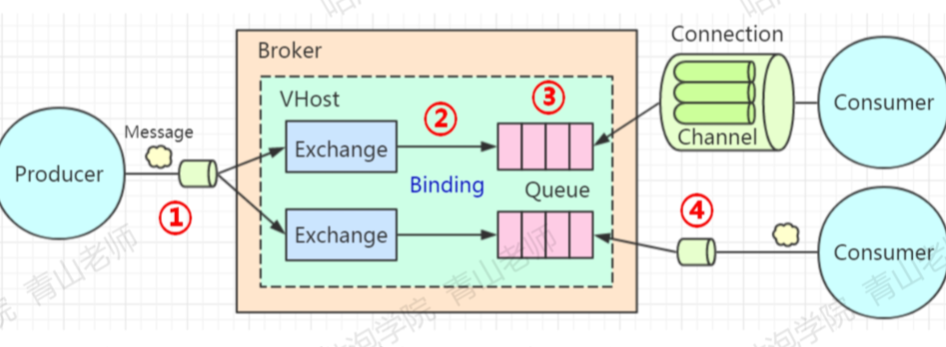

# 032-影响可靠性的第二阶段-消息从交换机路由到队列.md

## 简介

消息在什么情况下会无法到达正确的路由

- routingkey错误
- 队列不存在

一般在生产环境不会出现这两个问题

处理无法路由消息的解决方案

1. [消息回发-服务端打回给生产者](#消息回发-服务端打回给生产者)
2. [交换机路由到另一个备份的交换机](#交换机路由到另一个备份的交换机)

## 消息回发-服务端打回给生产者

查无此人

直接给chanel绑定一个回退监听器,回退监听器由生产者实现,处理回退时的逻辑



#### Java API方式

```java
channel.addReturnListener(new ReturnListener() {
  public void handleReturn(int replyCode,
                           String replyText,
                           String exchange,
                           String routingKey,
                           AMQP.BasicProperties properties,
                           byte[] body)
    throws IOException {
    System.out.println("=========监听器收到了无法路由，被返回的消息============");
    System.out.println("replyText:"+replyText);
    System.out.println("exchange:"+exchange);
    System.out.println("routingKey:"+routingKey);
    System.out.println("message:"+new String(body));
  }
});

channel.exchangeDeclare("TEST_EXCHANGE", "topic", false, false, false, null);
// 发送到了默认的交换机上，由于没有任何队列使用这个关键字跟交换机绑定，所以会被退回
// 第三个参数是设置的mandatory，如果mandatory是false，消息也会被直接丢弃
channel.basicPublish("TEST_EXCHANGE", "bucunzai", true, properties, "只为更好的你".getBytes());
```

#### SpringBoot

```java
@Bean
public RabbitTemplate rabbitTemplate(ConnectionFactory connectionFactory) {
  RabbitTemplate rabbitTemplate = new RabbitTemplate(connectionFactory);
  rabbitTemplate.setMandatory(true);
  //添加回退时触发的回调
  rabbitTemplate.setReturnCallback(new RabbitTemplate.ReturnCallback(){
    public void returnedMessage(Message message,
                                int replyCode,
                                String replyText,
                                String exchange,
                                String routingKey){
      System.out.println("回发的消息：");
      System.out.println("replyCode: "+replyCode);
      System.out.println("replyText: "+replyText);
      System.out.println("exchange: "+exchange);
      System.out.println("routingKey: "+routingKey);
    }
  });

  rabbitTemplate.setChannelTransacted(true);
	//添加确认回调
  rabbitTemplate.setConfirmCallback(new RabbitTemplate.ConfirmCallback() {
    public void confirm(CorrelationData correlationData, boolean ack, String cause) {
      if (!ack) {
        System.out.println("发送消息失败：" + cause);
        throw new RuntimeException("发送异常：" + cause);
      }
    }
  });

  return rabbitTemplate;
}
```

## 交换机路由到另一个备份的交换机

在声明交换机的时候指定备份交换机

```java
// 在声明交换机的时候指定备份交换机
Map<String,Object> arguments = new HashMap<String,Object>();
arguments.put("alternate-exchange","ALTERNATE_EXCHANGE");
channel.exchangeDeclare("TEST_EXCHANGE","topic", false, false, false, arguments);
```

那么当发现无法路由到队列时会发至备份交换机

