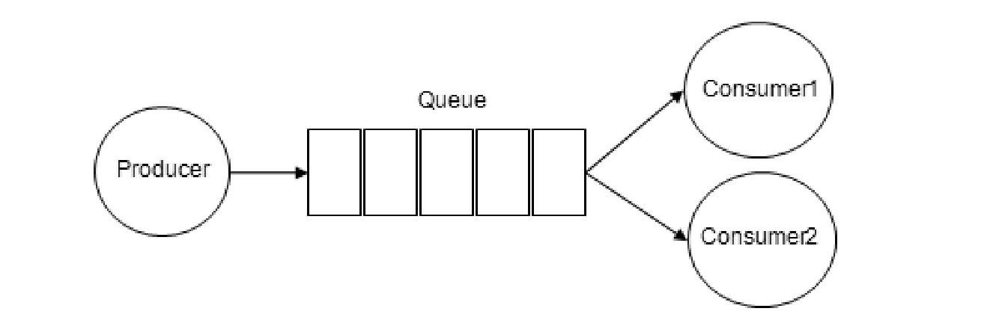

# 010-RabbitMQ基础概念

## 目录

- [生产者](#生产者)

- [消费者](#消费者)

- [三级目录](#三级目录)

- [四级目录](#四级目录)

## 生产者

生产者,投递消息的一方

生产者创建消息，然后发布到RabbitMQ中。消息一般可以包含2个部分：

- 消息体
- 标签（Label）

消息体也可以称之为payload，在实际应用中，消息体一般是一个带有业务逻辑结构的数据，比如一个JSON字符串。当然可以进一步对这个消息体进行序列化操作。

消息的标签用来表述这条消息，比如一个交换器的名称和一个路由键。生产者把消息交由RabbitMQ，RabbitMQ之后会根据标签把消息发送给感兴趣的消费者（Consumer）。

## 消费者

Consumer：消费者，就是接收消息的一方。

消费者连接到RabbitMQ服务器，并订阅到队列上。

当消费者消费一条消息时，只是消费消息的消息体（payload）。在消息路由的过程中，**消息的标签会丢弃**，存入到队列中的消息只有消息体，消费者**也只会消费到消息体**，也就不知道消息的生产者是谁，当然消费者也不需要知道。

## Broker

Broker：消息中间件的服务节点。

对于RabbitMQ来说，一个RabbitMQ Broker可以简单地看作一个RabbitMQ服务节点，或者RabbitMQ服务实例。**大多数情况下也可以将一个RabbitMQ Broker看作一台RabbitMQ服务器。**

## 队列

Queue：队列，是RabbitMQ的内部对象，用于存储消息。

RabbitMQ中消息都**只能存储在队列中**，这一点和Kafka这种消息中间件相反。

- Kafka将消息存储在topic（主题）这个逻辑层面，而相对应的队列逻辑只是topic实际存储文件中的位移标识。
- RabbitMQ的生产者生产消息并最终投递到队列中，消费者可以从队列中获取消息并消费。
- 多个消费者可以订阅同一个队列，这时队列中的消息会被平均分摊（**Round-Robin，即轮询**）给多个消费者进行处理，而不是每个消费者都收到所有的消息并处理

**RabbitMQ不支持队列层面的广播消费，如果需要广播消费，需要在其上进行二次开发，处理逻辑会变得异常复杂，同时也不建议这么做。**

## 