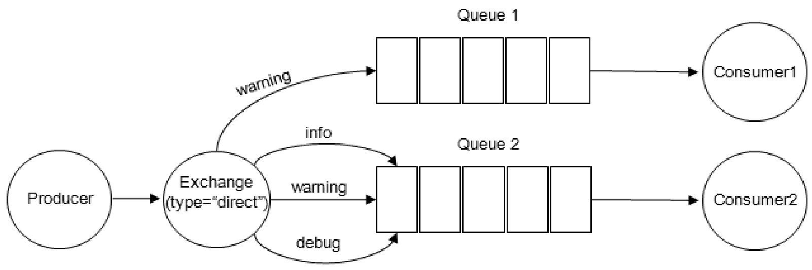
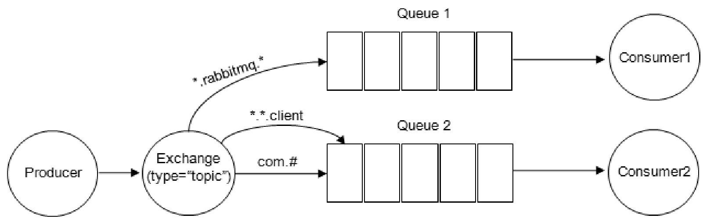

# 011-RabbitMQ交换器、路由键、绑定

------

[TOC]

## Exchange交换器

交换器，生产者将消息发送到Exchange，由交换器将消息路由到一个或者多个队列中，

如果路由不到

- 返回给生产者
- 直接丢弃

## Exchange交换器类型

RabbitMQ常用的交换器类型有

- fanout
- direct
- topic
- headers

#### fanout

会把所有发送到该交换器的消息路由到所有与该交换器绑定的队列中

#### direct

direct类型的交换器路由规则也很简单，它会把消息路由到那些BindingKey和RoutingKey完全匹配的队列中

```java
channel.basicPublish(EXCHANGE_NAME, 
										"worning", 
										MessageProperties.PERSISTENT_TEXT_PLAIN, 
										message.getBytes()
);
```



例如我们发送一条消息,并在发送消息的时候设置路由键为

- worning

则消息会路由到Queue1和Queue2

如果在发送消息的时候,设置为路由键为

- info
- debug

消息值会路由到Queue2, 如果以其他的路由键发送消息

#### topic

direct类型的交换器路由规则是完全匹配BindingKey和RoutingKey，但是这种严格的匹配方式在很多情况下不能满足实际业务的需求。

topic类型的交换器在匹配规则上进行了扩展，它与direct类型的交换器相似，也是将消息路由到BindingKey和RoutingKey相匹配的队列中，但这里的匹配规则有些不同，它约定：

- RoutingKey为一个点号“.”分隔的字符串（被点号“.”分隔开的每一段独立的字符串称为一个单词）,BindingKey和RoutingKey一样也是点号“.”分隔的字符串；
- BindingKey中可以存在两种特殊字符串“*”和“＃”，用于做模糊匹配，其中“＃”用于匹配一个单词，“＃”用于匹配多规格单词（可以是零个）。

例如：



- 路由键为“com.rabbitmq.client”的消息会同时路由到Queue1和Queue2；
- 路由键为“com.hidden.client”的消息只会路由到Queue2中；
- 路由键为“com.hidden.demo”的消息只会路由到Queue2中；
- 路由键为“java.rabbitmq.demo”的消息只会路由到Queue1中；
- 路由键为“java.util.concurrent”的消息将会被丢弃或者返回给生产者（需要设置mandatory参数），因为它没有匹配任何路由键。

#### headers

headers类型的交换器不依赖于路由键的匹配规则来路由消息，而是根据发送的消息内容中的headers属性进行匹配。

在绑定队列和交换器时制定一组键值对，当发送消息到交换器时，RabbitMQ会获取到该消息的headers（也是一个键值对的形式），对比其中的键值对是否完全匹配队列和交换器绑定时指定的键值对，如果完全匹配则消息会路由到该队列，否则不会路由到该队列。

headers类型的交换器性能会很差，而且也不实用，基本上不会看到它的存在。

## RoutingKey路由键

路由键，生产者将消息发给交换器的时候，一般会指定一个RoutingKey，用来指定这个消息的路由规则，而这个RoutingKey需要与交换器类型和绑定键（BindingKey）联合使用才能最终生效

在交换器类型和绑定键（BingingKey）固定的情况下，生产者可以在发送消息给交换器时，通过指定RoutingKey来决定消息流向哪里

## Binding绑定

RabbitMQ中通过绑定将交换器与队列关联起来，在绑定的时候一般会指定一个绑定键（BingingKey)，这样RabbitMQ就知道如何正确的将消息路由到队列了

生产者发送消息给交换器Exchange时，需要一个RoutingKey,

- 当BindingKey 和RoutingKey相匹配时，消息会被路由到队列中
- 并不是所有类型的交换器都根据BindingKey,比如fanout类型的交换器就会无视BindingKey，而是将消息路由到所有绑定到该交换器队列中

形象的比喻

- 交换器Exchange相当于投递包裹的邮箱
- RoutingKey相当于填写在包裹上的地址
- BindingKey相当于包裹的目的地
  - 当RoutingKey和BindingKey匹配时，投递
  - 当不匹配时，退回或丢弃

```java
//声明一个 direct类型的交换器
channel.exchangeDeclare(EXCHANGE_NAME, "direct", true, false, null);
//声明一个队列
channel.queueDeclare(QUEUE_NAME, true, false, false, null);
//使用ROUTING_KEY 去绑定交换器和队列
channel.queueBind(QUEUE_NAME, EXCHANGE_NAME, ROUTING_KEY);

String message = "HelloWorld";
channel.basicPublish(EXCHANGE_NAME, ROUTING_KEY, 
                  MessageProperties.PERSISTENT_TEXT_PLAIN,
                  message.getBytes());
```

- 在direct类型交换器下， RoutingKey和BindingKey要完全一致才能使用
