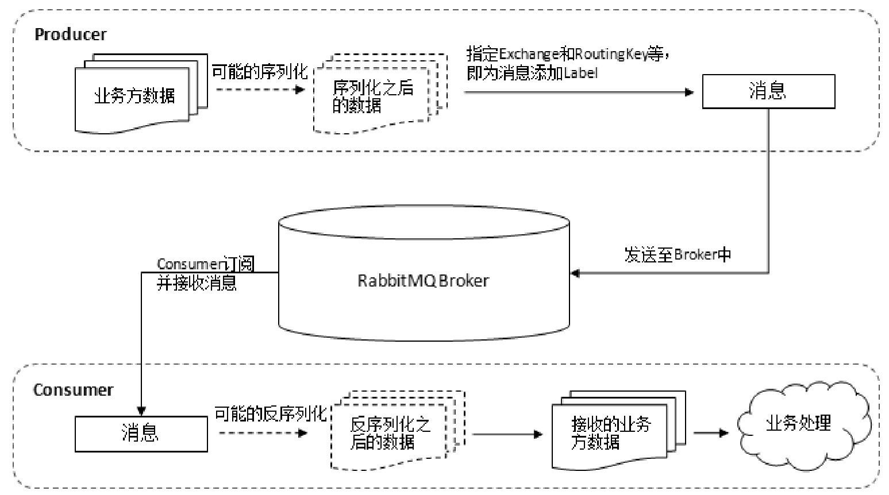

# 020-RabbitMQ工作流程

## 消息中间件流程

生产者将消息存入RabbitMQ Broker，以及消费者从Broker中消费数据的整个流程。

- 首先生产者将业务方数据进行可能的包装，之后封装成消息，发送（AMQP协议里这个动作对应的命令为**Basic.Publish**）到Broker中。

- 消费者订阅并接收消息（AMQP协议里这个动作对应的命令为**Basic.Consume**或者**Basic.Get**），经过可能的解包处理得到原始的数据，之后再进行业务处理逻辑。
  - 这个业务处理逻辑并不一定需要和接收消息的逻辑使用同一个线程。
  - 消费者进程可以使用一个线程去接收消息，存入到内存中，比如使用Java中的BlockingQueue。
  - 业务处理逻辑使用另一个线程从内存中读取数据，这样可以将应用进一步解耦，提高整个应用的处理效率。

##总体流程

### 生产者发送消息的过程:

1. 生产者连接到RabbitMQ Broker，建立一个连接（Connection），开启一个信道（Channel）
2. 生产者声明一个交换器，并设置相关属性，比如交换机类型、是否持久化等
3. 生产者声明一个队列并设置相关属性，比如是否排他、是否持久化、是否自动删除等
4. 生产者通过路由键将交换器和队列绑定起来
5. 生产者发送消息至RabbitMQ Broker，其中包含路由键、交换器等信息
6. 相应的交换器根据接收到的路由键查找相匹配的队列。
7. 如果找到，则将从生产者发送过来的消息存入相应的队列中。
8. 如果没有找到，则根据生产者配置的属性选择丢弃还是回退给生产
9. 关闭信道
10. 关闭连接。

### 消费者接收消息的过程：

1. 消费者连接到RabbitMQ Broker，建立一个连接（Connection），开启一个信道（Channel）。
2. 消费者向RabbitMQ Broker请求消费相应队列中的消息，可能会设置相应的回调函数，以及做一些准备工作
3. 等待RabbitMQ Broker回应并投递相应队列中的消息，消费者接收消息。
4. 消费者确认（ack）接收到的消息。
5. RabbitMQ从队列中删除相应已经被确认的消息。
6. 关闭信道。
7. 关闭连接。

