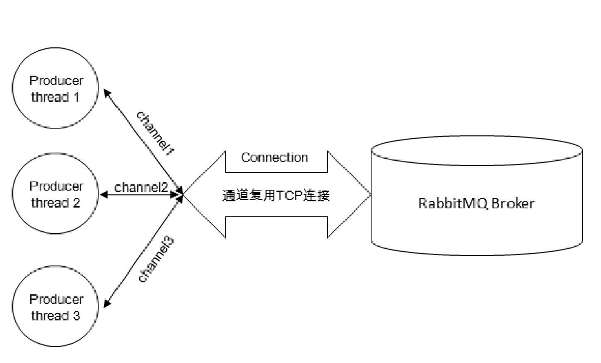
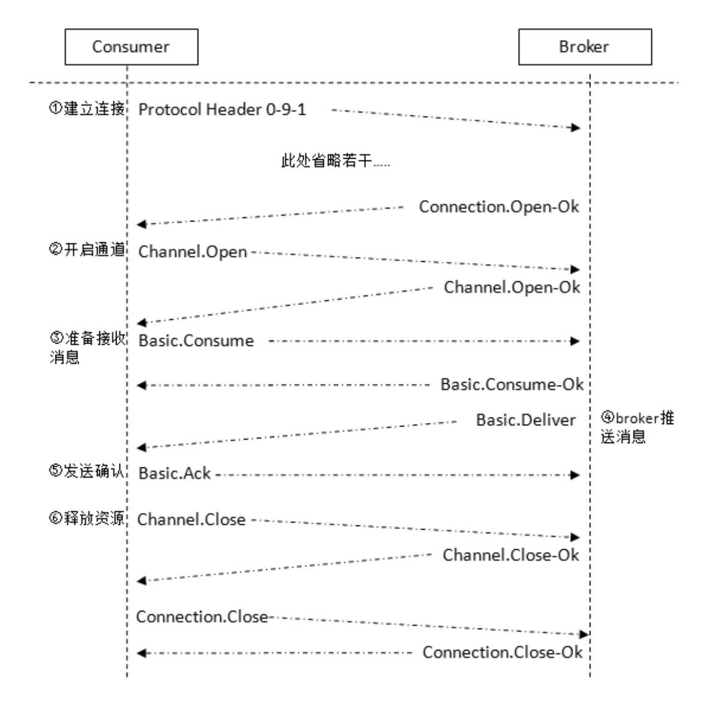

# 030-AMQP协议介绍

------

[TOC]



## Connection和Channel

无论是生产者还是消费者，都需要和RabbitMQ Broker建立连接，这个连接就是一条TCP连接，也就是Connection。

一旦TCP连接建立起来，客户端紧接着可以创建一个AMQP信道（Channel），每个信道都会被指派一个唯一的ID。信道是建立在Connection之上的虚拟连接，RabbitMQ处理的每条AMQP指令都是通过信道完成的。

我们完全可以直接使用Connection就能完成信道的工作，为什么还要引入信道呢？

试想这样一个场景，一个应用程序中有很多个线程需要从RabbitMQ中消费消息，或者生产消息，那么必然需要建立很多个Connection，也就是许多个TCP连接。然而对于操作系统而言，建立和销毁TCP连接是非常昂贵的开销，如果遇到使用高峰，性能瓶颈也随之显现。

**RabbitMQ采用类似NIO（Non-blocking I/O）的做法，选择TCP连接复用，不仅可以减少性能开销，同时也便于管理。**

每个线程把持一个信道，所以信道复用了Connection的TCP连接。

同时RabbitMQ可以确保每个线程的私密性，就像拥有独立的连接一样。当每个信道的流量不是很大时，复用单一的Connection可以在产生性能瓶颈的情况下有效地节省TCP连接资源。

但是当信道本身的流量很大时，这时候多个信道复用一个Connection就会产生性能瓶颈，进而使整体的流量被限制了。此时就需要开辟多个Connection，将这些信道均摊到这些Connection中，至于这些相关的调优策略需要根据业务自身的实际情况进行调节

信道在AMQP中是一个很重要的概念，大多数操作都是在信道这个层面展开的。

```
channel.exchangeDeclare
channel.queueDeclare
channel.basicPublish
channel.basicConsume
```

RabbitMQ相关的API与AMQP紧密相连，比如channel.basicPublish对应AMQP的Basic.Publish命令

## AMQP协议

RabbitMQ就是AMQP协议的Erlang的实现（当然RabbitMQ还支持STOMP、MQTT等协议）

AMQP的模型架构和RabbitMQ的模型架构是一样的，生产者将消息发送给交换器，交换器和队列绑定。当生产者发送消息时所携带的RoutingKey与绑定时的BindingKey相匹配时，消息即被存入相应的队列之中。消费者可以订阅相应的队列来获取消息。

RabbitMQ中的交换器、交换器类型、队列、绑定、路由键等都是遵循的AMQP协议中相应的概念。

## AMQP协议本身包括三层

- Module Layer：位于协议最高层，主要定义了一些供客户端调用的命令，客户端可以利用这些命令实现自己的业务逻辑。例如，客户端可以使用Queue.Declare命令声明一个队列或者使用Basic.Consume订阅消费一个队列中的消息。
- Session Layer：位于中间层，主要负责将客户端的命令发送给服务器，再将服务端的应答返回给客户端，主要为客户端与服务器之间的通信提供可靠性同步机制和错误处理。
- Transport Layer：位于最底层，主要传输二进制数据流，提供帧的处理、信道复用、错误检测和数据表示等。

AMQP说到底还是一个通信协议，通信协议都会涉及报文交互，从low-level举例来说，AMQP本身是应用层的协议，其填充于TCP协议层的数据部分。

而从high-level来说，AMQP是通过协议命令进行交互的。

AMQP协议可以看作一系列结构化命令的集合，这里的命令代表一种操作，类似于HTTP中的方法（GET、POST、PUT、DELETE等）。

## AMQP生产者流转过程


1. 当客户端与Broker建立连接的时候，会调用factory.newConnection方法，这个方法会进一步封装成Protocol Header 0-9-1的报文头发送给Broker，以此通知Broker本次交互采用的是AMQP 0-9-1协议
2. 紧接着Broker返回Connection.Start来建立连接，在连接的过程中涉及Connection.Start/.Start-OK、Connection.Tune/.Tune-Ok、Connection.Open/.Open-Ok这6个命令的交互。
3. 当客户端调用connection.createChannel方法准备开启信道的时候，其包装Channel.Open命令发送给Broker，等待Channel.Open-Ok命令。
4. 当客户端发送消息的时候，需要调用channel.basicPublish方法，对应的AQMP命令为Basic.Publish，注意这个命令和前面涉及的命令略有不同，这个命令还包含了Content Header和Content Body。Content Header里面包含的是消息体的属性，例如，投递模式、优先级等，而Content Body包含消息体本身。
5. 当客户端发送完消息需要关闭资源时，涉及Channel.Close/.Close-Ok与Connection.Close/.Close-Ok的命令交互。

典型代码如下

```java
//创建连接
Connection connection = factory.newConnection();
//创建信道
Cannel channel = connection.createChannel();
String message = "HelloWorld";
channel.basicPublish(EXCHANGE_NAME,
                     ROUTING_KEY,
                     MessageProperties.PERSISTENT_TEXT_PLAIN,
                     message.getBytes()
                    );
//关闭资源
channel.close();
connection.close();
```

## AMQP消费者流转过程



1. 消费者客户端同样需要与Broker建立连接，与生产者客户端一样，协议交互同样涉及Connection.Start/.Start-Ok、Connection.Tune/.Tune-Ok和Connection.Open/.Open-Ok等，图中省略了这些步骤
2. 紧接着也少不了在Connection之上建立Channel，和生产者客户端一样，协议涉及Channel.Open/Open-Ok。
3. 如果在消费之前调用了channel.basicQos（int prefetchCount）的方法来设置消费者客户端最大能“保持”的未确认的消息数，那么协议流转会涉及Basic.Qos/.Qos-Ok这两个AMQP命令。
4. 在真正消费之前，消费者客户端需要向Broker发送Basic.Consume命令（即调用channel.basicConsume方法）将Channel置为接收模式，之后Broker回执Basic.Consume-Ok以告诉消费者客户端准备好消费消息。紧接着Broker向消费者客户端推送（Push）消息，即Basic.Deliver命令，有意思的是这个和Basic.Publish命令一样会携带Content Header和Content Body。
5. 消费者接收到消息并正确消费之后，向Broker发送确认，即Basic.Ack命令。
6. 在消费者停止消费的时候，主动关闭连接，这点和生产者一样，涉及Channel.Close/.Close-Ok和Connection.Close/.Close-Ok。

```
Connection connection = factory.newConnection(address);//建立连接
final Channel channel = connection.createChannel();//创建信道

Consumer consumer = new DefaultConsumer(channel){
// 省略
}
channel.basicQos(64);
channel.basicConsume(QUEUE_NAME, consumer);

//等待回调函数执行完毕之后,关闭资源
TimeUnit.SECOND.sleep(5);
channel.close();
connection.close();
```

