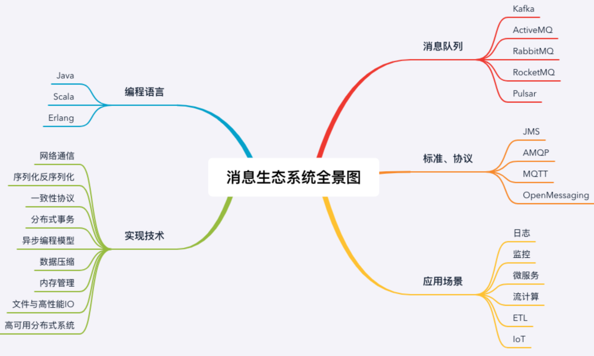

# 为什么要有分布式消息中间件

- 异步
- 解耦
- 削峰

 JMS、AMQP、MQTT、OpenMessaging

## 学习资源

RocketMQ 官方文档: https://rocketmq.apache.org/docs/quick-start/

RocketMQ 中国开发者中心:http://rocketmq.cloud/zh-cn/ 

Kafka 官方文档: http://kafka.apache.org/documentation/

RabbitMQ 官方文档: https://www.rabbitmq.com/documentation.html

