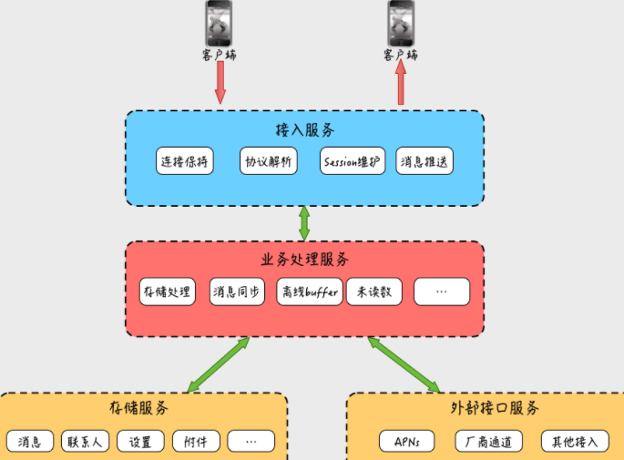

# 010-架构与特性：一个完整的IM系统是怎样的

[TOC]

## 总结

#### 一个较完整的 IM 系统都应该有什么

#### 即时消息有别于其他业务系统的四大特性

- 实时性，保证消息实时触达是互动场景的必备能力。
- 可靠性，“不丢消息”和“消息不重复”是系统值得信赖的前置条件。
- 一致性，“多用户”“多终端”的一致性体验能大幅提升 IM 系统的使用体验。
- 安全性，“数据传输安全”“数据存储安全”“消息内容安全“三大保障方面提供全面隐私保护。

## **为什么接入服务和业务处理服务要独立拆分呢？**

我们前面讲到，接入服务的主要是为客户端提供消息收发的出入口，而业务处理服务主要是处理各种聊天消息的业务逻辑，这两个服务理论上进行合并好像也没有什么不妥，但大部分 IM 系统的实现上，却基本上都会按照这种方式进行拆分。

我认为，接入服务和业务处理服务独立拆分，有以下几点原因。

- **第一点是接入服务作为消息收发的出入口，必须是一个高可用的服务，保持足够的稳定性是一个必要条件。**

试想一下，如果连接服务总处于不稳定状态，老是出现连不上或者频繁断连的情况，一定会大大影响聊天的流畅性和用户体验。

而业务处理服务由于随着产品需求迭代，变更非常频繁，随时有新业务需要上线重启。

如果消息收发接入和业务逻辑处理都在一起，势必会让接入模块随着业务逻辑的变更上线，而频繁起停，导致已通过网络接入的客户端连接经常性地断连、重置、重连。

这种连接层的不稳定性会导致消息下推不及时、消息发送流畅性差，甚至会导致消息发送失败，从而降低用户消息收发的体验。

所以，将“只负责网络通道维持，不参与业务逻辑，不需要频繁变更的接入层”抽离出来，不管业务逻辑如何调整变化，都不需要接入层进行变更，这样能保证连接层的稳定性，从而整体上提升消息收发的用户体验。

- **第二点是从业务开发人员的角度看，接入服务和业务处理服务进行拆分有助于提升业务开发效率，降低业务开发门槛。**

模块拆分后，接入服务负责处理一切网络通信相关的部分，比如网络的稳定性、通信协议的编解码等。这样负责业务开发的同事就可以更加专注于业务逻辑的处理，而不用关心让人头痛的网络问题，也不用关心“天书般的通信协议”了。

## IM 系统都有哪些特性？

上面我们从使用者和从业者两个角度，分别了解一个完整 IM 系统的构成，接下来我们和其他系统对比着来看一下，从业务需求出发，IM 系统都有哪些不一样的特性。

### 1. 实时性

对于一个实时消息系统，“实时”二字很好地表达了这个系统的基本要求。

通过微信和你的好友聊天，结果等半天对方才收到，基本上也没有意愿聊了；直播场景下，如果主播的互动消息房间里的粉丝要等很长时间才能收到，也很难让粉丝们有积极参与的欲望。

了解到“实时性”在实时消息场景下的重要性后，在技术方面，我们会采用哪些手段来提升和保证这一特性呢？细节暂不展开，在第 3 篇“轮询与长连接：如何解决消息实时到达问题”中，我会和你继续探讨“保证消息实时性”的几种方案。

### 2. 可靠性

如果说“实时性”是即时消息被广泛应用于各种社交、互动领域的基本前置条件，那么消息的可靠性则是实时消息服务可以“被信赖”的另一个重要特性。

这里的可靠性通俗来讲，一般包括两个方面。

- **不丢消息。**“丢消息”是互动中让人难以接受的 Bug，某些场景下可能导致业务可用性差，甚至不可用的情况。比如直播间“全员禁言”的信令消息丢失，就可能导致直播室不可控的一些情况。
- **消息不重复。**消息重复不仅会对用户造成不必要的骚扰和困惑，可能还会导致比较严重的业务异常，比如直播间“送礼物”的消息由于某种原因被重复发出，处理不妥的话可能会导致用户损失。

那么如何做到“不丢消息”的同时，还能解决“消息重复”问题呢？对于 IM 系统可靠性的解决方案，我会在接下来的第 4 篇“ACK 机制：如何保证消息的可靠投递”，和你一起探讨。

### 3. 一致性

消息的一致性一般来是指：同一条消息，在多人、多终端需要保证展现顺序的一致性。

比如，对于单聊场景，一致性是指希望发送方的消息发送顺序和接收方的接收顺序保持一致；而对于一个群的某一条消息，我们希望群里其他人接收到的消息顺序都是一致的；对于同一个用户的多台终端设备，我们希望发送给这个用户的消息在多台设备上也能保持一致性。

缺少“一致性”保障的 IM 系统，经常会导致双方沟通过程中出现一些“奇妙的误会”，语言乱序相关的“惨案”。网络上，你可以想象一下发给下属、领导或合作方的几条重要工作内容，如果消息错乱了，后果可能会比较严重。

保证“消息的一致性”，也是考验即时消息系统的重要指标，那么具体在实战中都有哪些通用的技术能实现这个特性，我会后续第 5 篇“消息序号生成器：如何保证你的消息不会乱序”中详细展开。

### 4. 安全性

由于即时消息被广泛应用于各种私密社交和小范围圈子社交，因此用户对于系统的隐私保护能力要求也相对较高。

从系统使用安全性的角度来看，首先是要求“数据传输安全”，其次是要求“数据存储安全”，最后就是“消息内容安全”。

每一个方面实际上业界也都有比较成熟的应对方案，具体如何从这几方面入手来保障系统的整体安全性，我在第 6 篇“HttpDNS 和 TLS：你的消息聊天内容真的安全吗”中也会一一细述。

除了以上四大特性，作为一个相对高频使用的系统，消息系统在节能省电、省流量这些方面也增加了众多锦上添花的功能，在后续课程中，关于这些特点在实战方面如何落地，我也会穿插进行讲解。